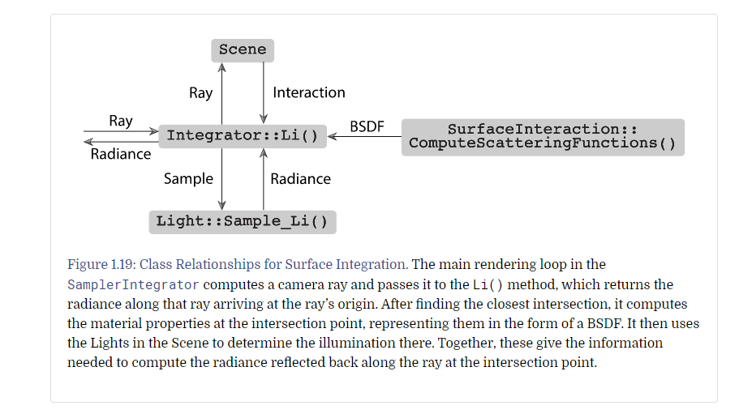
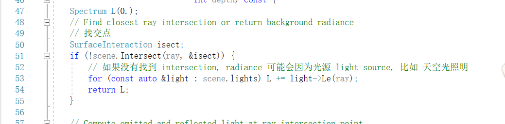
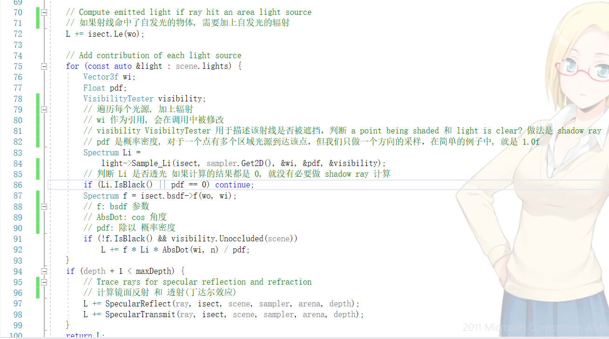
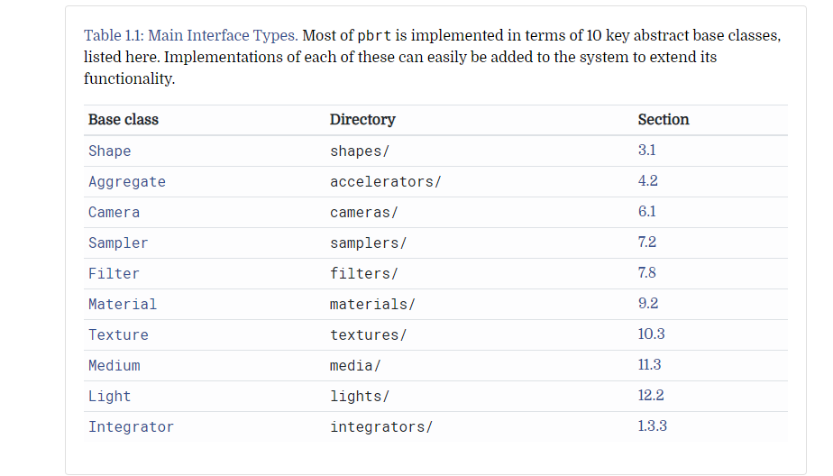
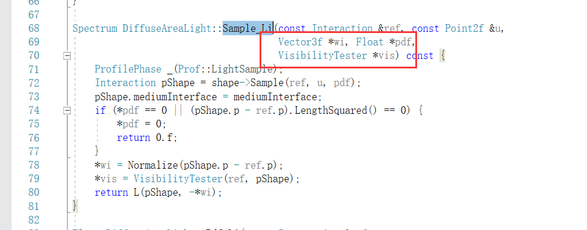
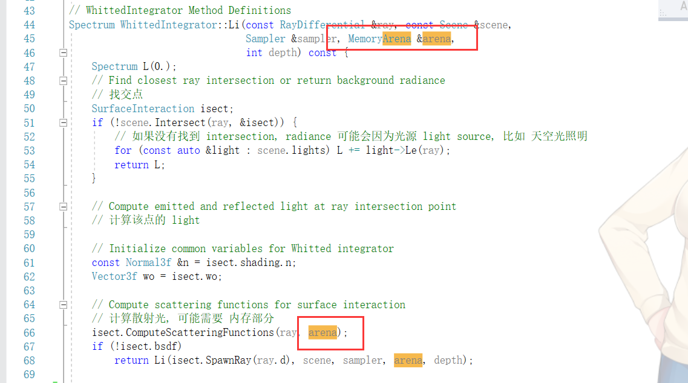

# 一个积分器的光照积分流程

基础光照积分流程

1. 入射光(IncidentRay) 传入, 求 交点(SurfaceInteraction)

2. 没有交点, 只需要计算 LE

3. 判断材质, 散射光要做方向偏移(SpawnRay)

4. 命中自发光物体, 需要加上自发光的辐射(LE)

5. 遍历光源, 做Li辐射计算

6. 递归深度, 加上反射(SpecularReflect)和折射(SpecularTransmit)的计算

# 并发

并发的手段

1. 互斥(Mutex)或锁(Lock)

2. 原子操作(Atomics)

3. 记录式内存(TransactionalMemory) **代价太高不使用**

# pbrt 中的线程安全

- 简单基类不保证线程安全: Point3f, Vector3f, Normal3f, Spectrum, Transform, Quaternion, and SurfaceInteraction
. 这些类做线程安全的维护成本太高

- MemoryArena(高效内存分配器), RNG(伪随机数生成器) 不是线程安全的

- SamplerIntegrator, Light 的 Preprocess() 函数不是线程安全的

- Sampler不是线程安全的, 实例的生成方法是 Sampler::Clone(), 作用于单个 格子(Tile)

- pbrt中的独立函数(All stand-alone functions in pbrt) 是线程安全的, **前提是多线程函数不传入数据指针**

- 下面的子类实现, 都应该是线程安全的

# pbrt 中的指针还是引用?

C++提供了两种讲数据结构的地址提供给函数的方式: 指针和引用

当你想 1. 将传入的参数作为输出变量 2. 使用指针或引用来节省传递整个结构的开销

惯例是:

指针 : 该变量将被完全改变

引用 : 该变量的内部状态会被改变, 并且不会被重新初始化(特指结构体)

const引用 : 该变量完全不变

例外:

单想传递一个 nullptr 来表示该参数不可用或者不应该使用

# 代码优化

pbrt 不会使用局部的细微的优化来提高效率，而是通过更优选的算法。

目的是增强代码的可读性。

目前的代码优化主要手段：

1. 当前的CPU架构中，最慢的运算是 除法，平方根，三角函数。例如，使用乘上 1/a 比直接 /a 效率高很多。
2. CPU的处理速度, 比从内存中读取数据要快得多，使用良好的组织算法和数据结构。
