
# 线性代数复习

向量的点乘和代码实现

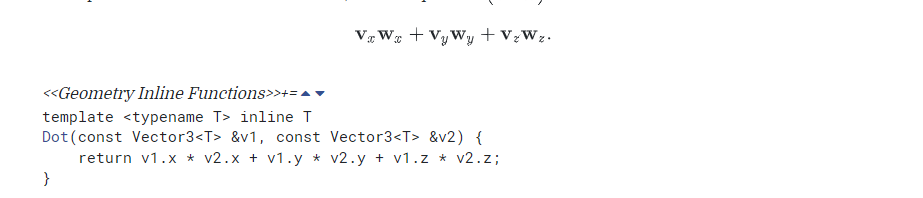

向量的叉乘和代码实现

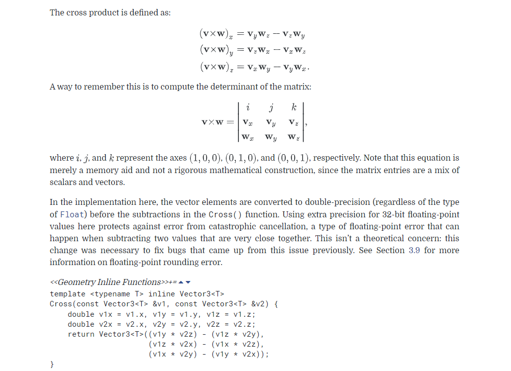

标准化向量和代码实现

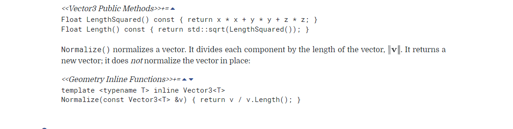

构建正交坐标系的代码实现

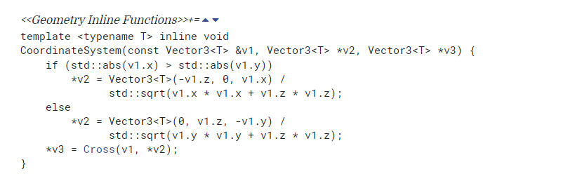

射线的定义

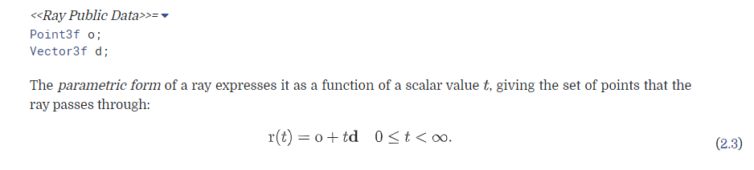

射线做微分的定义

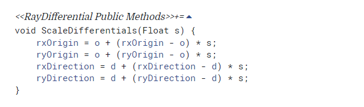

这是一个复合的微分定义, 支持对原点o，射线d分别进行微分

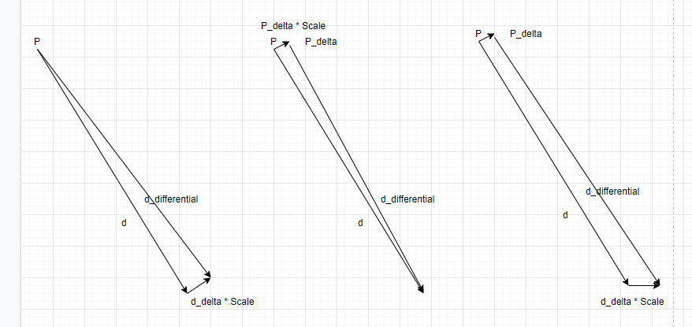

# C++ 部分

## 关键字学习

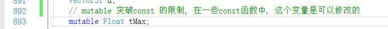

## numeric_limits

这是一个提供查询各种算术类型属性的标准库。

常见用法

最大有限制

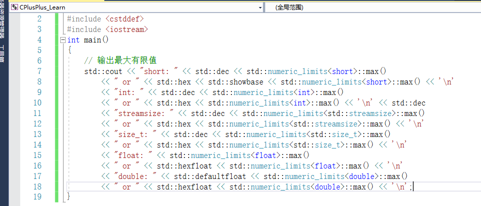

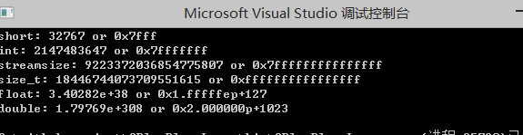

无限大的定义(仅对float, double, long double 有意义) 

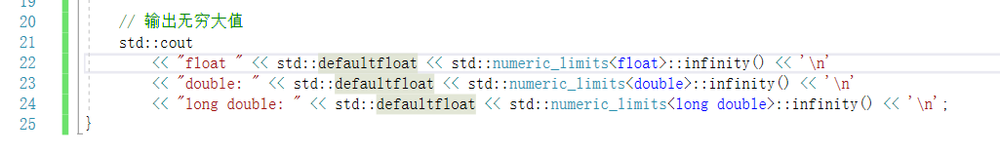

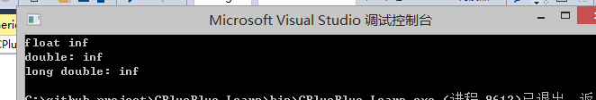

极小步长 epsilon

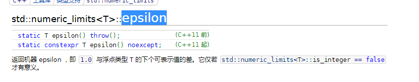

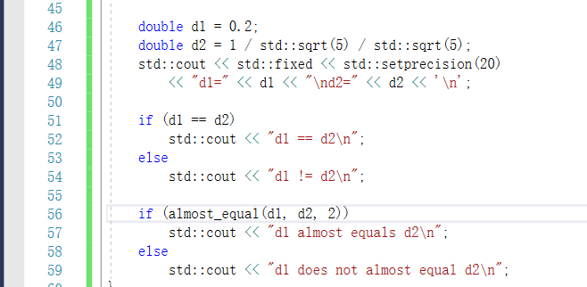

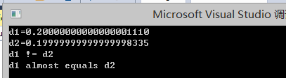

疑问:

这里的 epsilon, 在 [C++网站](https://zh.cppreference.com/w/cpp/types/numeric_limits/epsilon) 给出的内容中
有这样的说法

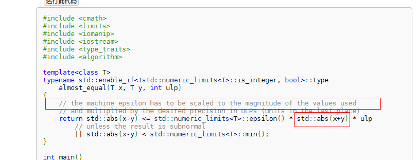

???? 为什么要乘上 std::abs(x+y)

