
# 线性代数复习

在程序中, 我们都默认 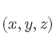 是 列向量 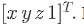

矩阵和点的乘法, 需要先在齐次坐标系中进行计算, 再转换成非齐次坐标

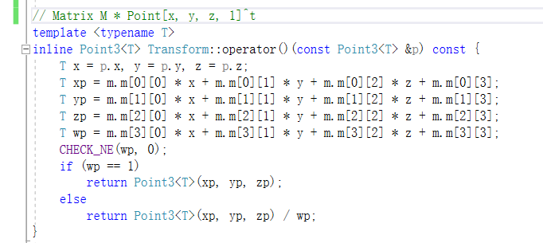

矩阵和向量的乘法, 因为向量的 w 本身就是 0， 所以是

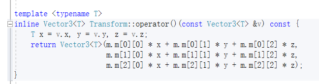

法线的变换和向量有所不同

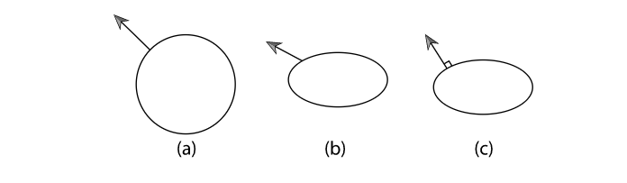

a 是原来的法线，b 是坐标系中的y轴全部除以2, 则法线不再垂直, 而c 是矫正后的法线

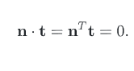

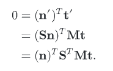

所以当 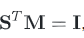 即 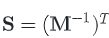 时, 等式成立

所以法线的transform如下

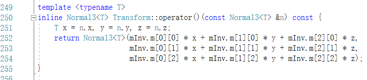

transform 的位置变换

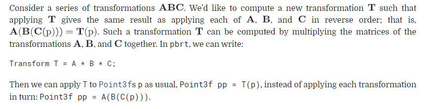

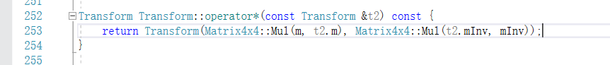

## 四元数

四元数的定义

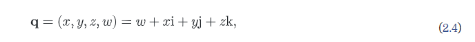

四元数的乘法 四元数相乘之后, 还是得到一个四元数

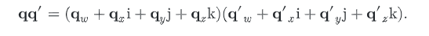

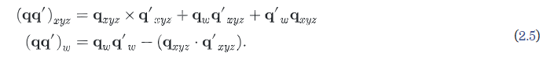

推导过程

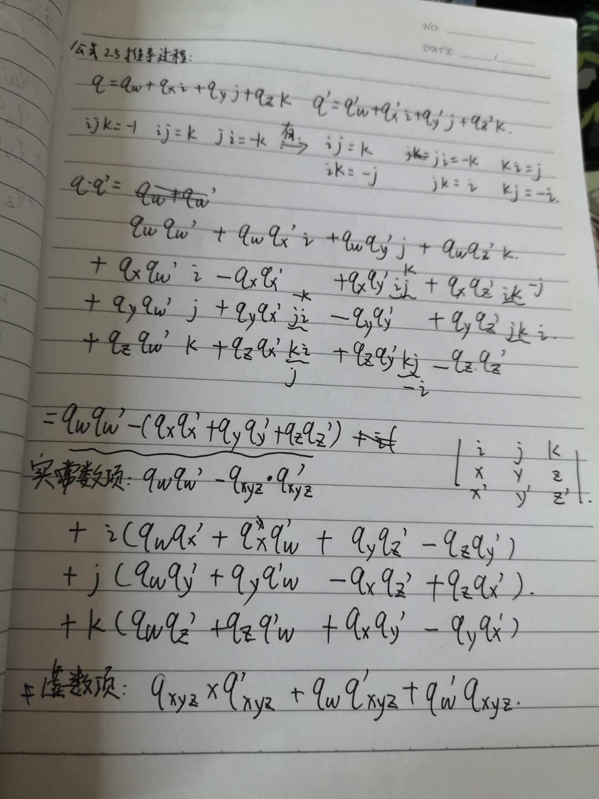

而四元数 可以用来表示一个 θ 角的旋转, 其过程主要是 通过计算 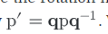 我们可以得到和 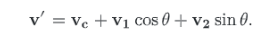 类似的结构式

推导过程

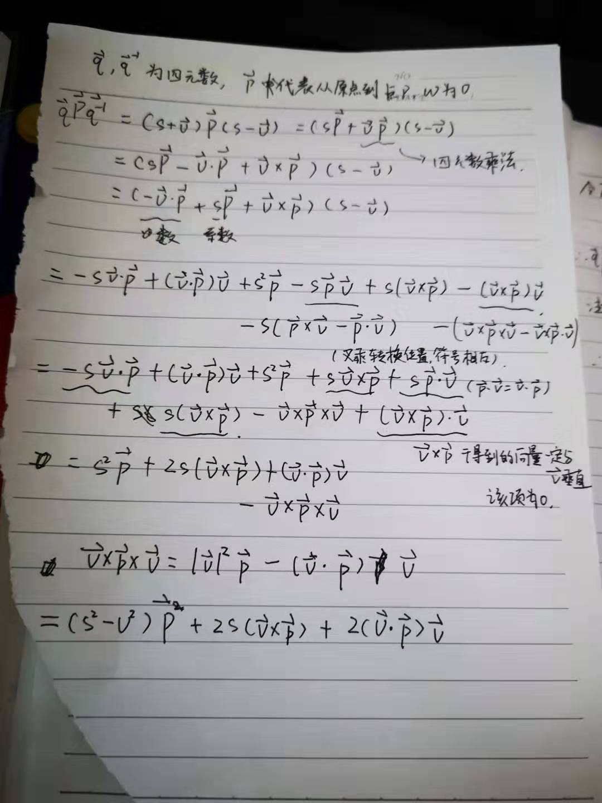

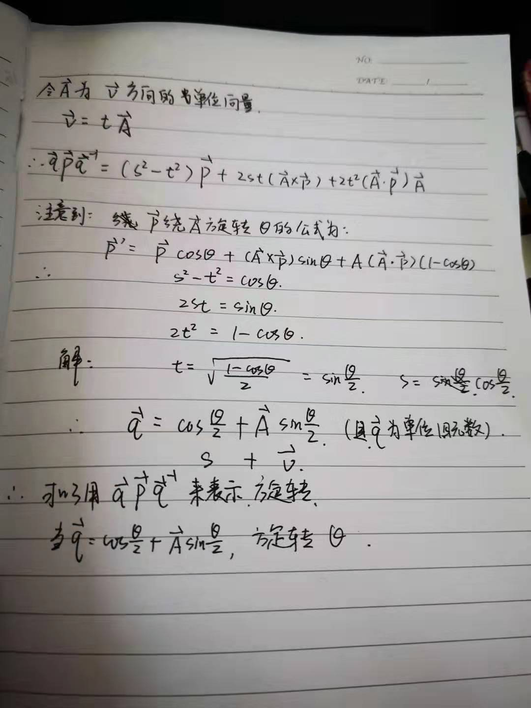

四元数的矩阵表示则是将上述的推倒过程, 转换为 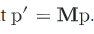 的格式, 用于计算机运算

推导过程

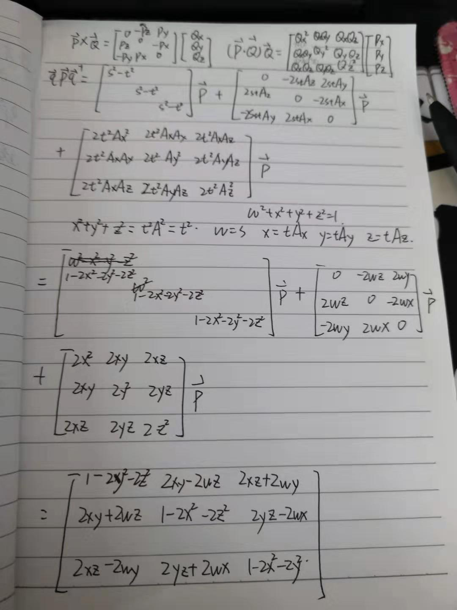

因此，在代码中的公式为

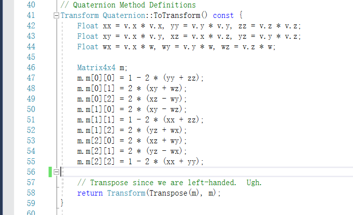

