
# 四元数的插值

四元数的插值使用的不是纯粹的线性插值

如果使用线性插值，无法满足角速度一致的关系

所以使用的是，角度插值

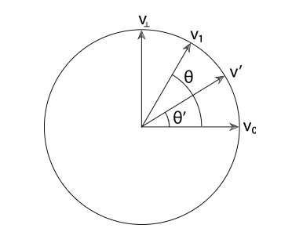

对于 V0 - V1 之间的插值, 有：

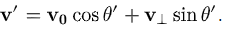

同理，对于四元数的插值，有：

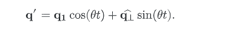

四元数作为向量，也符合向量投影的原理：

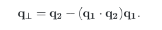

所以四元数的插值为：

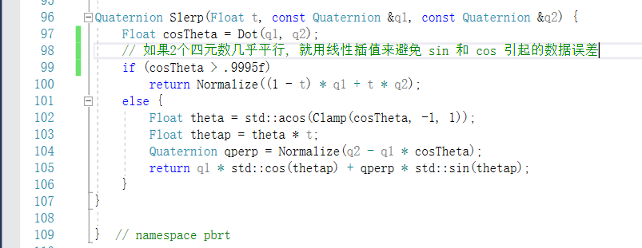

这里对几乎平行的四元数做了 trick。

# 复合矩阵解析

因为一个复合矩阵的解析会有多种解法，这里选择的是:

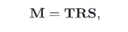

T 平移, R 旋转, S 缩放

构建位移矩阵, 这一步很简单

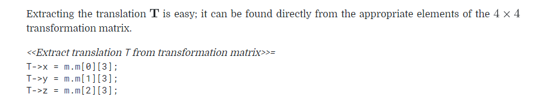

这里构建旋转矩阵使用的是一个逼近公式

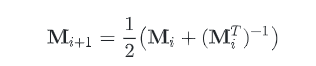

如果, M 是纯粹的旋转矩阵, 那么上述等式会一直成立 M(i+2) = M(i+1) ....

而当 M 不是时, 可以通过这种方式来逼近, [具体的证明](https://research.cs.wisc.edu/graphics/Courses/838-s2002/Papers/polar-decomp.pdf)

因为该方法能够快速收敛, 所以非常实用

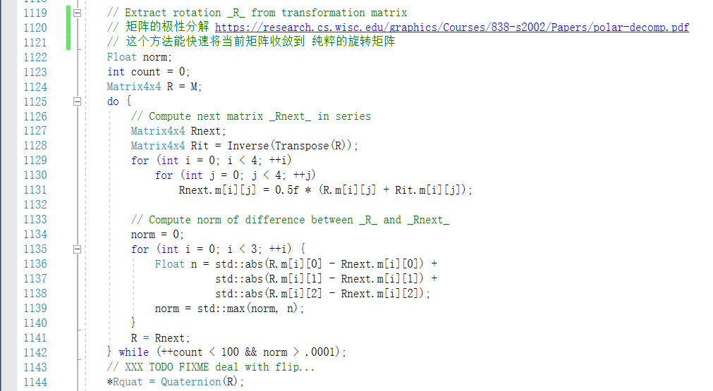

最后将矩阵转化为四元数

计算得到 R后, 通过逆运算得到 S 矩阵

# 复合矩阵插值

对矩阵进行中间插值，就是先分解，然后分别对 T, R, S 进行插值来实现。

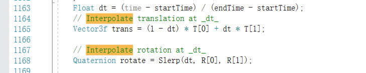

对T 矩阵 和 R 矩阵的插值， T 矩阵使用线性插值， R 矩阵使用四元数插值

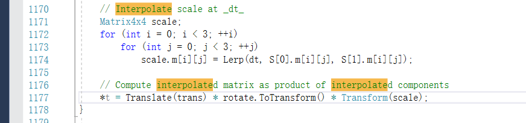

而 S 矩阵就可以直接使用矩阵中的元素进行插值。

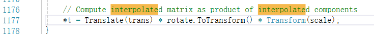

重新得到 T, R, S 将他们相乘就能得到新得到的插值符合矩阵

# 矩阵插值中的范围变化

为了计算光照射线和物体是否相交，需要常常用到范围变量

范围变量的用法是用2个Point来记录点的范围

但在物体做矩阵变化中，这个范围应该被拉长，并给出该范围的总体范围

判断是否有可能与射线相交

接下来，就是点的范围在矩阵插值中的变化

首先，定义矩阵插值的起点 M0 终点 M1

那么对于 t 时间的点 P, 我们做如下的矩阵乘法

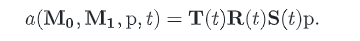

对于该等式，我们做对 dt 的微分

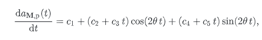

θ是2个四元数的点乘的反余弦，C1-C5 是基于 M0，M1 和 点P 的5个 3维向量

该函数的呈现如下

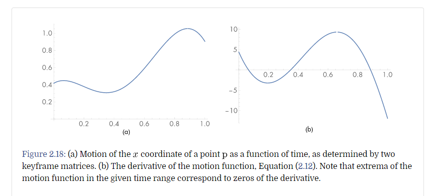

右边为导数, 即我们做的微分

在取零点的时候，我们能取到范围内的极值

首先是 C1-C5 的表示

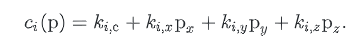

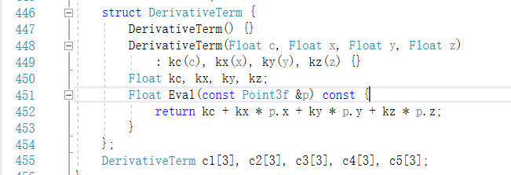

