# Shape

Shape 定义了几何体的总接口

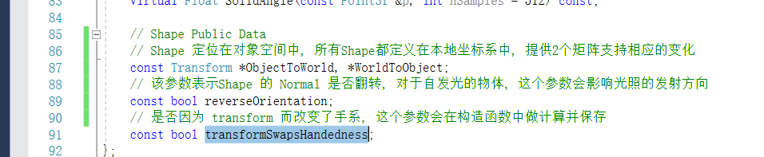

# 射线与边界的交点

几何体带有边界

边界的定义如下

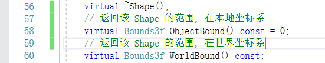

当然, 边界的实现由每个几何体自己实现

比如:

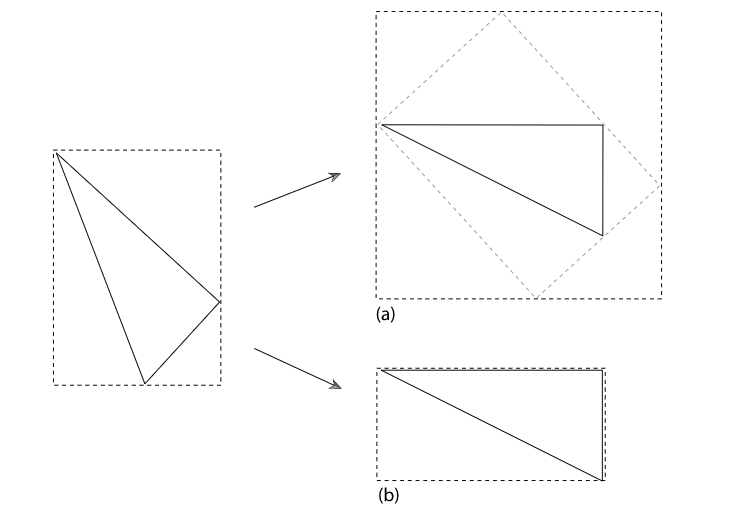

b 的实现方式, 是先对顶点做坐标系转化, 在获取范围,  显然更好.

接下来的问题, 就是求出 一条射线和一个范围的交点

推导过程

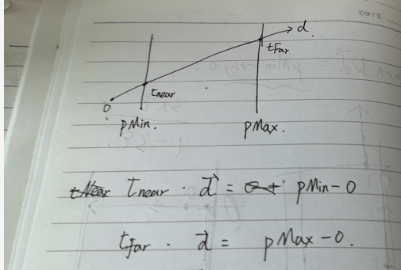

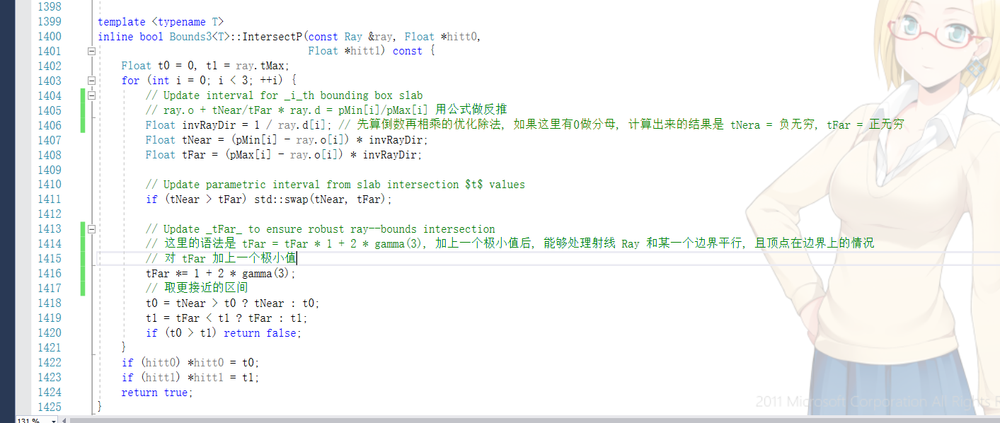

下面是对上述内容的优化函数

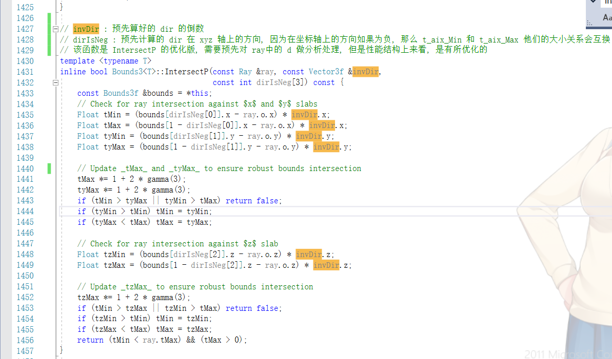

# 球体

球体的2种几何表达

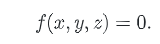

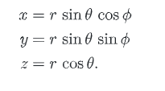

如果我们定义 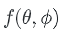 并将 其对应 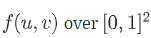

定义 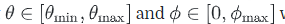 那么我们就能得到对应 uv 的映射

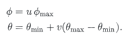

这种映射方式对应了纹理坐标的覆盖

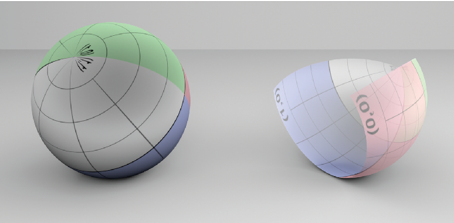

