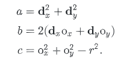
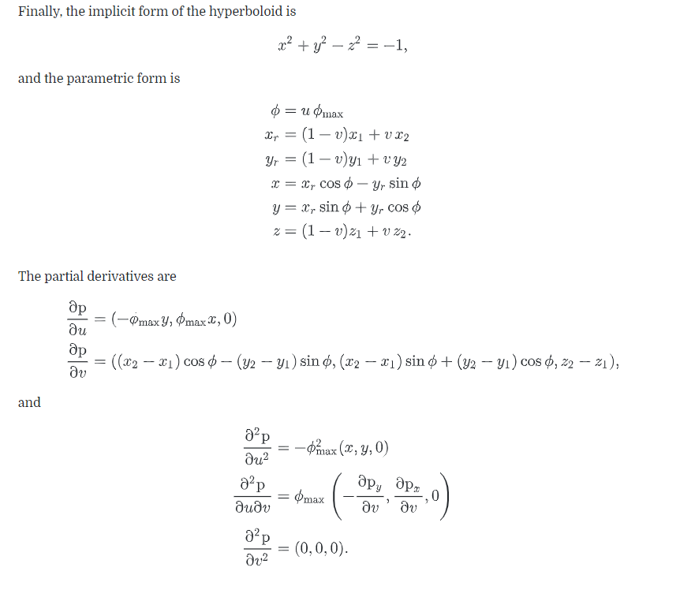

# 法线的微分

介绍一个数学公式，在交点 P 上，有法线 N，则法线相对 N 与 uv 的偏导数为的计算过程是：

这就是 Weingarten equations

计算流程如下:

# 表面积的计算方法

这里有个积分法的通用公式:

对于  并且满足 

其表面积为:

# 圆柱面

圆柱面的表达式和uv表示

求交点

圆柱求与射线的交点与球体类似

 - 将射线转换到本地坐标系
 - 构建一元二次方程
 - 对一元二次方程求解, 得到较小的 t
 - 根据 t 计算 phi 和 hit point 的坐标
 - 进行Z Test 过滤一些可能不相交的情况
 - 计算 u,v 以及 dpdu, dpdv, dndu, dndv
 - 构建表面交点 SurfaceInteraction
 - 更新 tHit 变量, 记录 t

# 圆环

圆环需要 2个半径, 高度, 还有角度

与射线求交点

 - Ray 转换到 本地坐标系
 - 如果 Ray 和 Disk 平行，那么不会有交点
 - 求得交点, 与半径和角度范围比较
 - 计算 dpdu dpdv dndu dndv
 - 构建表面交点 SurfaceInteraction
 - 更新 tHit 变量, 记录 t

表面积

# 更多的二次曲面

这里包括圆锥体, 抛物面, 双曲线面

## 圆锥体

对于Z轴的圆锥体, 高度是 h, 半径是 r

转换到 uv

分别求一阶导数和二阶导数

### 抛物面 和 双曲面

