# 智能指针

1. 智能指针的构造函数都有关键字, explicit, noexcept

 - 不允许隐式转换 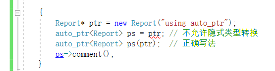
 - noexcept 表示该函数不会抛出异常，如果抛出异常，就会直接结束程序。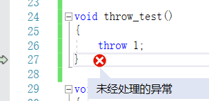 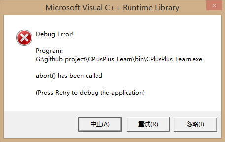

2. 如果智能指针指向的是非堆内存, 就会报错, 因为delete运算符不能用于非堆内存
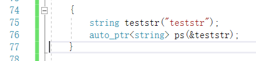

3. auto_ptr 对2个指针指向同一块内存的解决方案是，移交控制权

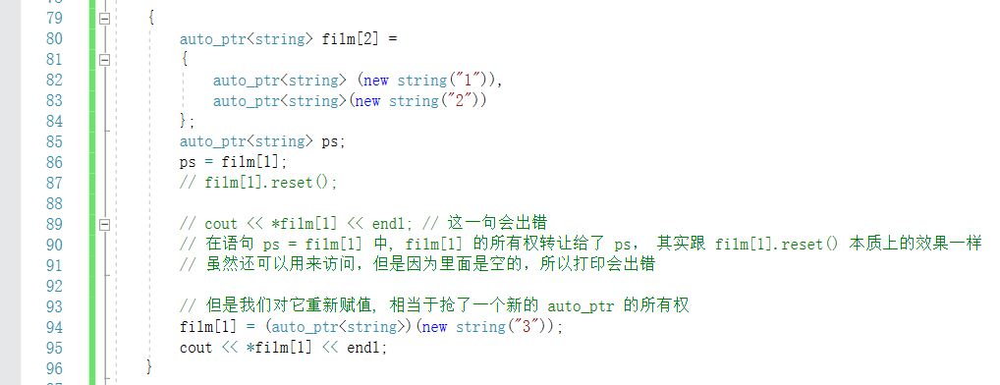

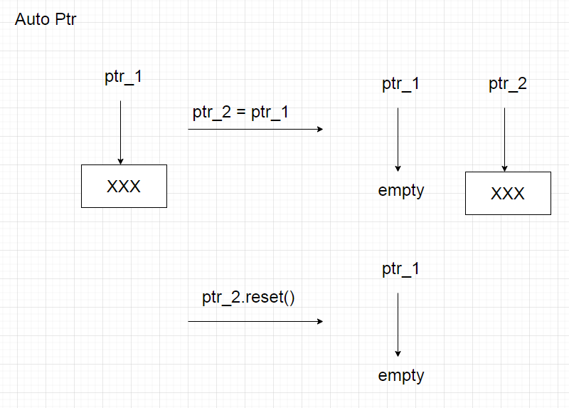

4. shared_ptr 使用引用计数机制

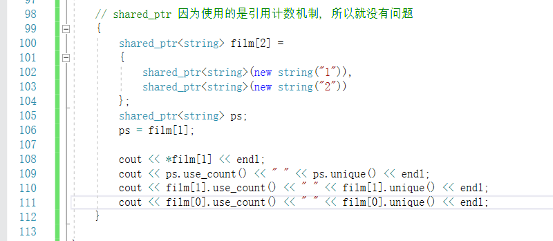 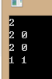

5. unique_ptr 使用这种赋值, 会直接引发错误

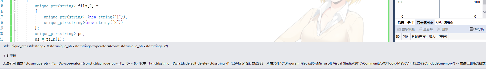

关键字 delete

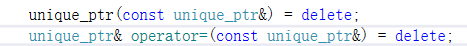

弃置函数声明

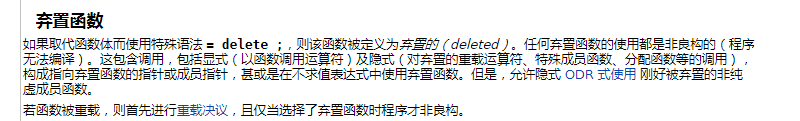

但是 unique_ptr 支持右值赋值

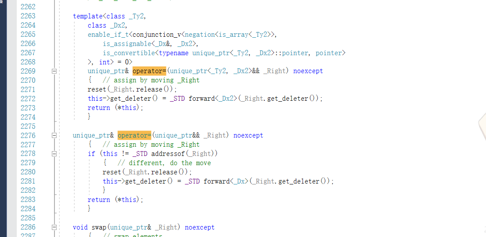

所以可以使用这种写法:

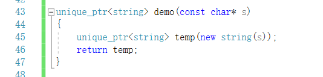 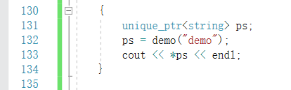

本质上, 这种写法也是返回的右值


6. 智能指针中使用 delte 和 delete[] 来释放内存, 初始化时应该用 new 和 new[] 保持一致

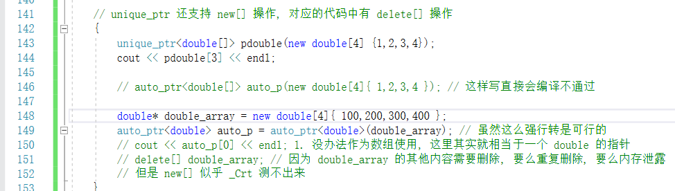

7. shared_ptr 支持用 unique_ptr&& 赋值, 但是 unique_ptr就不行

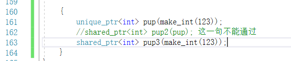

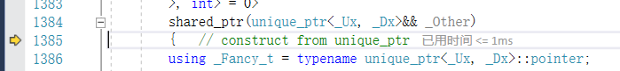

8. unique_ptr 使用小结

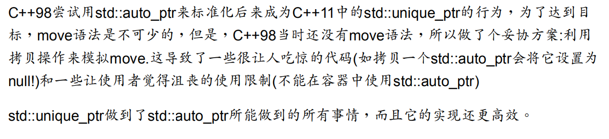

# 模板

模板分  函数模板 和 类模板

先来一个最简单的函数模板的例子

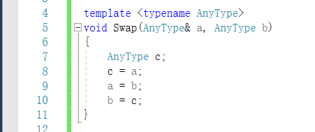

 - 函数模板不是缩短程序，最终仍然会生成独立的函数定义，最终的代码不包含任何模板。
 - 函数模板亦可进行重载，比如支持一个 T，或者支持 二个T 的同名模板

函数模板的显示具体化：

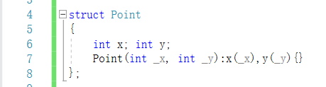

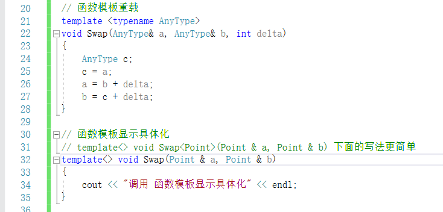

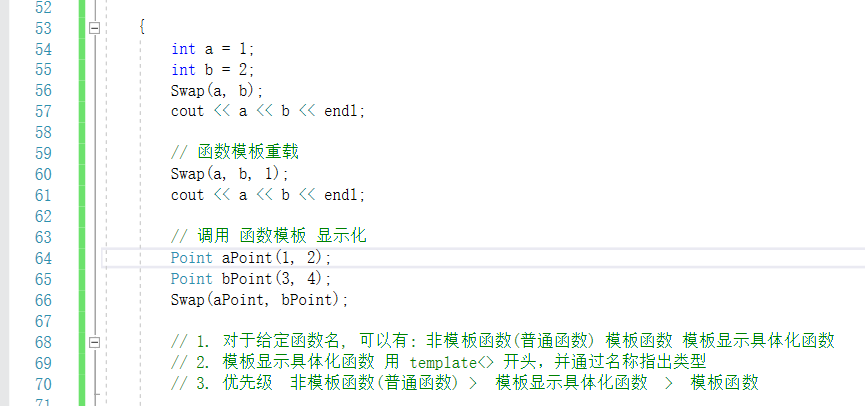

函数模板的实例化和具体化

 - 函数模板本身不会生成函数定义，它只是一个用于生成函数定义的方案。
 - 在定义了 Swap 模板后, 调用 Swap(a, b), 这里导致编译器生成了一个 Swap 实例，这种实例化被称为隐式实例化
 - 当然，我们也可以显示实例化这个模板函数

但是实例化，也只是一个声明，也需要做定义

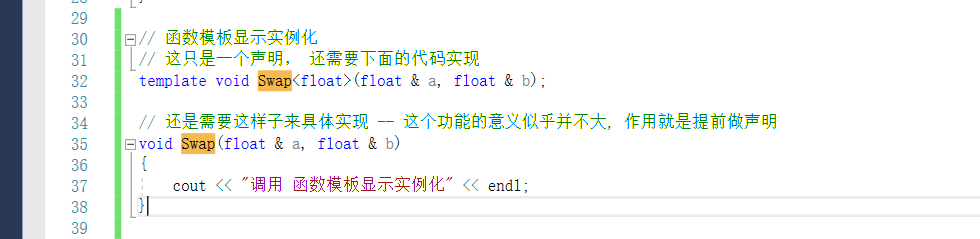

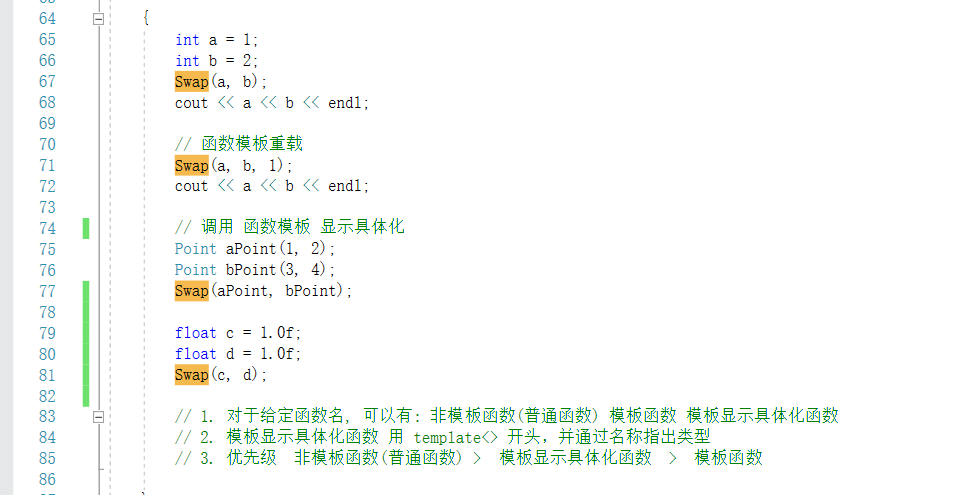

总结一下, 函数模板的选择策略
在有函数模板的情况下，会有一系列的选择方案

 - 创建候选函数列表
 - 使用候选函数列表创建可行函数列表
 - 确认是否有最佳的可行函数

编译器为了确定哪个可行函数是最佳的，有如下顺序来确定最佳

 - 完全匹配，但常规函数优先于模板
 - 提升转换 (例如, char 和 shorts 自动转换为 int, float 自动转换为 double)
 - 标准转换 (例如, int 转换为 char, long 转换为 double)
 - 用户定义的转换, 如类声明中定义的转换

这里的顺序和机制不需要记住，只需要知道有一个机制来决定完成，这个机制决定了运行哪个函数。

**decltype 关键字**

在这样一段代码中

```C++
template<type T1, type T2>
void ft(T1 x, T2 y)
{
    ...
    type? xpy = x + y;
    ...
}
```

因为x, y 都是 T, 所以不知道 xpy 的类型, 这里就引出了 C++ 的 decltype 的关键字设定

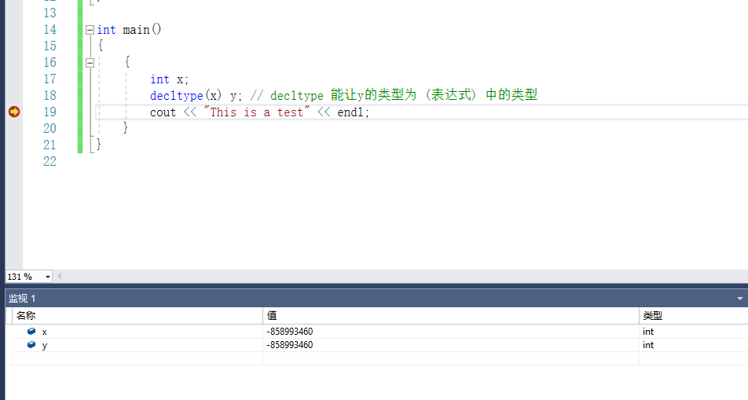

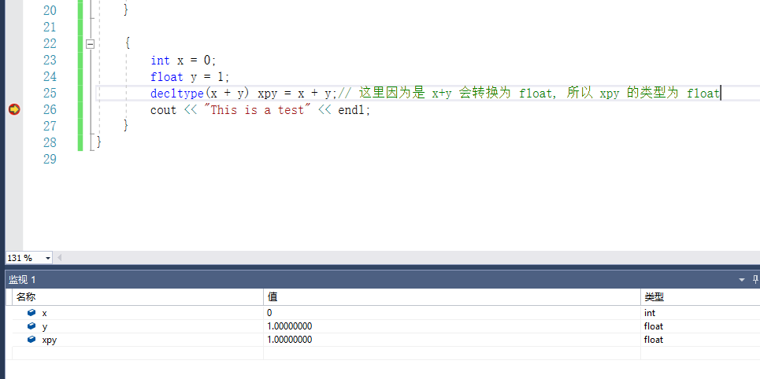

对于
```C++
decltype(expression) var
```

 - Step 1: 如果 expression 中是一个没有用括号包括起来的标识符，那么 var 的类型应该和 expression 相同, 包括 const 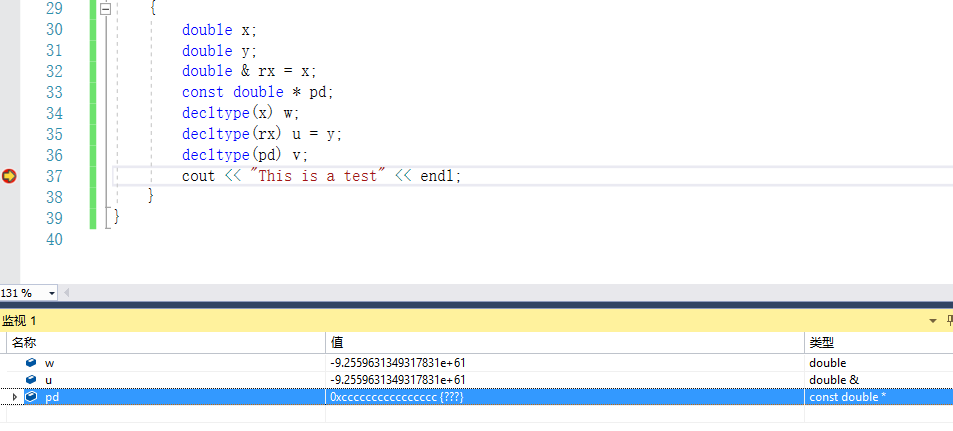
 - Step 2: 如果 expression 是一个函数调用, 那么 var 的类型应该和 函数的返回值类型相同, 并且不会实际调用函数，只是通过查看函数的原型来获取返回值类型。 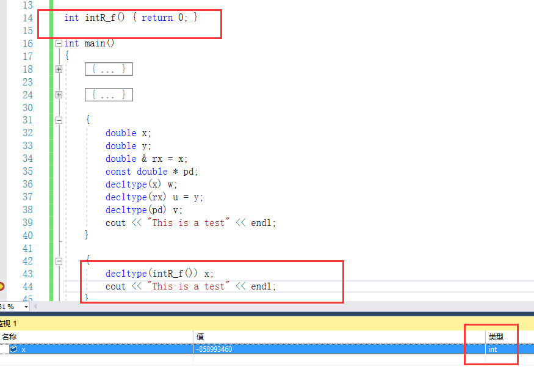
 - Step 3: 如果 expression 是一个左值，而且用括号括起来（**与1的区别是用括号括起来**）, 那么 var 是 expression 的类型的引用 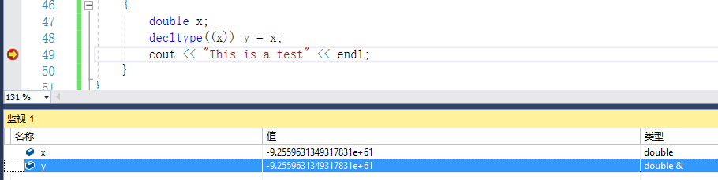
 - Step 4: 如果前面的条件都不符合, 那么 var 的类型与 expression 的类型相同 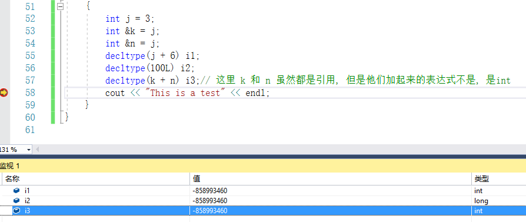

对于C++11的后置返回类型的定义

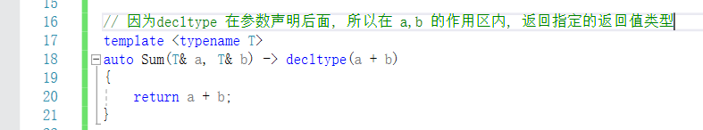

先来一个最简单的类模板的例子

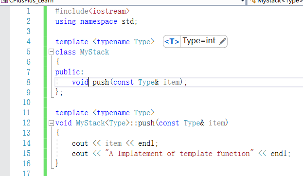

类模板的设定

 - 类模板不是函数，不能单独编译
 - 类模板必须与特定的类模板实例化请求一起使用
 - 最简单的解决方案：类模板信息放在一个头文件中，使用类模板的文件包含该头文件

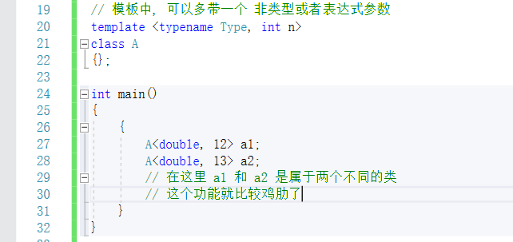

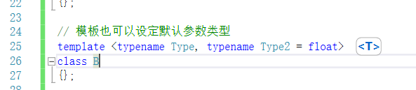

类模板的实例化和具体化

 - 默认都是隐式实例化 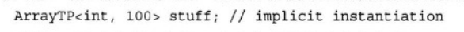
 - 显示实例化做声明(和函数模板一样, 显示实例化 做的只是 声明) 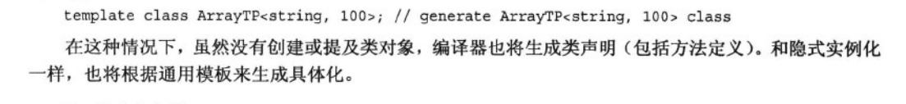
 - 显示具体化, 解决的问题是, 某个模板对于特殊的类时，实现的内容不一样，在课本中, 给出了 const char* 的重载操作>, 但是这里需要重写的是 strcmp 函数, 而不是 operator>,在这种情况下, 就需要特殊具体化一个类的实现。 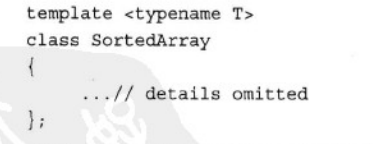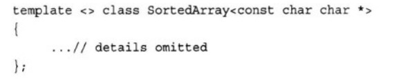

C++11的玩法, 部分具体化
1. 给类型参数之一, 指定具体的类型
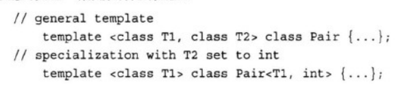
2. 如果1中, 全部给定具体的类型, 就变成了 具体化
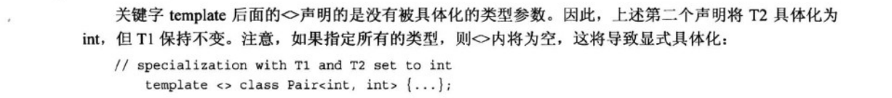
3. 编译器优先使用具体化程度最高的模板
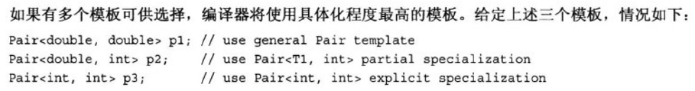
4. 支持具体化指针
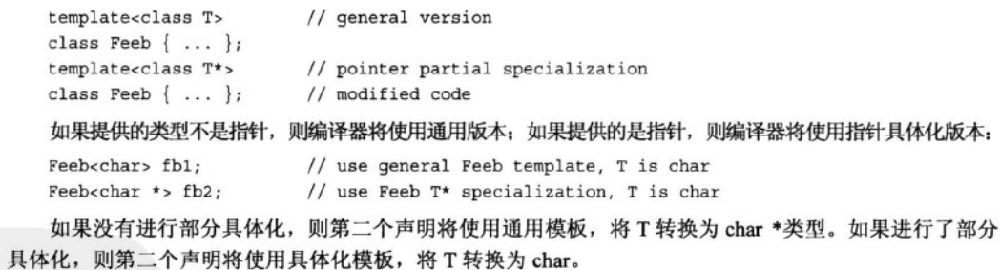
5. 支持做前后关系的具体化
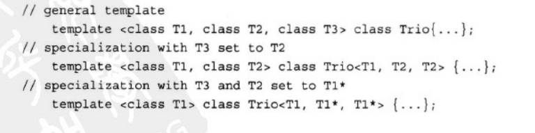
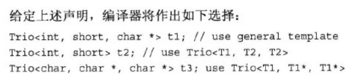

类模板支持

 - 成员模板, 将成员变量中, 使用子模板, 在模板类中定义子模板类, 也可以用特殊的语法糖在同一个文件外, 定义子模板类
 - 将模板做参数, 模板的参数也可以是模板, 可以做嵌套, 语法糖为 ``` template <typename T> class ```表示这是一个模板类

C++11支持别名
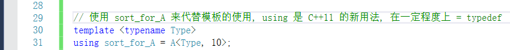
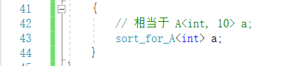


# public,private,protect继承

C++ 继承有继承选择, 他们的效果依然是控制访问权限，该功能个人认为不实用。

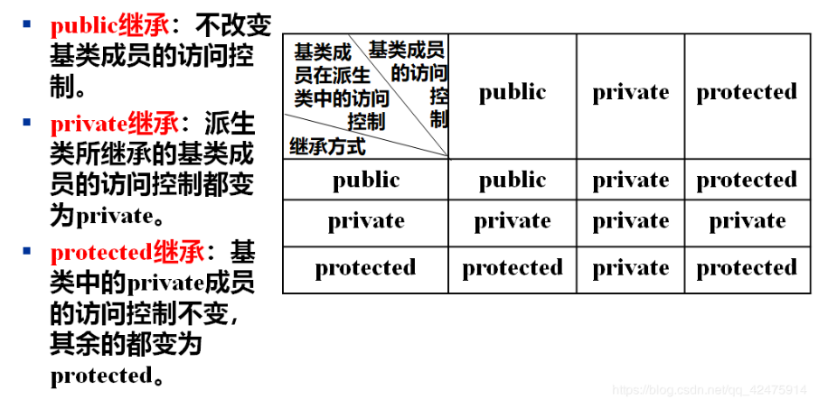

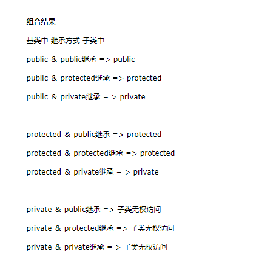


