# 可变参数模板

在函数模板 和 类模板的基础上, C++11 增加了可变参数模板的新特性。

可变参数的模式, 通过```..```的语法糖, 和递归的写法来实现函数参数包的解包

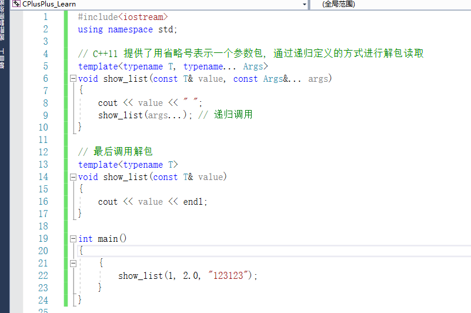

# 函数指针, 函数符, lambda

这3个东西, 都是用来表达一段可变的函数的语法糖

### 函数指针

基础介绍

1. 声明

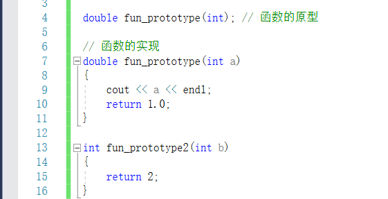


2. 使用

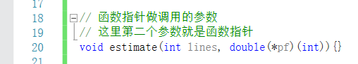

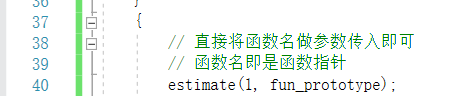

3. 调用指针指向的函数

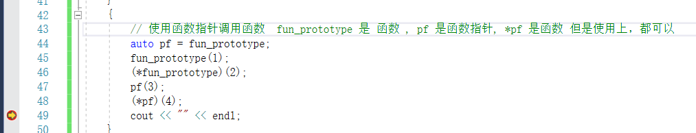

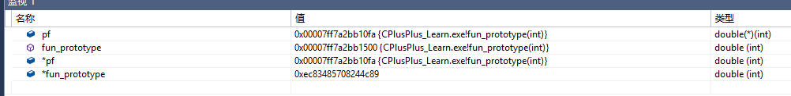

函数指针的高级嵌套(迷惑行为)

这里主要是关于函数指正，对于复杂函数的使用，以及函数指针数组的语法玩法

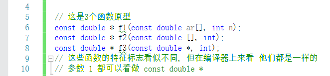

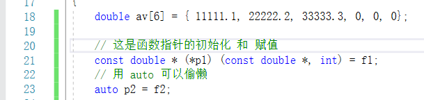


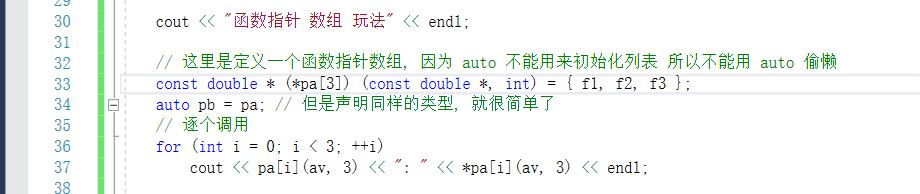

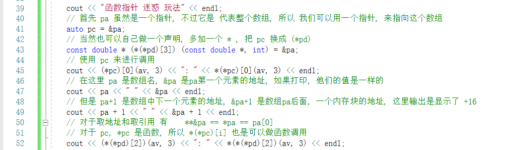

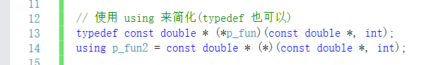


看下输出

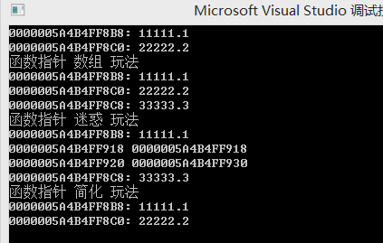

### 函数符

函数符的定义

 - 函数名
 - 指向函数的指针
 - 重载了()运算符的类对象

函数符的意义:

在一些标准模板的函数中, 需要传入函数符作为参数, 比如 list 的 remove_if

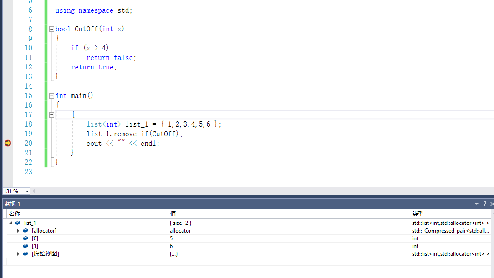

一些默认的函数符叫法:

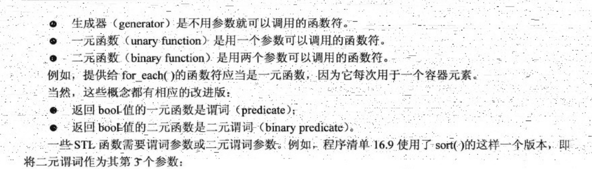

这些英文的缩写, 可以直接在STL库的定义中看到，能够让我们迅速的知道需要怎样的函数


预定义的函数符

有一些计算, 比如 加减乘除 比较大小, 这些功能是没有具体的函数定义的，所以C++提供了一套预定义的函数符

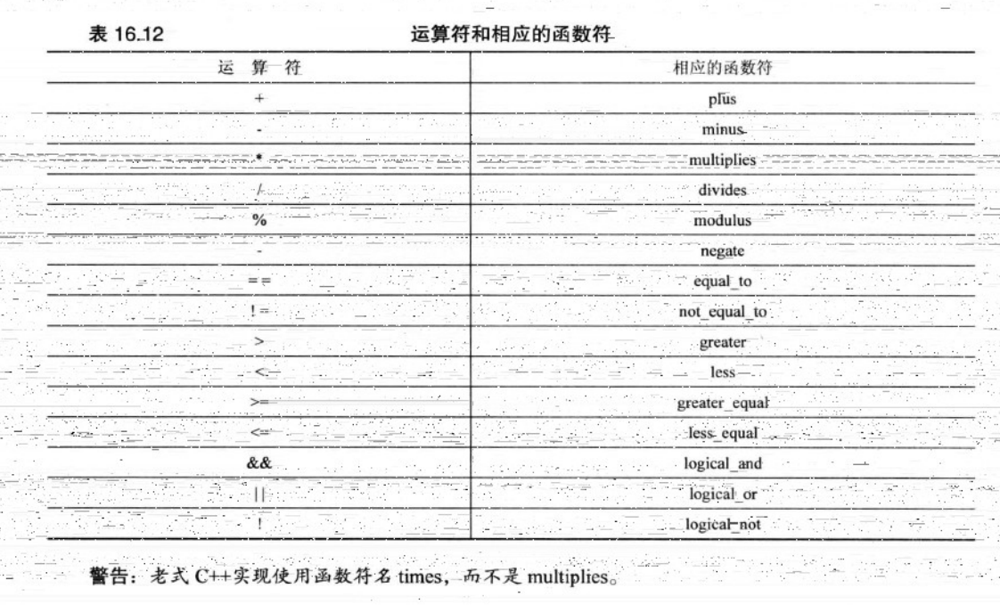

使用方法

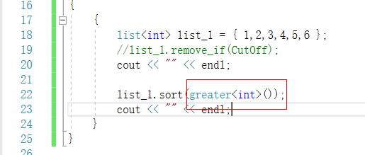

函数适配器, 这个东西很像python的偏函数

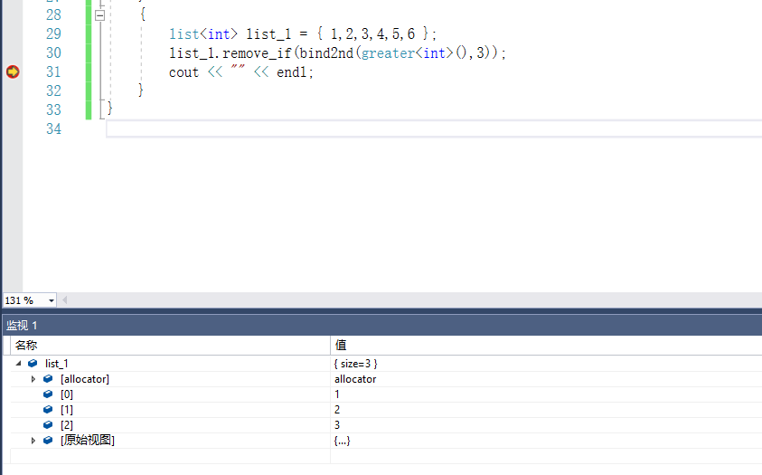

### lambda

C++11 中, 提供了 函数指针和函数符 的替代品, lambda 表达式

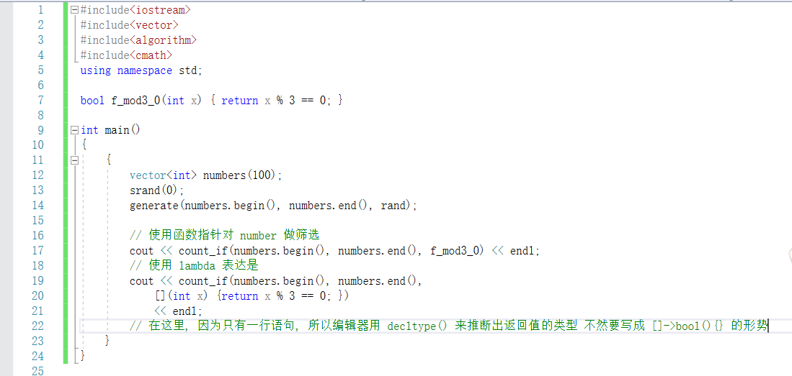

lambda的优点

 - 编写方便
 - 可以直接在函数内定义
 - 函数指针因为编译器的机制，不会内联其地址被获取的函数, 而函数符的定义很繁琐, 所以综合, lambda 较优

lambda的变量访问

 - lambda 可以访问作用域内的任何动态变量
 - ```[z]``` 按值访问 z
 - ```[&x]``` 按引用访问 x
 - ```[&]``` 按引用访问所有变量
 - ```[=]``` 按值访问所有变量
 - ```[a, &b]``` 按值访问a, 按引用访问b
 - ```[&, b]``` 按引用访问其他所有变量, 按值访问b
 - ```[=, a]``` 按值访问其他所有变量, 按引用访问a

# 智能指针 高级玩法

### unique_ptr

相对于 auto_ptr, unique_ptr 更加完善, 同样是独占机制, 基本上能用 unique_ptr 解决的, 用

unique_ptr 是一个具有开销小，速度快， move-only 特定的智能指针，使用独占拥有方式来管理资源

unique_ptr 支持自定义 deleter (从开销的角度, 使用 lambda 是最好的)

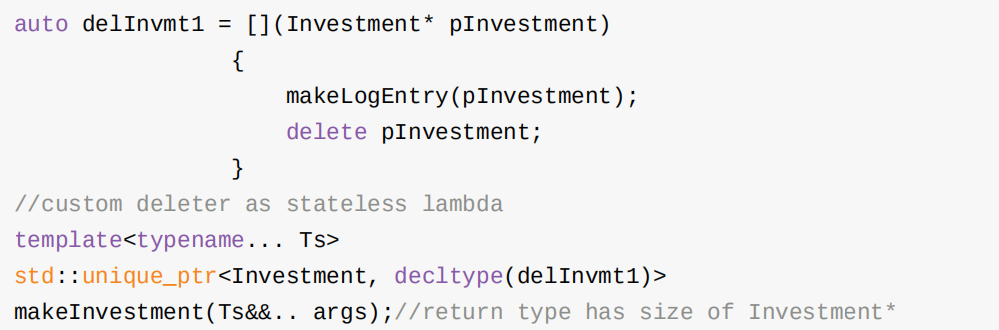

unique_ptr 可以转化成 shared_ptr, 但是需要的是右值

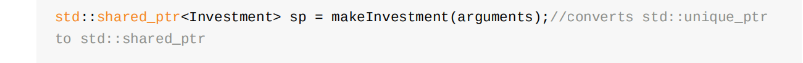

### shared_ptr

shared_ptr 的点

 - shared_ptr 是原生指针的两倍大小, 因为它们内部除了包含了一个指向资源的原 生指针之外，同时还包含了指向资源的引用计数
 - 引用计数的内存必须被动态分配.概念上来说，引用计数会伴随着被指向的对象，但是被 指向的对象对此一无所知。因此，他们没有为引用计数准备存储空间。(一个好消息是任 何对象，即使是内置类型，都可以被 shared_ptr 管理。)
 - 引用计数的递增或者递减必须是原子的

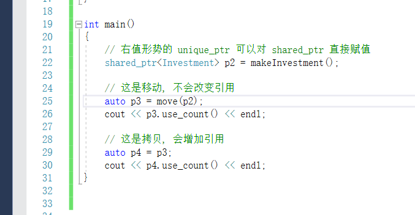

control-block 机制

首先来看一段会引起报错的代码

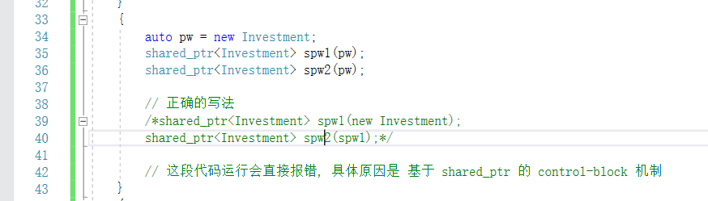

 - 一个 shared_ptr 包含2个指针, 一个是指向内容, 另一个指向 control-block
 - control-block 里面包含了 引用计数 自定义的deleter的拷贝 甚至包含了自定义的 allocator
 - 在创建一个 shared_ptr 时
 - - make_shared 总是会创建一个 control-block。(所以这个新的对象在 被make_shared 之前没有对应的 control-block)
   - 当 shared_ptr 由 unique_ptr 等独占性指针构建时, 会创建控制块, 因为他们没有
   - 如果用原生指针创建时，会创建一个控制块
 
所以在代码中, 会有2个控制块被创建，会有2个引用计数，会引起两次指针的 delete.

 另一种情况就是 this.

shared_ptr 不适用与数组。

记住的点

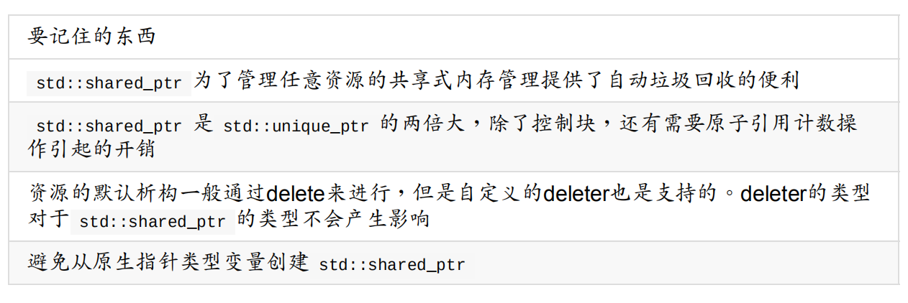


