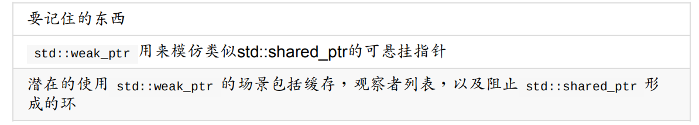

# 智能指针 高级玩法

### weak_ptr

首先说一下 weak_ptr 的用法

 - weak_ptr 被设计为与 shared_ptr 共同工作
 - weak_ptr 可以从一个 shared_ptr 或者另一个 weak_ptr 对象构造，获得资源的观测权。
 - weak_ptr 没有共享资源，他的构造和析构不能引起引用计数的变化
 - weak_ptr 没有 -> 和 * 操作符
 - weak_ptr 提供 expired() 操作, 这个用于判断 它指向的对象是否被销毁
 - weak_ptr 提供 lock() 操作, 这个用于返回其所指对象的 shared_ptr, 对象销毁是返回空的 shared_ptr

关于lock函数, 底层机制保证了这是一个原子操作

在 判断弱引用是否过期, 并获得对应的 shared_ptr 的流程中, 如果不是原子操作, 则有可能被另一个进程干扰导致错误的结果

而 weak_ptr 的使用情况，就是 python 中的循环引用的情况, 用弱引用来破解环指针的关系

### make_unique 和 make_shared

make 函数的优点有二:

 - 智能指针的构造 和 对应实例的构造 是在一个原子化的操作中的, 不会出现中途被打断导致可能 构造了实例却没构造指针的内存错误
 - 带控制块的指针, 需要分配2次内存, make函数把这两次分配优化为一次分配

make 函数的缺点

 - 无法自定义 deleter
 - 自定义new和delete操作符的实例

# 三角形网格

三角形求交

在这里，三角形和射线的求交，用了一种非常数学的方式来化简并计算

### 将三角形的顶点, 转换到射线空间

首先射线空间的定义，是以  R = O + td, O做原点, d 做Z轴的单位向量来形成的, 射线空间

第一步，获取三个三角形顶点

第二步, 顶点做位移

第三步, xyz 互换, 我们保证换出的 Z 值是最大的

第四步, 做剪切矩阵

这一步比较疑惑，这里给出对于 d:  的效果

那么，现在的问题就简化成了，对于一个坐标系，三角形和z轴的交点

这个问题，可以用投影来简化

在这里，巧妙的使用了叉乘的用法来定义点和线的相对位置

我们知道，叉乘的数学意义是平行四边形的面积，且带符号。

所以我们需要做的是，把三角形的三条边，作为3条边，算出他们的叉乘权重 e

然后做数学上的 trick 判断

