# 曲线

使用4个点确定的贝塞尔曲线方程

那么一条1维的曲线是：

我们表示一段空间上的线

我们的曲线分3种：

 - Flat ：永远朝向对它感兴趣的射线，模拟圆柱，且消耗低，多用于毛发的实现
 - Cylinder ： 一根细小的圆柱，可以用来模仿面条，通心粉这一类的细圆柱
 - Ribbon ： 丝带，起点和终点的朝向固定，中间的朝向由插值完成

## 曲线计算 Bound

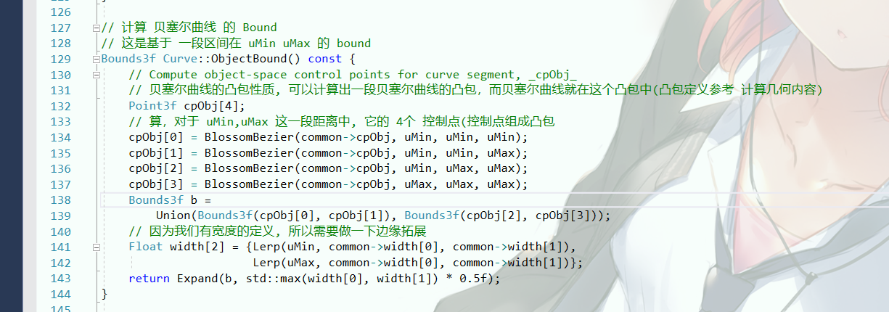

## 曲线计算 Intersect

第一步是获得 Up 向量, 这里的 Up 向量是垂直于 Ray.d 的向量, 尽量可能垂直于 一段Cruve的 P0-P3

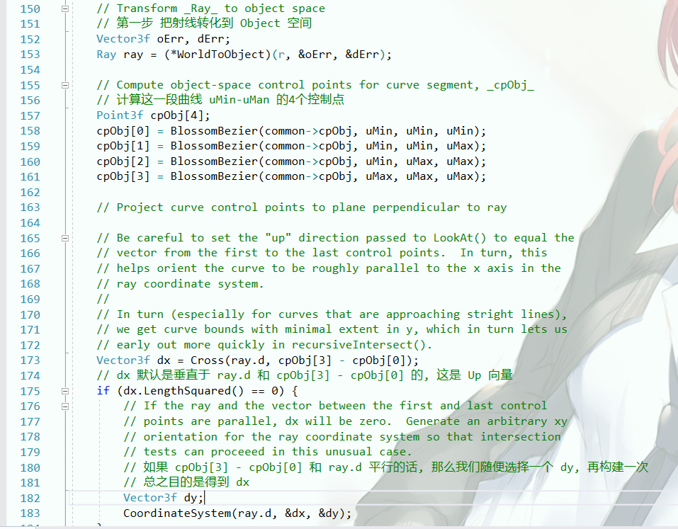

第二步是优化性的判断, 先判断 射线是否和 Cruve 的 bounding 相交

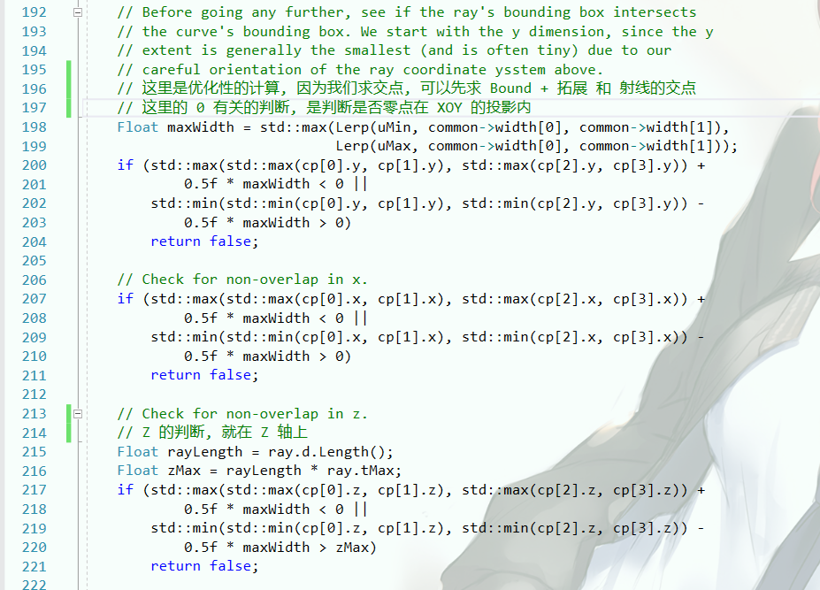

第三步是，求一个最合适的递归值来对 Cruve 进行分段，让它更近似于线性的直线

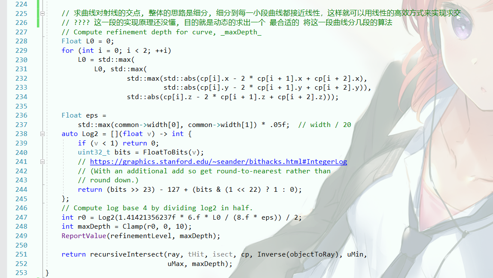

第四部是 2分法，先对Bounding 进行一次递归的判断，求得原点(射线已经简化成了坐标系的原点)是否在 2分中的 Bounding 内

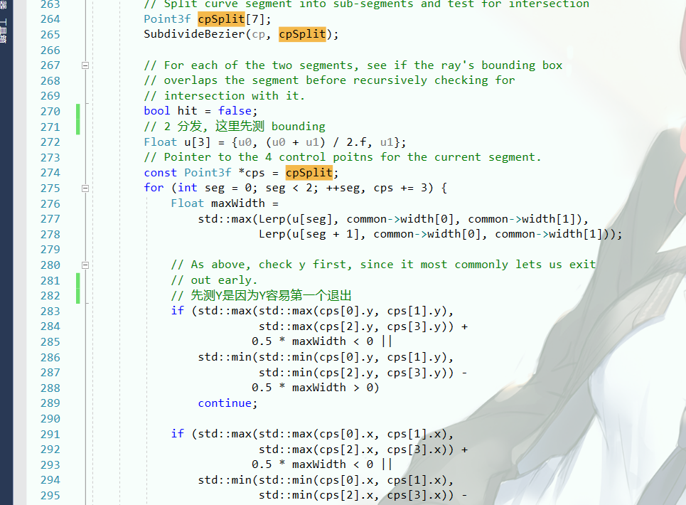

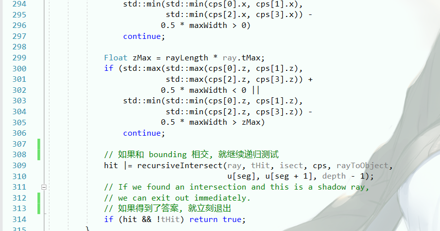

第五步是 对于一个 Bounding ，可能有这种情况

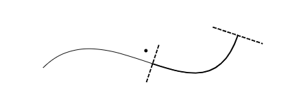

如图，如果原点在实心点位置，在 Bounding 测试中，它会被两个 Bounding 包含，我们需要求得它在 我们的 P0-P1 的左侧还是右侧

首先，是关于起始点：

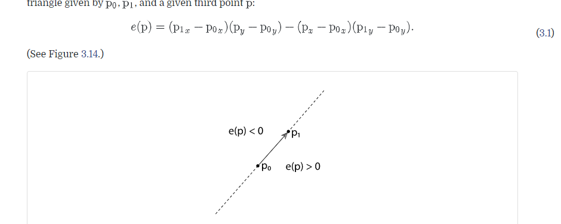

参考该流程，我们可以这么做：

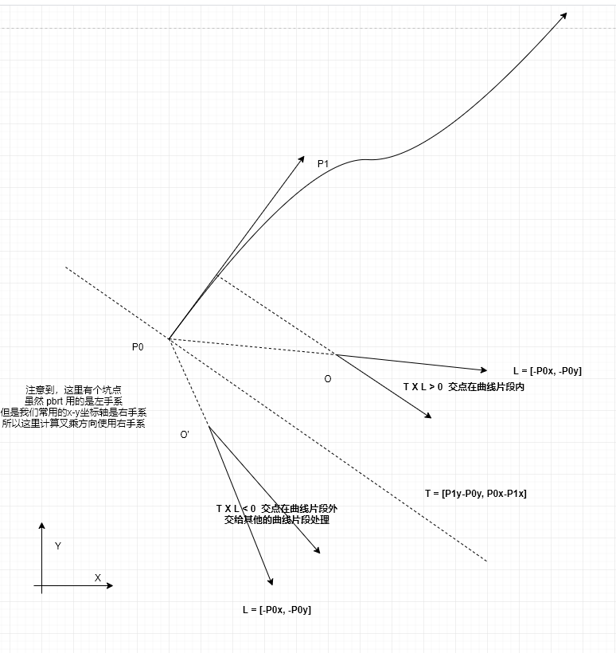

这个就是对交点的 Edge 的判断

经过判断，可以确定交点在这一块线段内了，直接投影，求比例

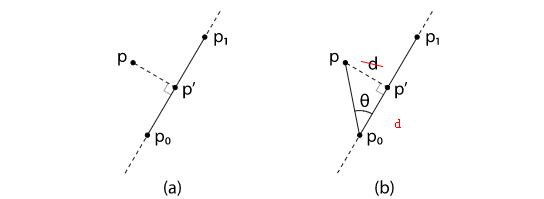

他这里d写错了，应该是下面那段

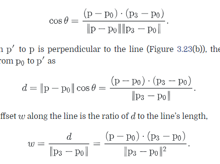

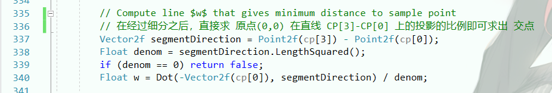

计算W之后，我们计算 u， 即 u0-u1 之中的比例

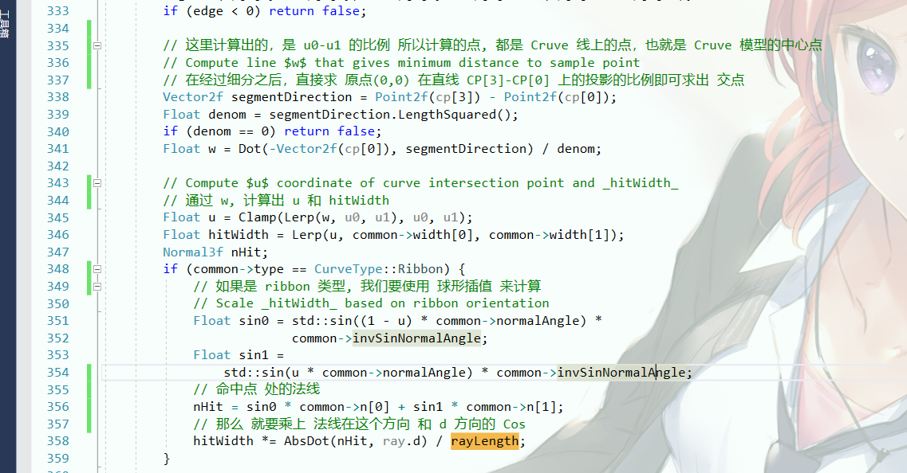

关于 Ribbon 是需要这么算

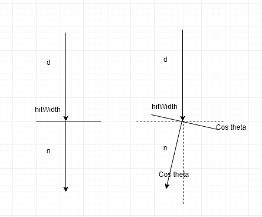

然后是一次验证计算，验证带入 w, 验证距离和是否落在 [0-Zmax]

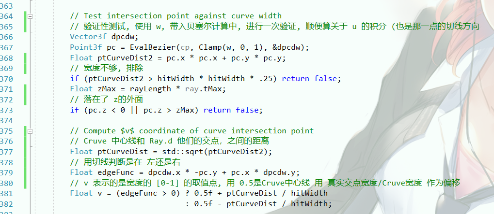

这里算切线坐标系, 其中 dpdu 直接求导可得，其物理意义就是 贝塞尔曲线的走势

关于 圆柱形，Rot的理解

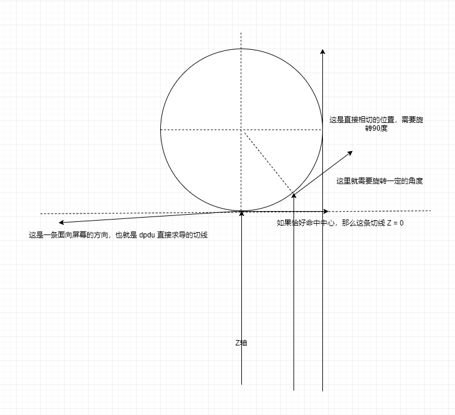

