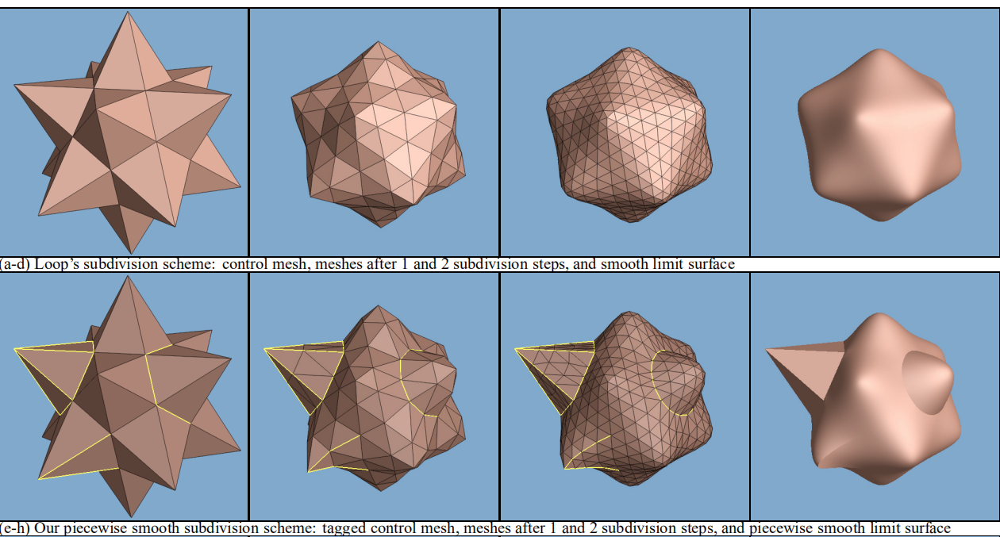

# 细分表面(曲面细分)

曲面细分的简介, 直接看看图即可

### 曲面细分的一些定义

首先曲面细分的函数接口, 完全对三角形网格提供方便的, 前面两步也是提供初始的参数服务

下面是一些定义

 - **Maniflod**  称之为流体, 流体指的是, 给定任何一条边, 最多只用2个面用到了它, 不会存在第三个面
 - **Close Mesh**  流体的子自定义, Mesh 没有边界，并且所有的面，他们的三条边，都有一个相邻面
 - **Open Mesh**  流体的子自定义, Mesh 有边界，存在没有3个相邻面的面。

我们的算法支持 Close 和 Open 2种情况

关于点的一些定义

在三角形网格的内部，大多数的点和 **6个面相邻** 并且有 **6个顶点** 跟它通过线段做连接

在OpenMesh的边界，一般来说，点会 **3个面相邻** 并且有 **4个顶点相邻**

顶点与之相邻的顶点个数，称为 **顶点价(valence)**

**内部** valence 超过6，**外部**顶点超过 4 的点，被称为 **非凡点(extraordinary vertices)**，其他的点被称为 **普通点(regular)**

我们不会对 ex_v 做处理

我们对顶点的数据结构定义

关于面的结构，首先是有 顶点和对应面的定义

v和f的对应关系

我们的算法要求，所有的三角形网格具有 **连续顺序(consistently ordered)** 连续顺序的定义在于

 - 一条线段，它可能被2个三角形共用，那么需要这条线段在2个三角形中分别是 2个不同的 向量
 - 或者说, 所有的三角形，都是顺时针顺序 或者 逆时针顺序(都一个顺序即可)

不在这个的特例： 莫比乌斯环

下一步是构造面，以及构造 面和面之间的相邻关系 是第几线(0,1,2) 和哪个面相邻

通过构建，我们得到了这样的结构

我们可以通过:

不停的寻找 next face, 如果出现 nullptr 就是**边界点**, 如果出现返回到了开始的面，就是**内部点**

然后给定了一系列的面的，前后操作

### 开始细分

细分的大致逻辑，c[0-2] 对应每个顶点, c[3] 作为中心的最后那一块

### 点的细分

点再分2种

even，内部，算法

even，边界，算法

odd 的 内部和边界算法

### 面的构成

按照这个去推算即可

之后的内容, 书中只讲了算法怎么算, 没有说为什么, 可能还是得看论文