# 浮点运算的误差处理

## 问题所在

在做各种射线相交，反射时，会出现因为计算精度不够而产生的浮点误差。

这些误差可能导致，我们得到的交点，实际在平面的上或者下，这样会产生阴影，或者位移（有光缝等概念


这个偏移值也非常讲究, 左边, 偏移值不够, 加了等于没加, 这条反射的光线还是视为被遮挡的。

右边, 加多了, 我们的反射交点就计算不到正确的反射交点了。

当然，这个问题有简单的解决方法，就是加位移（一个极小量的偏移值

这个方法参考 opengl 的初学者 demo中对阴影纹理的处理

而且，这种方法最不靠谱的是，当角度偏移很大时，需要一个非常大的偏移值。


这个偏移量一大, 我们的交点偏移就更大了。

所以这里描述了, 对这种情况的解决方案。

## 浮点运算

因为内存的限制, 我们无法表示所有的数。

所以浮点数在内存中的表示如下:

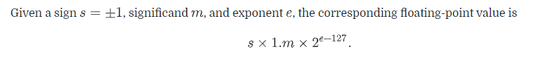

s 代表符号, m 代表基数, e 代表指数

这个表示方法, 有以下特性

在 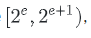 范围内, 最小的差值是 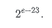

我们把这个最小的差值, 称为 ulp, unit in last place (“ulp”)

注意到, ulp 依赖于它的区间, 所以表示的数字越大, ulp 也越大.

该表示方法存在特例,

0的表示, 也就是 e = 0, eb = -127 的情况, 我们不使用 1.m, 使用 0.m

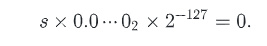

那么, 我们表示的, 距离 0 最小的值是:

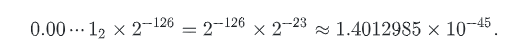

这一类数被称为 非规格化浮点数 (denormalized numbers)

注意到, 这里的这种表示, 浮点数的0表示分为 +0.0 和 -0.0

对于 e = 255 的情况, 也是特殊情况

如果基数全是 0, 那么就表示 正无穷大 和 负无穷大

如果基数不全是 0, 那么就表示 NAN

## 有用的操作

1. 互相转化的接口

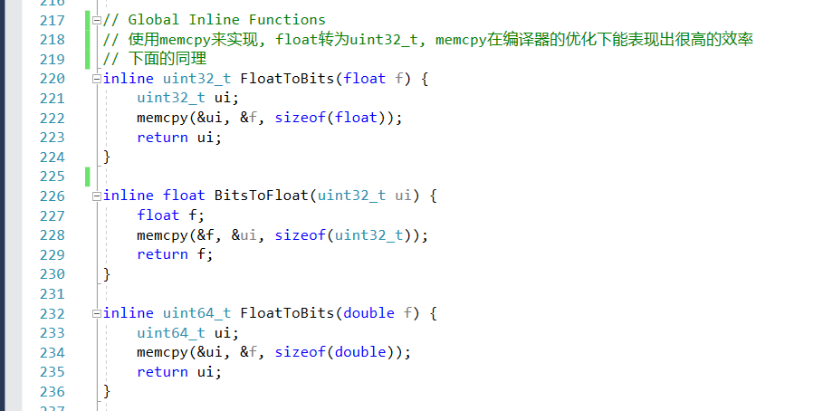

2. 获取下一个, 或上一个, 可以得到的最近的 浮点数

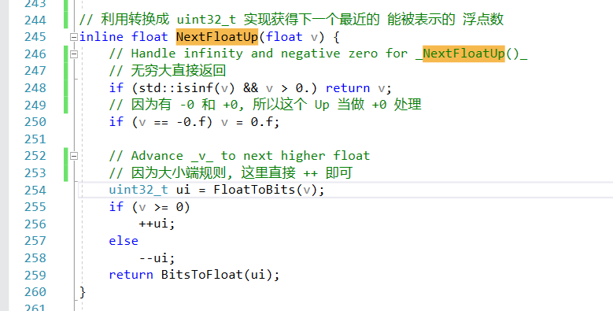

## 算数运算

根据 IEEE 754 提供的算法, 浮点数的算法符合 2 个要求

 - same input, same output, output is float
 - for infinite-percision, return cloest result

对于浮点数的运算, 我们可以表示为：

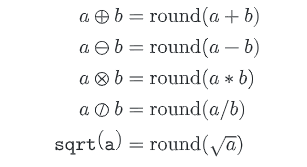

round 表示选择 最近的一个可以表示的 浮点数, 我们假设 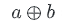 存在一个极小的区间内：

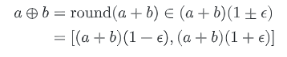

根据 round 的原理, 这个 e 必定在 ulp / 2 的正负区间内

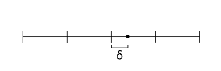

因为如果超过了 ulp / 2, 那么就会选择 另外一个浮点数值

当我们选取 eb = 0 时, 那么 e 的范围就是：

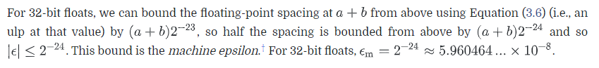

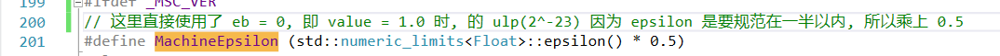

所以,   为：


对于浮点数运算, 有一些精确的运算

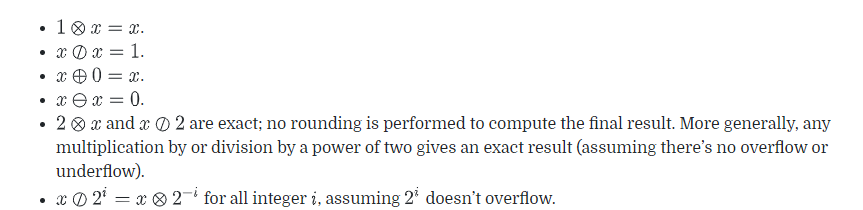

其中 乘除 2 都是在不溢出的情况下, 能做到精确

## 误差传递

在一次浮点计算后，得到结果

```mathjax!
$$Round(result) = \tilde{a}$$
```

我们把这个计算结果，和真实的值的误差，称为绝对误差

```mathjax! 
$$\delta_{\mathrm{a}}=|\tilde{a}-a|$$
``` 

那么当 a 不为 0 时，我们有 绝对误差 的概念

```mathjax! 
$$\delta_{\mathrm{r}}=\left|\frac{\tilde{a}-a}{a}\right|=\left|\frac{\delta_{\mathrm{a}}}{a}\right|$$
``` 

那么，我们计算出来的 a 值，和真实的 a 值的关系是：

```mathjax! 
 $$\tilde{a}=a \pm \delta_{\mathrm{a}}=a\left(1 \pm \delta_{\mathrm{r}}\right)$$
``` 

下面举例，对于 a, b, c, d 四个数字，他们做浮点数加法，我们计算 r = a + b + c + d，得到的结果 和 其误差是：

```mathjax! 
$$\begin{aligned}
(((a \oplus b) \oplus c) \oplus d) & \in\left(\left(\left((a+b)\left(1 \pm \epsilon_{\mathrm{m}}\right)\right)+c\right)\left(1 \pm \epsilon_{\mathrm{m}}\right)+d\right)\left(1 \pm \epsilon_{\mathrm{m}}\right) \\
&=(a+b)\left(1 \pm \epsilon_{\mathrm{m}}\right)^{3}+c\left(1 \pm \epsilon_{\mathrm{m}}\right)^{2}+d\left(1 \pm \epsilon_{\mathrm{m}}\right)
\end{aligned}$$
``` 

因为 Em 是一个趋近于 0 的数，所以我们在 它的等价的泰勒展开上，再加上 Em 来获取它的区间

```mathjax! 
$$\left(1 \pm \epsilon_{\mathrm{m}}\right)^{n} \leq\left(1 \pm(n+1) \epsilon_{\mathrm{m}}\right)$$
```

通过简化，我们的 a + b + c + d 的计算结果

```mathjax!
$$\begin{aligned}
(a+b)\left(1 \pm 4 \epsilon_{\mathrm{m}}\right) &+c\left(1 \pm 3 \epsilon_{\mathrm{m}}\right)+d\left(1 \pm 2 \epsilon_{\mathrm{m}}\right)=\\
& a+b+c+d+\left[\pm 4 \epsilon_{\mathrm{m}}(a+b) \pm 3 \epsilon_{\mathrm{m}} c \pm 2 \epsilon_{\mathrm{m}} d\right]
\end{aligned}$$
```

所以误差是：

```mathjax!
$$4 \epsilon_{\mathrm{m}}|a+b|+3 \epsilon_{\mathrm{m}}|c|+2 \epsilon_{\mathrm{m}}|d|$$
```

这里有一个很有趣的现象，先进行运算的内容，它的误差累计会越多，显然不符合我们的预期。

于是，根据 Higham 发表的一篇[论文](http://www.pbr-book.org/3ed-2018/Shapes/Further_Reading.html#cite:Higham2002)，我们可以把误差写作：

```mathjax!
$$\left|\theta_{n}\right| \leq \frac{n \epsilon_{\mathrm{m}}}{1-n \epsilon_{\mathrm{m}}}$$
```

我们把它记做 gama

```mathjax!
$$\gamma_{n}=\frac{n \epsilon_{\mathrm{m}}}{1-n \epsilon_{\mathrm{m}}}$$
```

在代码中，是这样表示的

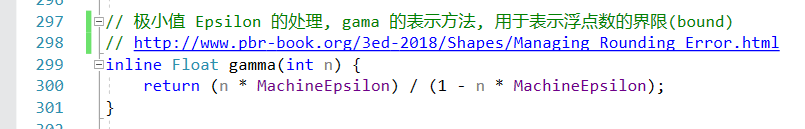

对于 r = a + b + c + d，我们的误差变为

```mathjax!
$$|a+b| \gamma_{3}+|c| \gamma_{2}+|d| \gamma_{1}$$
```

当然，这里先做运算的也会使得误差变大，但是整个范围被限制了。

对于加减乘除的算法，我们的误差范围处理：

除法：

```mathjax!
$$\frac{\left(1 \pm \epsilon_{\mathrm{m}}\right)^{m}}{\left(1 \pm \epsilon_{\mathrm{m}}\right)^{n}} = \left(1 \pm \gamma_{m+n}\right)$$
```

乘法:

```mathjax!
$$a\left(1 \pm \gamma_{i}\right) \otimes b\left(1 \pm \gamma_{j}\right) \in a b\left(1 \pm \gamma_{i+j+1}\right)$$
```

加法：

```mathjax!
$$a\left(1 \pm \gamma_{i}\right) \oplus b\left(1 \pm \gamma_{j}\right) = a\left(1 \pm \gamma_{i+1}\right)+b\left(1 \pm \gamma_{j+1}\right)$$
```


## 运行中的误差分析

pbrt 提供了一个类，Efloat 来处理浮点数的运算误差

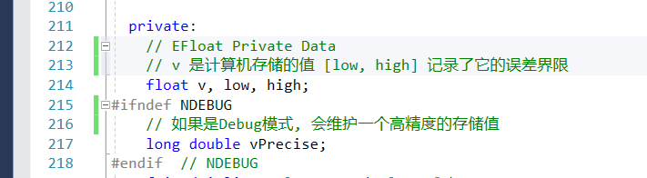

对于浮点数的加法运算，误差区间也会做相应的运算：

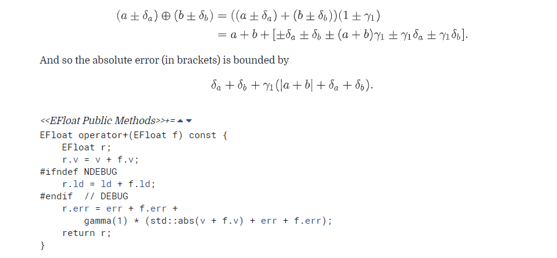

其他运算同理

该类会提供一系列的API常用接口

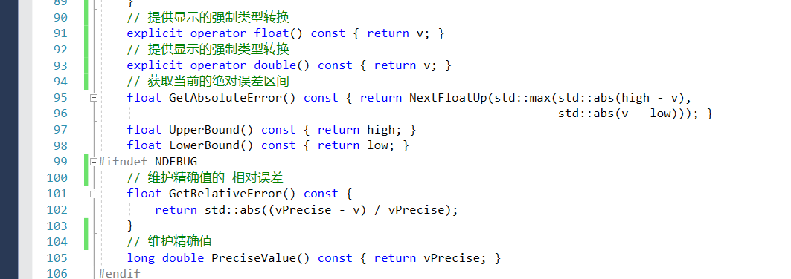

## 保守-边界-射线相交运算

对于边界（Bound) 我们利用误差估计, 做保守的算法

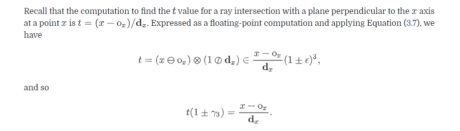

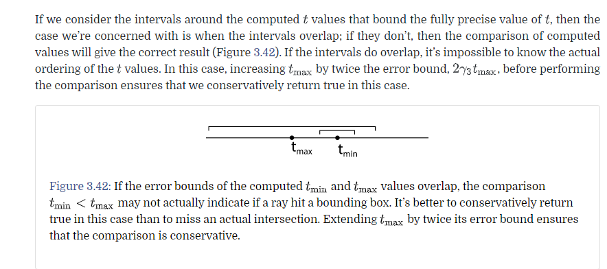

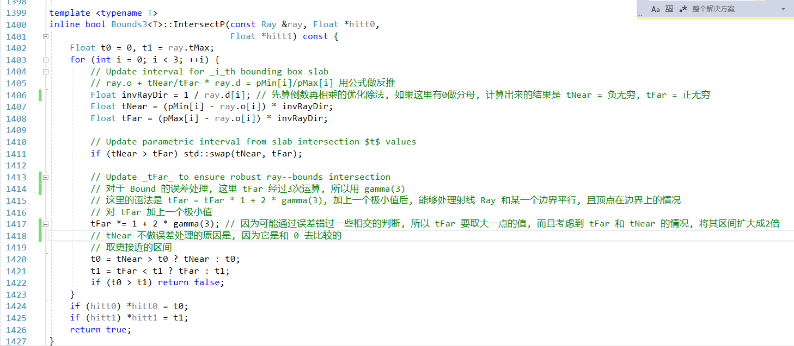

## TODO 后面这一部分暂时跳过, 是误差控制在 各种图形算法中的一些应用