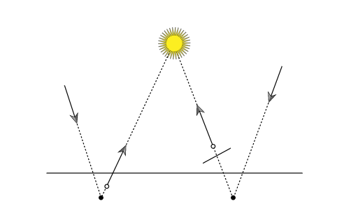
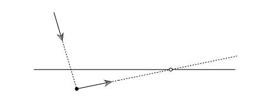

# 浮点运算的误差处理

### 问题所在

在做各种射线相交，反射时，会出现因为计算精度不够而产生的浮点误差。

这些误差可能导致，我们得到的交点，实际在平面的上或者下，这样会产生阴影，或者位移（有光缝等概念

当然，这个问题有简单的解决方法，就是加位移（一个极小量的偏移值

这个方法参考 opengl 的初学者 demo中对阴影纹理的处理

当然，这种方法也不靠谱，因为当角度偏移很大时，需要一个非常大的偏移值。

这个偏移值大了，也会影响效果。

