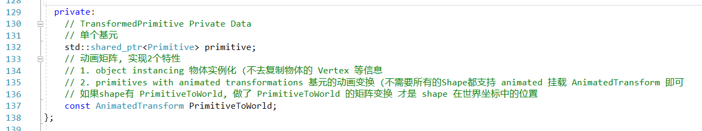
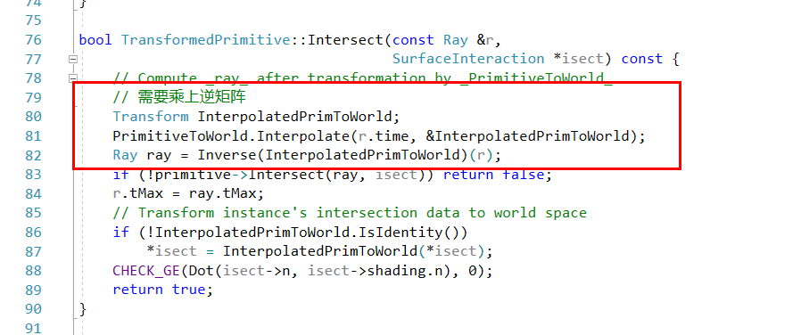

# 基元和交点区域加速

 终于看到第四章了, 这里开始讲如何跟渲染有关的内容了
 
 ## 基元接口 和 几何接口 
 ## Primitive Interface and Geometric Primitives
 
 基元接口的类函数解析

### 几何基元

### 变换基元

变化基元存在的目的是2点
 - 实现物体的实例化（同一种Mesh的不同位置
 - 实现物体的动画变化
 
 所以在相关计算的地方，会比原来的计算多乘上一个矩阵
 

 