# BVH 算法

BVH 是基于物体的细分算法，它的大意如下：

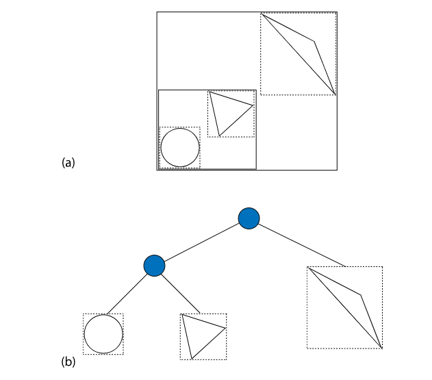

- 它的根节点就是整个场景
- 叶子节点就是 primitive
- 如果 Ray Insert 不与子节点相交，子树就会被忽略
- 每个子节点，即每个 primitive 只出现一次

这里提供了 BVH 树的算法，总共 4 种。

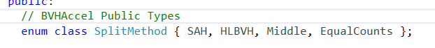

- SAH： 表面积启发算法，默认值
- HLBVH：构建树的效率低于 SAH，但是更适合并发
- Middle，EqualCounts：更少的计算量，但是构建的树的精度不高

## BVH流程

bvh的流程主要分三步

- 计算所有的 primitive 的 bounding，并存在一个数组中
- 根据算法来构建一颗二叉树，每个叶子节点有着对 一个或者多个 primitive 的引用
- 将树转化为更紧凑的无指针的表达模式（更加紧凑

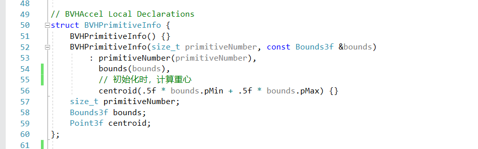

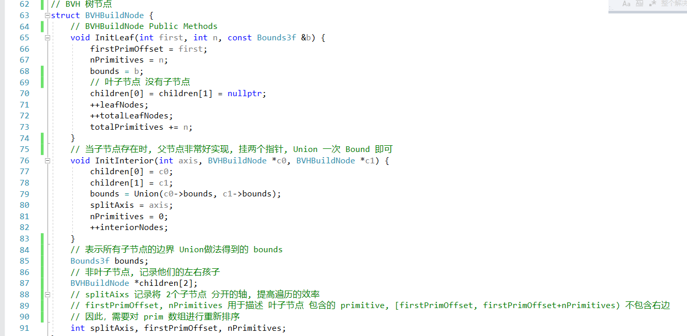

这是用到的数据结构

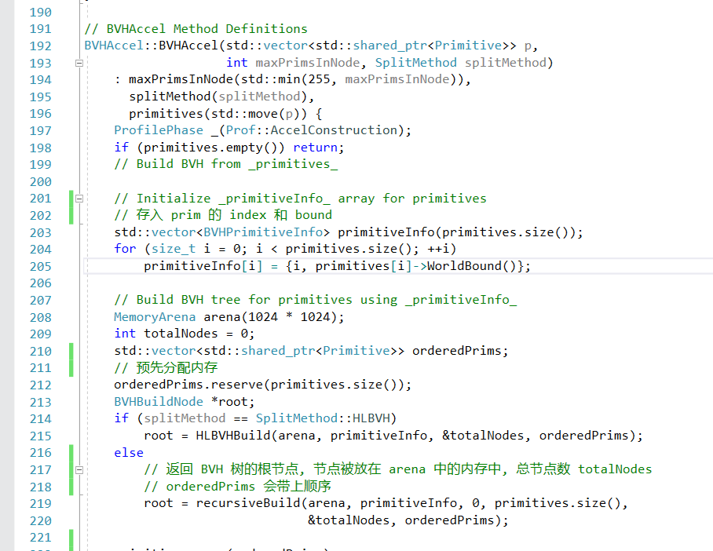

这是第一步

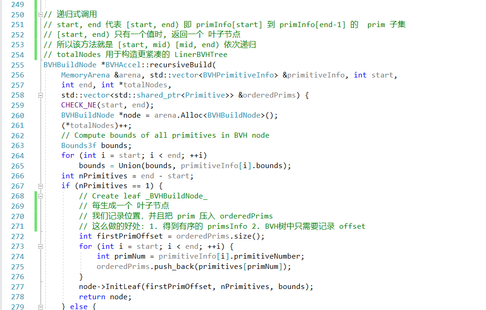

开始递归处理，叶子节点非常好处理

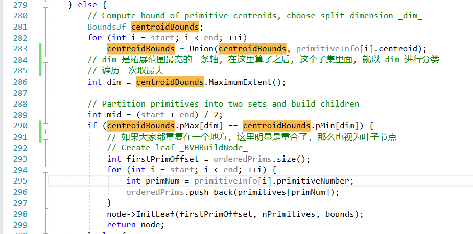

选一条最长的边，尽可能少的 overlape

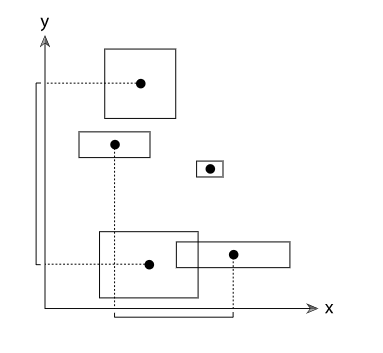

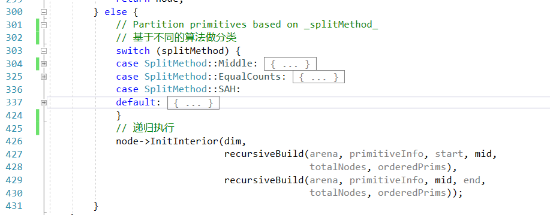

这里分别讲解不同的，将一堆 primInfo 拆分成两类的算法

### Mid

直接取平均值, 用 C++ 和 lambda, 一个函数就可以搞定

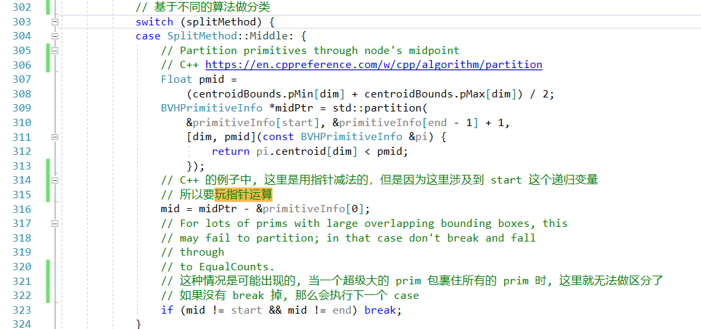

但是有一种情况无法处理：

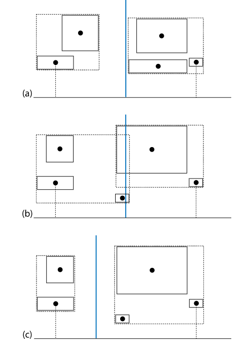

- a 情况，用 Mid 处理非常合适
- b 情况，这种方式就不是很好了，因为2个子节点有重叠的地方（做BVH遍历的时候，就需要遍历更多
- c 情况，这个才应该是 b 情况的划分方式，这样在做渲染时（BVH遍历），我们的消耗会更少

### 中位数

在Mid不能分割的情况下，只能去中位数，而且，这里，只关心重心位置，不关心 Bound

所以只能减少少部分的消耗

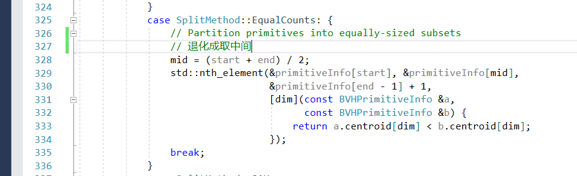

## SAH 表面积启发算法（贪心算法

首先，复习一下[贪心算法](https://houbb.github.io/2020/01/23/data-struct-learn-07-base-greedy)
- 贪心算法 追求的是局部最优解
- 一系列的局部最优解组成全局解（这个不一定是最优解，但一定是一个较优解

我们回想我们的目的
- 通过加速结构，让我们的 Ray-Insert 计算次数最少

现在，我们假设有一个中间节点，如果将它作为叶子节点，那么我们需要做的 Ray-Insert 就是遍历的代价

$$\sum_{i=1}^{N} t_{\text {isect }}(i)$$

这是我们需要付出的代价

那么，假设，我们把这一个 中间节点，分成了A，B两块

$$c(A, B)=t_{\mathrm{trav}}+p_{A} \sum_{i=1}^{N_{A}} t_{\mathrm{isect}}\left(a_{i}\right)+p_{B} \sum_{i=1}^{N_{B}} t_{\mathrm{isect}}\left(b_{i}\right)$$

其中参数意义
- $t_{\mathrm{trav}}$  Ray和中间节点的大Bound的计算时间，这个是一个常量
- $p_{A} p_{B}$ 是Ray与 A 集合，B集合 相交的 **概率**

在 pbrt 中 $t_{\mathrm{isect}}$ 是非常好估算的，我们下面考量的就是这个概率的表示

而这个概率，因为它的物理意义是射线与某个Bound相交，假如有两个 Bound A，B，在已经和 B 相交的情况下，和 A 相交的概率，就是 他们的 体积比

$$p(A | B)=\frac{s_{A}}{s_{B}}$$

所以这里的概率，就转换成了体积比

我们用 2维 的例子看一下，就明白了

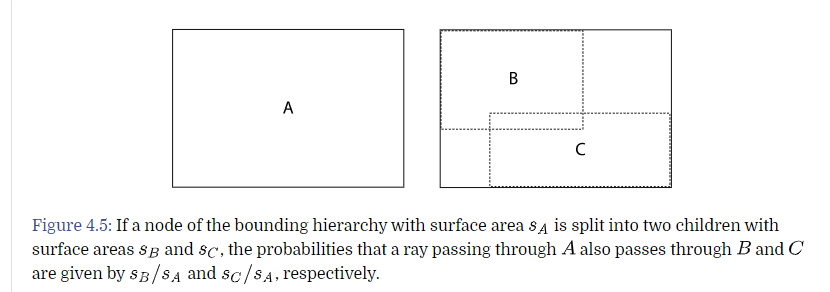

对于这种算法，在中间节点只有几个的时候就不划算了，所以直接做拆分

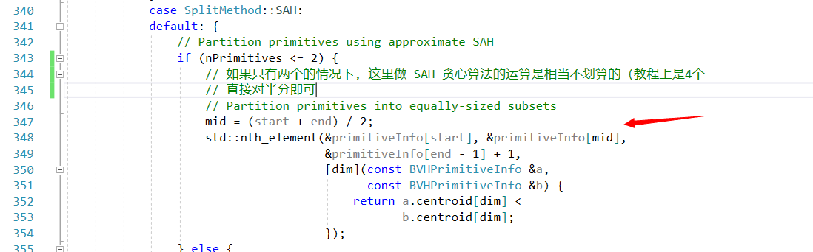

然后是，对轴的拆分，假设有 n 个 Prim，这里不做枚举法来计算代价，而是根据轴，做等分，然后用等分的边界来做拆分，因为这样做的结果基本上跟枚举一致

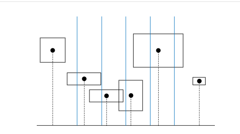

这每一个等分，在代码里，被称为 Bucket

把属于这个 bucket 的 Prim 做合并

然后是对 11 个 bucket 进行遍历，计算开销

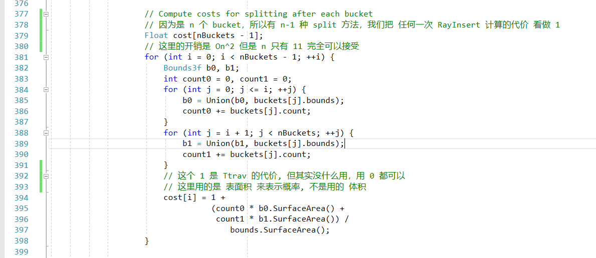

结束拆分，最低要求是比遍历的开销低

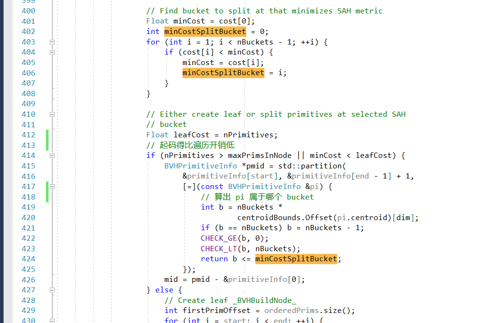

 