# Linear BVH

线性BVH结构

SAH算法的缺点
- 计算Surface的代价过大
- 自顶向下的算法设计，导致了无法很好的做并行处理

### 莫顿编码

首先介绍一种编码, **莫顿编码**

莫顿编码是一种将多维的点，以一维的方式进行映射的方法，比如一个系列2维的坐标，(xi,yi) 他们转换到一维是

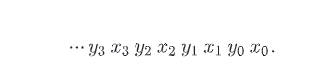

在坐标轴上, 如果我们用二进制来表示横纵坐标, 那么我们的二维的点会是这个形状

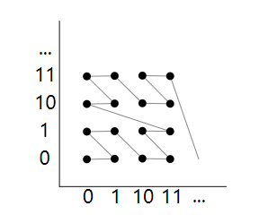

这个形状也被称为 Z排序，他有很多的特性

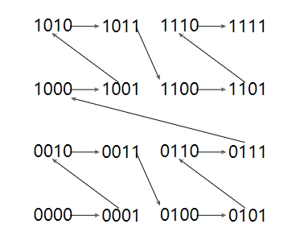

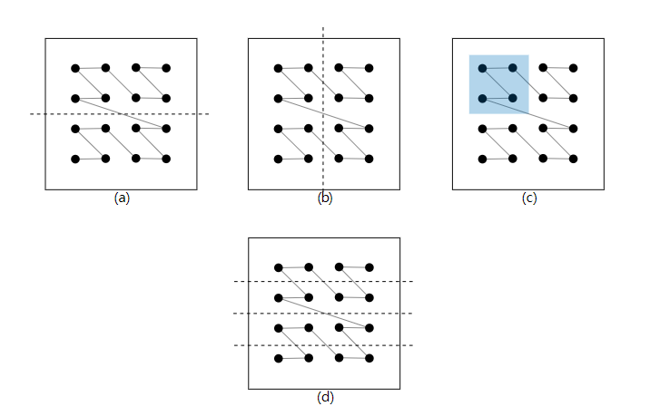

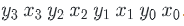

- y3 = 1 可以把图形分为 2 部分 (a)
- x3 = 1 同理 (b)
- y3 = 1, x3 = 0 可以得到一块内容 (c)
- y2 = 1 可以把图形分为 4 块

这个性质，非常适合拿来做 BVH

### 并发计算中心点的莫顿码

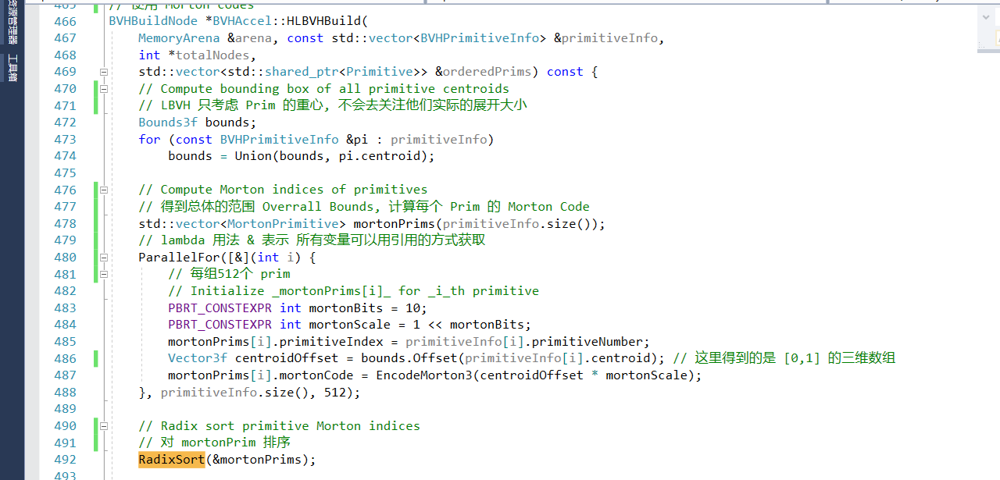

对带有莫顿码的 Prim 进行 基数排序

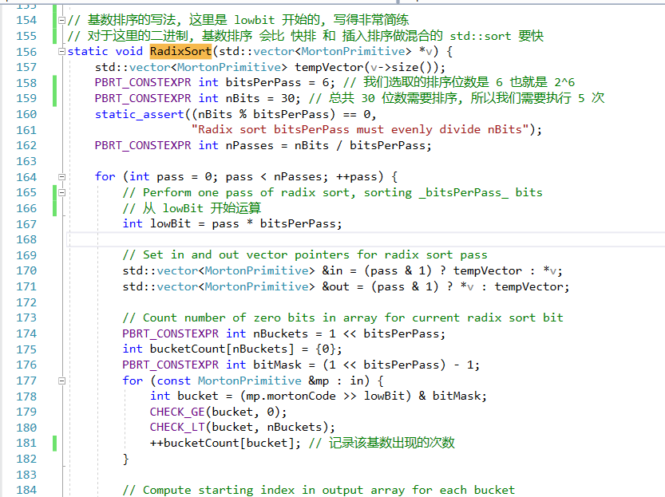

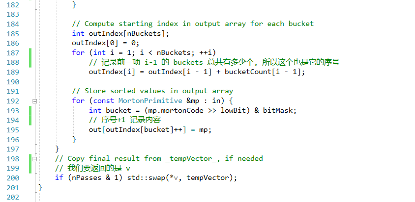

### 并发的构建子树

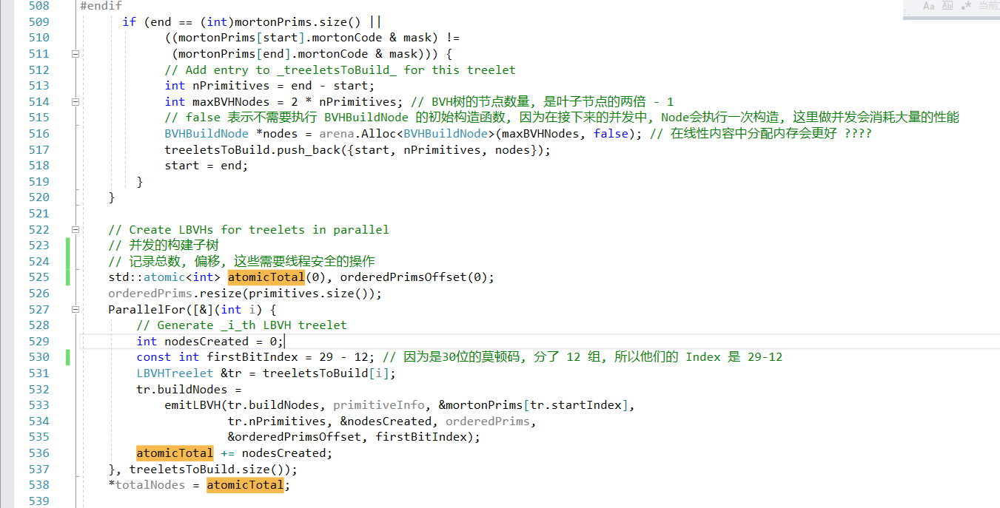

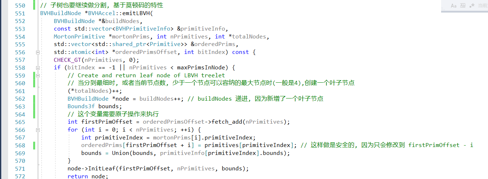

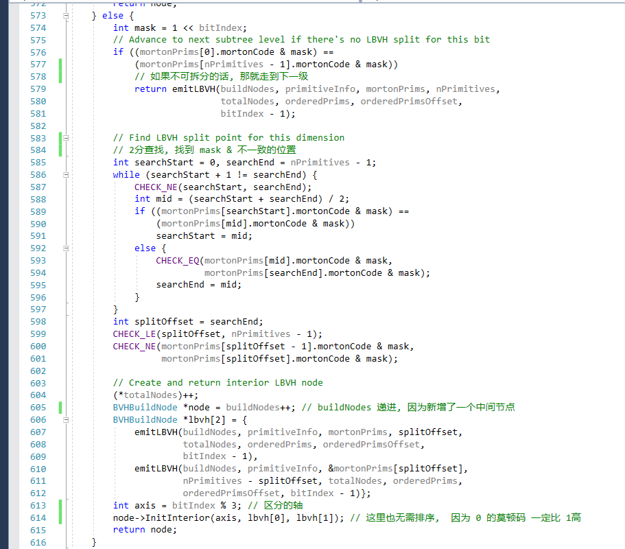

### 最后进行SAH算法(对剩下 4096 颗树)

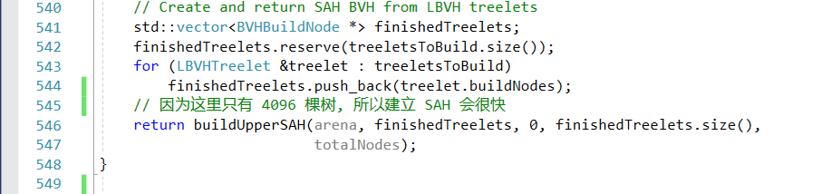

