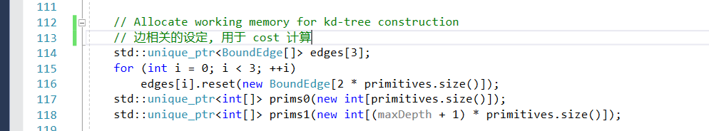
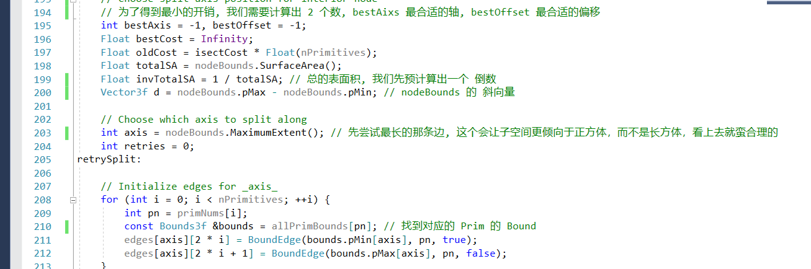

# BSP

BSP 全称 **Binary space partitioning**, 对空间进行二进制的分割

对比 BVH，它的不同是

- 任意分割，对不规则的情况有更好的处理
- 对于被一个平面分割为2块

BSP 有两种方法实现，kd树 和 八叉树（Octree

本篇只讨论 kdTree

## kdTree 表示

中间节点需要以下信息

- Split Aix：是在哪条轴做切分
- Split Pos：切分的位置
- Children：指向它的孩子（可以指针，也可以线性

叶子节点需要记录他们重复的 Prim

这里使用了 Union 的结构, 甚至充分的利用了 32位的bit，可以说是省到了极点。

两种节点的初始化

## kdTree 构建

kdTree的构建的每一步，只会有2种结果

- 生成一个中间节点，将区域分为 2 部分
- 生成叶子节点，结束当前的递归

我们的kd树构建的前序步骤

这里需要留意的是，这里的根节点, 传入的数据, 是它包含的所有 Prim 下标

节点的构建

对于中间节点, 跟 BVH 算法很像的，它也是走一个开销

这里的  是指未分割的情况

be 是一个参数，如果分割 ????

在这里, Split 做分割的可能边界是：

每个 Box 的 Bound。

对于边界，要做一次存储

然后是最小开销的计算

这里需要做一次排序 sort

分块的表面积概率计算

这里要考虑一种分割时的特殊情况

传递当前使用的数据，也非常的 trick

## kdTree 遍历

kdTree 的遍历，是一个深度优先遍历，从前到后 的遍历模式（因为前面相交了，这是一个更近的交点，后面就不需要考虑了

在这里 kd树 采用的是用堆栈来帮忙遍历（记录第二个子节点

我们需要考虑几种特殊情况

- 当 Prim交点 在节点的外面时（或者上一层已经算出了交点，然后来到了一个比上一层计算中，距离远的子节点

- 这里一定要做方向判断，可以简化很多计算！

- 这里可以考虑各种情况，来做减枝

