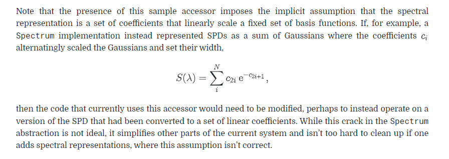

# 辐射度

In this chapter, we will introduce four key quantities that describe electromagnetic radiation: flux, intensity, irradiance, and radiance.

这里有4个关于光的属性， 光通量，强度，辐照度，辐射度，看这个[链接](https://www.junpin360.com/html/2015-04-12/4088.html)

### 光通量

### 发光强度

### 光照度

### 光亮度

TODO： 维基百科上会更详细，但是暂时被封了，回去翻墙查。

# 光谱表示

真实的光谱非常复杂，a 是自发光的光谱分布，b 是柠檬皮的反射光谱分布

我们的基础思想是根据简单的基函数来表达复杂的光谱变换

在 pbrt 中，提供了两种表达思路

- RGB光谱，基于计算机的 RGB 模型的光谱表达
- 采样光谱，对一组波长样本中进行点采样的光谱表达

# 代码中的光谱

光谱相关的代码都在 spectrum.h 中

光谱使用的是静态的类来表示，因为光谱是非常底层的类，所以当这个进行改动后，整个底层系统都会被改动

使用静态类的好处有

- Spectrum 中很多函数可以用 inline 的方式进行实现，而不是通过虚函数继承的方式实现，前者效率会高很多。
- Spectrum 需要进行保存，用静态类进行保存，会比动态的根据光谱的类型进行保存效果要高很多。

???? 这2点优点具体原因？没看明白，后续结合 C++ 基础来拆解

# CoefficientSpectrum  的实现

两种光谱的实现，都是基于存储固定数量的SPD样本实现的

RGBSpectrum ， SampledSpectrum 的实现都部分继承了 CoefficientSpectrum

它的初始化是一组波长上的恒定值的初始化

这里是基础的加减乘除的实现

是否是黑的判断

我们也同时支持一些基础的计算（这些对后面进行 菲涅尔效果或其他效果 的时候会非常有用

注意到，这里都是使用 inline 函数（对于短函数，使用内联能提高效率

???? 这一段每看得太懂，大致是，目前的这一套，是线性的，如果是高斯分布的，需要把基本的内容做改动。

