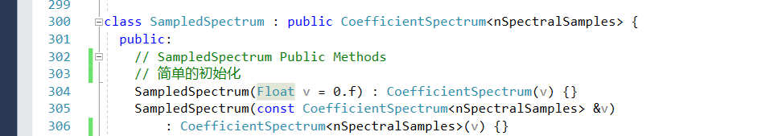
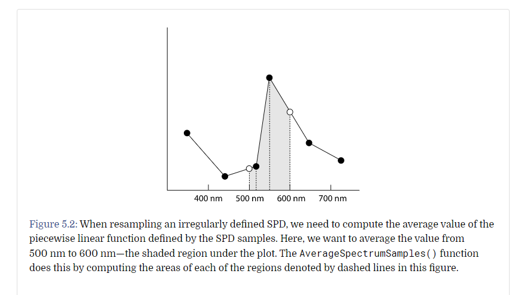
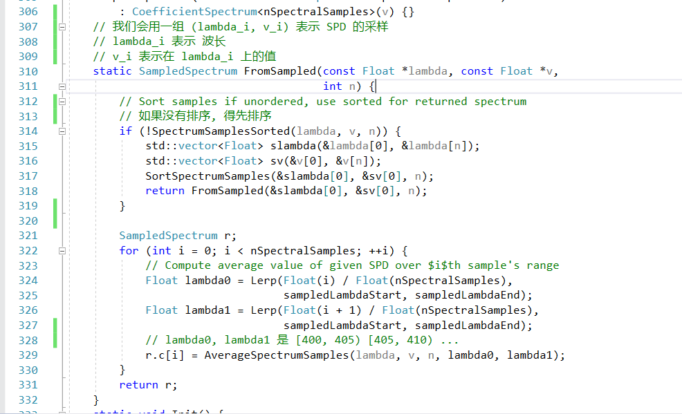
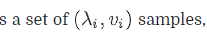
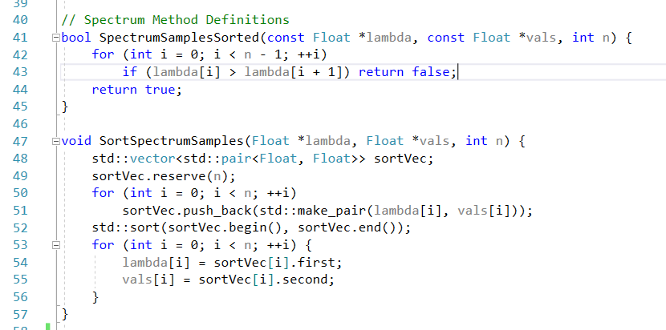
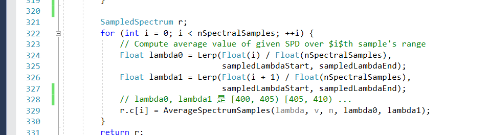
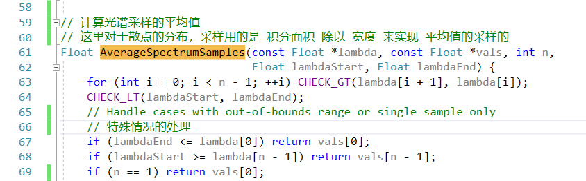
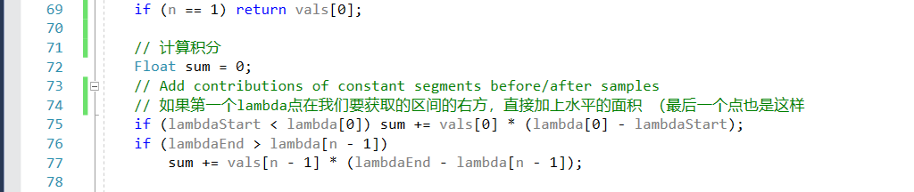
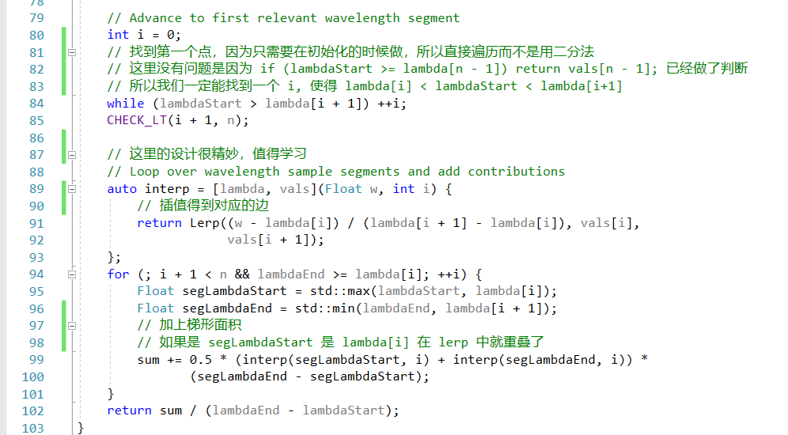

# 采样光谱

采样光谱沿用了 参数光谱的基础架构，它是用一个均匀的空间，用 60 个样本，对 400-700 nm 进行采样

400-700 是人类最敏感的范围，我们进行 60 个样本，也是为了足够细

第一个空间是 [400, 405）第二个是 [405, 410)

采样光谱的初始化

采样光谱会根据一系列的 波长-采样 数据，来进行初始化内容

我们计算对应区间的波长，是用，计算出的覆盖面积，除以底边的宽度来计算的

我们的输入是 
- lambda[i]: 第i个数据的波长
- v[i]: 第i个数据的光谱

这里是一个排序的写法，很简单，用的std的库

挨个区间，去计算平均值

这里先计算头尾

计算梯形面积，设计精妙，值得学习

