# XYZ 形式

对于光谱，我们将其定义为 SPD，根据物理学的原理，我们可以把光谱分为 XYZ 的3条匹配曲线

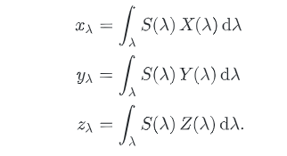

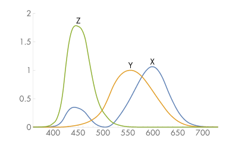

文中的3条曲线，分别是 X(λ)，Y(λ)，Z(λ)，这是人眼最敏感的三段曲线

而计算出来的三个值，小写的 xyz，是表示该光谱 SPD，在人眼中，在这三段曲线的视图下，他们的 **系数**

所以这里是 **系数**，他们其实是常量

而且，在这里，SPD，也就是 S(λ) 还满足

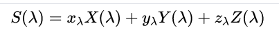

这里是个人理解，从能量的角度，XYZ相当于是在三个频段上的分布，而他们的权重和，就是应该等于总的 SPD

下面是代码部分

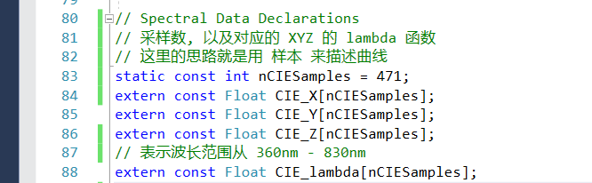

这里对应的是 XYZ 曲线，以及他们在 [360nm-830nm] 的样本分布，这里的数据非常精确，因为这个是我们的 XYZ 的基础匹配曲线

对于 XYZ，他们本身也是光谱，这一点理解非常重要，因为他们表示的是总 SPD 在三段曲线上的分布，所以他们合起来是 SPD，但本身也是光谱

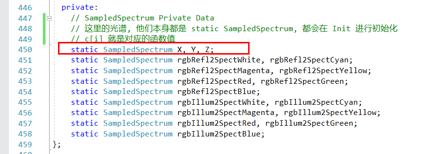

这是他们在代码中的定义

因为他们本身也是光谱，所以需要做初始化计算（提供的初始数据太精确了，其实我们只需要 60 间隔的采样信息

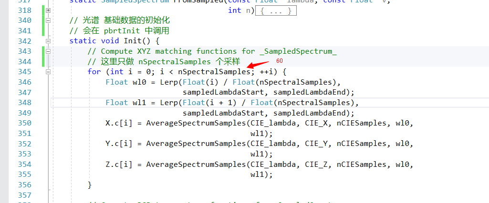

计算的方法就是用的采样算法

注意到，这里光谱的 Init 函数是静态函数，没错，XYZ是静态变量，他们会在 pbrtInit 中被初始化

下一步，我们就是计算 **XYZ系数**

拿X举例，X系数的计算方式为：

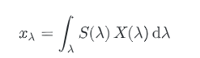

这里是 乘积 再 乘上 λ 的微分，所以有

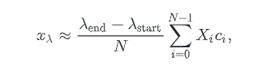

在代码中是

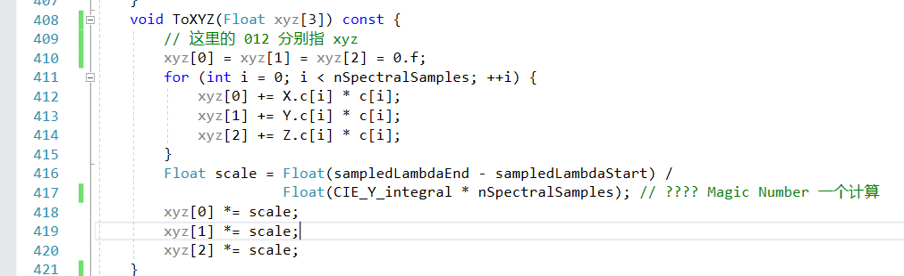

TODO：这个 Y_intergal 不知道是干嘛的，但因为用这个方法是计算出常量，所以把它当成一个 Magic Number即可

这里特别提了一点，Y曲线上的分布，其实跟我们人眼的 亮度 感观很有关系，所以单独做了出来

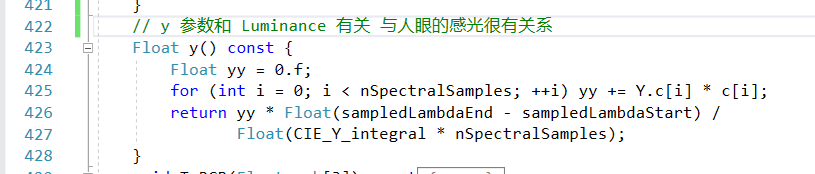

# RGB 形式

现在的问题是，我们机器的表示光的方法，是用 RGB 三种不同颜色的灯来表示的，与我们人眼接受的 XYZ 形式，是有区别的。

当然，如果把机器的 RGB 作为一个光谱，我们也可以得到人眼对应的 XYZ 分布，这个每个机器都是不一样的

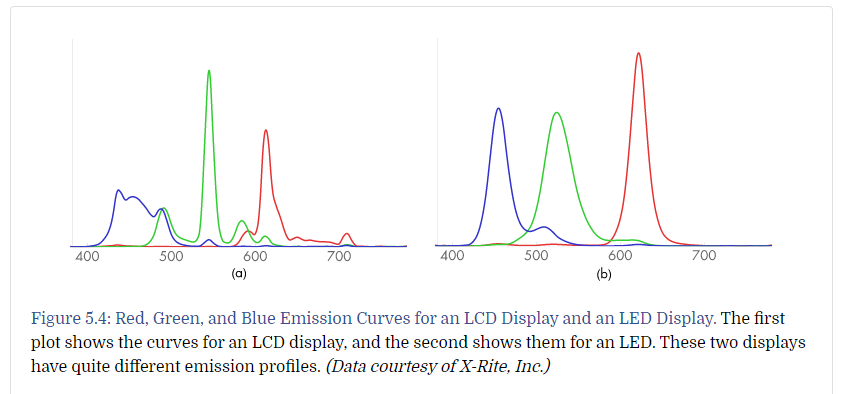

左边是LED，右边是LCD

那么，同样与人眼有 XYZ 三条曲线，那么对于 RGB，也会有 三条曲线

对于 R

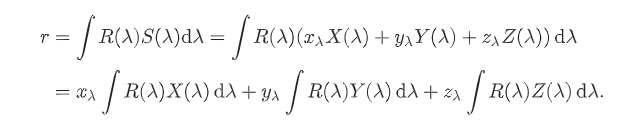

将其拓展到 RGB

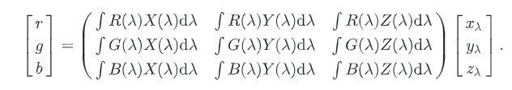

这个形式是不是很眼熟，没错，就是矩阵的形式，我们可以把它理解为 XYZ基底，和 RGB基底

他们也有相互的转换代码

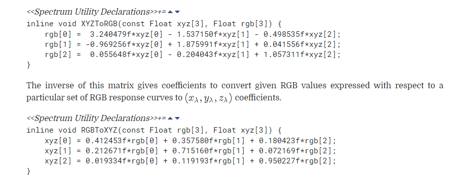

# 构建SPD

在我们获得到一个物体时，我们不太可能能够得到一整段的SPD的频谱分布

但我们往往只能得到一个物体的 RGB 颜色，这时，就需要一个流程去 构建SPD

构建SPD，显然，有很多的解法，但我们需要构建的 SPD 满足

- 如果RGB是常量（对于所有的lambda，波长），SPD也应该是常量
- SPD应该尽可能的平滑，这样才接近自然界中的物体

其中，Smits 提供了一个比较通用的方法

首先，将物体分为 2 种，反光体和反射体

计算，各种物体的各个颜色的，发光和反射的 SPD

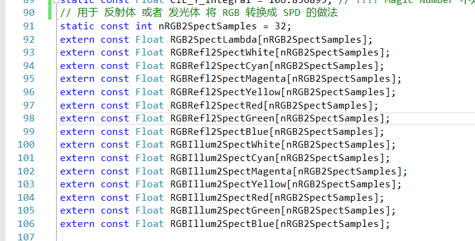

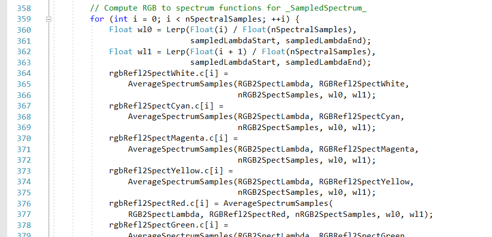

这些基础的 SPD 也会在初始化的时候被构建（他们也有科学家提供的采样数据

我们在计算时，只需要知道 RGB 和 是发光体和反射体即可

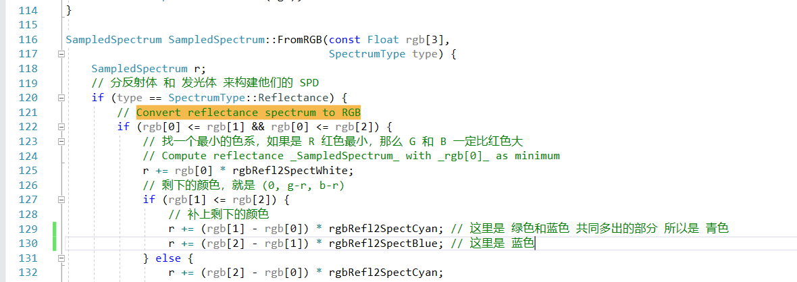

# 其他

文中有一些 RGB，XYZ的相互转换函数，就不细谈了
