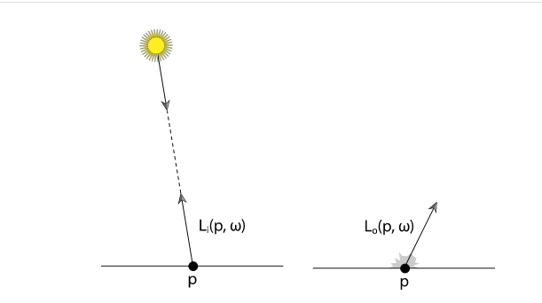
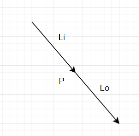

# 辐射学的基础理论

辐射学的基础理论基于光的粒子理论的。

在pbrt中，我们给我们的辐射光理论以下的设定

- 线性： 两组输入的结合效果，等于各自输入获得的效果的和，即

```mathjax!
$$ L(input_0 + input_1) = L(input_0) + L(input_1)$$
```
- 能量守恒：当光在表面进行散射时或者通过一个介质时，出射的能量一定不会超过入射的能量
- 无偏振：我们忽视光的偏振现象，光的唯一属性就是他的波长（或者是等效的频率
*个人理解：光的偏振就是波动性，我们不去考虑，波长和频率的乘积等于光速，他们呈反比*
- 无磷光和荧光现象：光在一个波长上的表现，是完全独立的，与其他波长无光。（这两种光的现象的实现意义真的太小了
- 状态稳定：如果光在环境中的状态达到了稳定，那么它的分布就不会在变化了。（在现实生活中，这些内容每分每秒都在变化

采用几何的光照模型，比较难解决的一个点是光的衍射和干涉现象无法实现，但是这个不在考量范围之中了。

# 基础知识点

对于光，有4个基础概念
- flux（光通量）
- irradiance / radiant exitance （辐射度、辐射出度）
- intensity （光照强度）
- radiance （辐射）

这4个概念，可以从时间，面积，方向等角度计算出来。所有这些概念都是跟**波长相关**的。这个概念非常重要。

### Energy（能量

能量，它的单位是 焦耳（**J**oules )

照明源发射光子，每个光子都会处于特定的波长，并携带特定的能量。

所有的基础的，辐射的概念，都是用不同的方法，去测量光子。

一个光子，它所处的波长是 λ，那么它携带的能量是：

```mathjax!
$$ Q = \frac{hc}{\lambda}$$
```

其中，C是常量，光速 ，h 是 普朗克系数 

### Flux （光通量

光通量表示的是，在单位时间内，光通过一块区域的总能量

我们使用，对时间求极限的方法，来表示光通量

```mathjax!
$$\Phi=\lim _{\Delta t \rightarrow 0} \frac{\Delta Q}{\Delta t}=\frac{\mathrm{d} Q}{\mathrm{d} t}$$
```

它的单位，是 焦耳/秒，更常见的单位是 瓦特（**W**）

比如在一小时内，一个光源发射了 200000 J 的能量，如果它是一直稳定的发射能量，那么它的光通量就是


反过来，给出一段时间，我们就能通过积分的方法，来求出这段时间内，发射的能量

```mathjax!
$$Q=\int_{t_{0}}^{t_{1}} \Phi(t) \mathrm{d} t$$
```


图中是一个展示光通量的例子，有大小两个球形的范围，他们的光通量是一致的。

虽然大球的面积大，但是它的每一小部分的通过的能量少

这里的 φ，表示的就是 一个点光源的光通量

# irradiance / radiant exitance （辐射度、辐射出度）

光通量，除以面积，就是辐射度和辐射出度。为什么会有两个概念呢？

- irradiance (E)，代表**入射度**，即**到达**表面的，光子的面积密度
- radiant exitance (M)，代表**出射度**，即**离开**表面的，光子的面积密度

对于在光通量中给出的例子，假设是均匀的球形，那么，我们的辐射度的计算就是：

```mathjax!
$$ E = \frac{\Phi}{4\pi r^2}$$
```

进一步的，我们对这个式子，改为除以面积，然后取极限

```mathjax!
$$E(\mathrm{p})=\lim _{\Delta A \rightarrow 0} \frac{\Delta \Phi(\mathrm{p})}{\Delta A}=\frac{\mathrm{d} \Phi(\mathrm{p})}{\mathrm{d} A}$$
```

同理，我们可以通过积分，来进行反求

```mathjax!
$$\Phi=\int_{A} E(\mathrm{p}) \mathrm{d} A$$
```

关于照射到表面，我们需要计算的是，垂直于光线方向的面积，当光线不是垂直照到表面时，需要
- 算出垂直的表面面积
- 才算出正确的光通量密度


# Solid Angle and Intensity （立体角，点光源强度

这里先引入两个概念，平面角和立体角

对于平面角


在点P观察物体，我们能看到弧长s包围住了物体，那么弧长S，也就是这个夹角 θ，表示的就是一个平面角。

那么，我们拓展到三维


这里的视角，单位是 sr，球体就是 4πsr，半球就是 2πsr

所以对于强度 I，那么它的单位就是 W/sr

对于一个完整的点光源来说，它的强度就是

```mathjax!
$$ I = \frac{\Phi}{4\pi}$$
```

推广到极限就是

```mathjax!
$$I=\lim _{\Delta \omega \rightarrow 0} \frac{\Delta \Phi}{\Delta \omega}=\frac{\mathrm{d} \Phi}{\mathrm{d} \omega}$$
```

反过来，积分就是

```mathjax!
$$\Phi=\int_{\Omega} I(\omega) \mathrm{d} \omega$$
```

这里的积分是，对立体角的，积分

注意，这里的光强度，**只对点光源有意义**（比如一个面光源，他是没有立体角度的说法的

# Radiance （辐射率 - 入射光

辐射率是最重要，最基础的一个概念。因为辐射出度，辐射入度的概念中，他们并没有包括，光沿着角度分布的信息。

所以我们给出了辐射率的概念。

个人的理解如下：

对于一个垂直的辐射度，我们可以有：


显然，对于角度的分布，这里没有做区别，所以我们要除上一个 dω

所以是：

```mathjax!
$$L(\mathrm{p}, \omega)=\lim _{\Delta \omega \rightarrow 0} \frac{\Delta E_{\omega}(\mathrm{p})}{\Delta \omega}=\frac{\mathrm{d} E_{\omega}(\mathrm{p})}{\mathrm{d} \omega}$$
```

所以，辐射度是，光通量的每立体角，每单位面积的单位，注意到，这里的单位面积，是垂直于光照方向的面积（也就是要乘上 cosθ

```mathjax!
$$L=\frac{\mathrm{d} \Phi}{\mathrm{d} \omega \mathrm{d} A^{\perp}}$$
$$A^{\perp}=\frac{\mathrm{d} A}{cos\theta}$$
```


# 入射光和反射光的方向问题

从这里开始，我们把 radiance 当做光来解析

对于一个表面而言，它在表面上，和表面下，发射的光的射线，我们做这样的定义

```mathjax!
$$\begin{array}{l}
L^{+}(\mathrm{p}, \omega)=\lim _{t \rightarrow 0^{+}} L\left(\mathrm{p}+t \mathrm{n}_{\mathrm{p}}, \omega\right) \\
L^{-}(\mathrm{p}, \omega)=\lim _{t \rightarrow 0^{-}} L\left(\mathrm{p}+t \mathrm{n}_{\mathrm{p}}, \omega\right)
\end{array}$$
```
即：


这是 L 正

那么 L 负就是


- np 指的是平面的法线
- ω 指的，是从**点P出发**的光照方向

然后，我们对于入射光，和出射光，做如下定义




这里注意
- **Li**  代表入射光
- **-ω** 代表是**到达P点**的光照方向
- 入射光和出射光，都会有两种情况，就是 ω 和 法线的相交情况，这其实是分类讨论的结果（或者说是，光是照在了正面，还是照在了反面

我们拿空间上的一点，做解析（而非平面上的一点



则有：


# 亮度
*个人想法，感觉这一部分没啥用*

按照光谱的玩法，光线会在人的感观视觉上做分布，有如下的设定

```mathjax!
$$Y=\int_{\lambda} L(\lambda) V(\lambda) \mathrm{d} \lambda$$
```

而且，V(λ) 会和 XYZ 的 Y 分布有一定的关系

这是一个正比的关系

```mathjax!
$$Y=683\int_{\lambda} L(\lambda) V(\lambda) \mathrm{d} \lambda$$
```

这里还有一张亮度表


# 单位表


