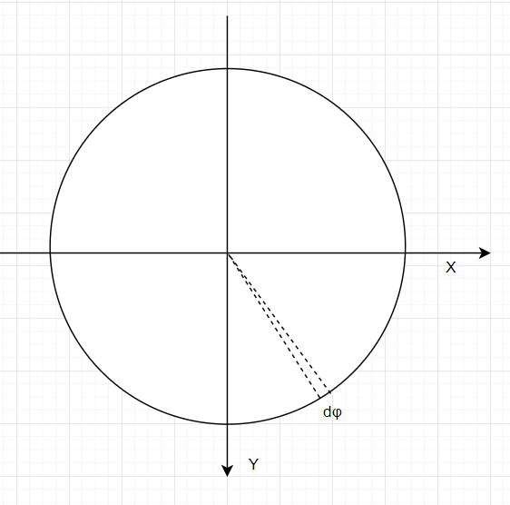

# 使用 辐射积分

对于以 n 为法线的平面，在平面上的点P，它的入射辐射是（**Irradiance** （辐照度

因为这里是一个点，所以我们需要当成 密度来算

```mathjax!
$$E(\mathrm{p}, \mathbf{n})=\int_{\Omega} L_{\mathrm{i}}(\mathrm{p}, \omega)|\cos \theta| \mathrm{d} \omega$$
```
- $L_{\mathrm{i}}(\mathrm{p}, \omega)$ 是入射光函数
- $\cos \theta$ 是因为我们的入射光，并不是全都垂直入射的，如果是斜着入射，需要乘上 cos 来获取垂直面
- $\mathrm{d} \omega$ 的积分范围是垂直于平面的半球体


下面提到的几种方法，都是对这条式子
```mathjax!
$$E(\mathrm{p}, \mathbf{n})=\int_{\Omega} L_{\mathrm{i}}(\mathrm{p}, \omega)|\cos \theta| \mathrm{d} \omega$$
```
的一个变体运算。

## 使用投影的固体角做积分

我们观察式子，很容易就注意到有这么一块，$|\cos \theta| \mathrm{d} \omega$那这一块是否能当成一个整体来求呢？

答案是可以的，这一块的几何意义就是，投影的固体角


计算固体角的步骤是
- 计算出包围物体的固体角，并求出它在单位球面上的范围
- 把范围投影在，垂直于法线的平面上
- 计算投影的**面积**

这里是需要计算投影的面积，因为固体角是三维的，所以它的投影，也是一块面积，而不是一段范围。

我们计算的投影固体角是：
```mathjax!
$$\mathrm{d} \omega^{\perp}=|\cos \theta| \mathrm{d} \omega$$
```
在半球上做积分
```mathjax!
$$E(\mathrm{p}, \mathbf{n})=\int_{\mathrm{H}^{2}(\mathrm{n})} L_{\mathrm{i}}(\mathrm{p}, \omega) \mathrm{d} \omega^{\perp}$$
```

如果要计算一个发光体表面的光，对面积做积分即可
```mathjax!
$$\begin{aligned}
\Phi &=\int_{A} \int_{\mathrm{H}^{2}(\mathrm{n})} L_{0}(\mathrm{p}, \omega) \cos \theta \mathrm{d} \omega \mathrm{d} A \\
&=\int_{A} \int_{\mathrm{H}^{2}(\mathrm{n})} L_{0}(\mathrm{p}, \omega) \mathrm{d} \omega^{\perp} \mathrm{d} A
\end{aligned}$$
```
*这里感觉没啥意义，就是多搞个对单位面积的积分而已*

## 使用球形坐标系来做积分

首先，我们知道球形坐标系是

```mathjax!
$$\begin{array}{l}
x=\sin \theta \cos \phi \\
y=\sin \theta \sin \phi \\
z=\cos \theta
\end{array}$$
```


那么我们用球形坐标系，来对 $\mathrm{d} \omega$ 做拆解

因为 $\mathrm{d} \omega$  是一个立体角（立体角可以理解成一小块面积），所以有


这里的  $\mathrm{d} \theta$ 很好理解，就是在Z方向上的，θ 角的微分单元

我们从俯视的视角看，能看到这样的情况



但实际上，我们要计算的立体角 $\mathrm{d} \omega$  使用的不是 $\mathrm{d} \phi$，而是乘上了一个 sin 的投影，所以有：

```mathjax!
$$ \mathrm{d} \omega = sin \theta \mathrm{d} \theta \mathrm{d} \phi$$
```

那么，如果对于法线方向上的正半球 $\Omega=H^2(n)$  ，我们去计算光子密度是

```mathjax!
$$E(\mathrm{p}, \mathbf{n})=\int_{0}^{2 \pi} \int_{0}^{\pi / 2} L_{\mathrm{i}}(\mathrm{p}, \theta, \phi) \cos \theta \sin \theta \mathrm{d} \theta \mathrm{d} \phi$$
```

如果这里的各个方向都是均匀的光照，这个积分可以计算，化简为：

```mathjax!
$$E(\mathrm{p}, \mathbf{n})= \pi L_{\mathrm{i}}(\mathrm{p}, i)$$
```

## 使用面积来做积分

想象一下，当光线从P点发出，照到一个表面 $\mathrm{d} A$ 时


在这里，θ 角的意义是，平面 $\mathrm{d} A$ 和方向 $\omega$ 的夹角

它和我们要求的 $\mathrm{d} \omega$  的面积比，可以用相似三角形算出来，因为单位半球的半径是 1，所以

```mathjax!
$$\mathrm{d} \omega=\frac{\mathrm{d} A \cos \theta}{r^{2}}$$
```

在这里，r 指的是，$\mathrm{d} A$ 到点P的距离

所以，我们的积分公式，就改良为：

```mathjax!
$$E(\mathrm{p}, \mathbf{n})=\int_{A} L \cos \theta_{\mathrm{i}} \frac{\cos \theta_{\mathrm{o}} \mathrm{d} A}{r^{2}}$$
```


这里的 2 个 θ 角度，是不同的意义