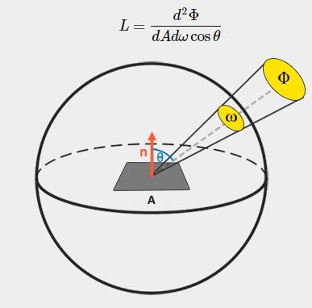
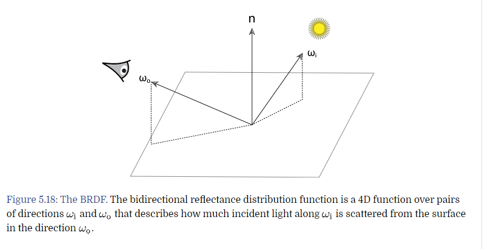
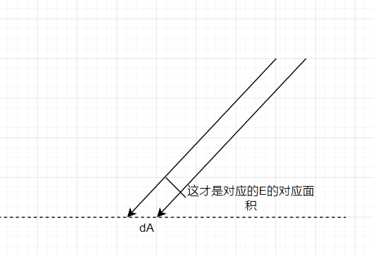
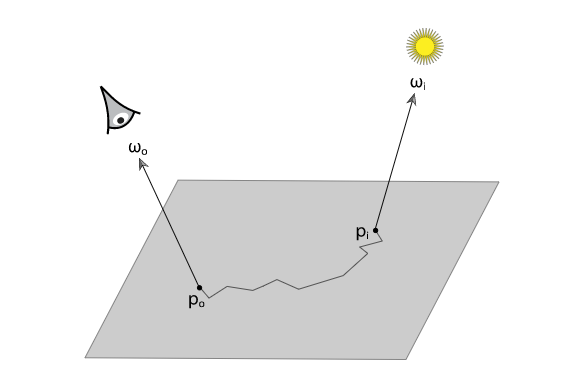

# 问题讨论

今天群里的大佬给出了一个疑问

在有的paper里面，Radiance 的公式是这样子的：



```mathjax!
$$L=\frac{d^{2} \Phi}{d A d \omega \cos \theta}$$
```

在这里的 $\mathrm{d^2} \Phi$ 中是两次求导，跟pbr中的写法，不太一致

```mathjax!
$$L=\frac{\mathrm{d} \Phi}{\mathrm{d} \omega \mathrm{d} A^{\perp}}$$
$$A^{\perp}=\frac{\mathrm{d} A}{cos\theta}$$
```

其实这里的二阶导数，只是一个理解问题，pbr的写法更好做理解，而paper中的写法，会更加准确

因为确实，是拿 φ 对 ω 和 A 做两次求导

但是 pbrt 为了方便理解，用单位 φ 来定义，做两次除法即可（即，pbr 中的 dφ 表示的是一个实际的光子密度

然后除上，单位面积和单位固体角，就等于 radiance，从理解上来说，也没问题

# 表面反射 （Surface Reflection

这里主要将介绍两种光照反射模型，**BRDF**和**BSSRDF**

- BRDF：忽视子表面的光的传播
- BSSRDF：在 BRDF 的基础上，支持半透明物体的子表面传播

# The BRDF
*bidirectional reflectance distribution function*

*双向反射率分布函数*



在之前的章节中，我们有如下定义


其中，Li 是入射光，Lo 是出射光

我们知道，入射单位面积的密度（**E**），就是 L 乘上 ω 的积分

```mathjax!
$$\mathrm{d} E\left(\mathrm{p}, \omega_{\mathrm{i}}\right)=L_{\mathrm{i}}\left(\mathrm{p}, \omega_{\mathrm{i}}\right) \cos \theta_{\mathrm{i}} \mathrm{d} \omega_{\mathrm{i}}$$
```

这里呢，有一个物理意义上的公式，这个，出射的辐射度（**Lo**）和入射的单位面积光子密度（**E**）成正比关系，即

```mathjax!
$$\mathrm{d} L_{\mathrm{o}}\left(\mathrm{p}, \omega_{\mathrm{o}}\right) \propto \mathrm{d} E\left(\mathrm{p}, \omega_{\mathrm{i}}\right)$$
```

那么，我们可以计算出这个比例，在这里，用$f_{\mathrm{r}}\left(\mathrm{p}, \omega_{\mathrm{o}}, \omega_{\mathrm{i}}\right)$表示 

```mathjax!
$$f_{\mathrm{r}}\left(\mathrm{p}, \omega_{\mathrm{o}}, \omega_{\mathrm{i}}\right)=\frac{\mathrm{d} L_{\mathrm{o}}\left(\mathrm{p}, \omega_{\mathrm{o}}\right)}{\mathrm{d} E\left(\mathrm{p}, \omega_{\mathrm{i}}\right)}=\frac{\mathrm{d} L_{\mathrm{o}}\left(\mathrm{p}, \omega_{\mathrm{o}}\right)}{L_{\mathrm{i}}\left(\mathrm{p}, \omega_{\mathrm{i}}\right) \cos \theta_{\mathrm{i}} \mathrm{d} \omega_{\mathrm{i}}}$$
```

在这里的 cos 的理解：



对于 **BRDF**（这里的R，指的是反射），这个参数，有以下的特性
- 交换性：$f_{\mathrm{r}}\left(\mathrm{p}, \omega_{\mathrm{o}}, \omega_{\mathrm{i}}\right) =f_{\mathrm{r}}\left(\mathrm{p}, \omega_{\mathrm{i}}, \omega_{\mathrm{o}}\right)$ 他们之间是可以互换的，因为光线的交换性
- 能量守恒：我们的反射光的能量，一定会小于入射光的能量，在这里，我们对 ω0 在反射半球上，做积分
```mathjax!
$$\int_{H^{2}(\mathrm{n})} f_{\mathrm{r}}\left(\mathrm{p}, \omega_{0}, \omega^{\prime}\right) \cos \theta^{\prime} \mathrm{d} \omega^{\prime} \leq 1$$
```

还有一种光线的传播方式，叫做 **BTDF**，这里的T是transmittance，透射，在这种情况下，透射性质不遵从交换性，而且，ω0 和 ω1 会出现在不同的半球内。

如果，我们把BRDF和BTDF放在一起考虑，则被称为，**BSDF**，这里的S是scattering。

对于 BSDF：

```mathjax!
$$\mathrm{d} L_{\mathrm{o}}\left(\mathrm{p}, \omega_{\mathrm{o}}\right)=f\left(\mathrm{p}, \omega_{\mathrm{o}}, \omega_{\mathrm{i}}\right) L_{\mathrm{i}}\left(\mathrm{p}, \omega_{\mathrm{i}}\right)\left|\cos \theta_{\mathrm{i}}\right| \mathrm{d} \omega_{\mathrm{i}}$$
```

在这里，使用 cosθ 的绝对值，是我们假设，入射光都是在表面的另外一侧，且我们在光线中，我们会保留光的方向。

如果要求出Lo，我们在上式中，对 ωi 求积分

```mathjax!
$$L_{\circ}\left(\mathrm{p}, \omega_{0}\right)=\int_{\mathrm{S}^{2}} f\left(\mathrm{p}, \omega_{0}, \omega_{\mathrm{i}}\right) L_{\mathrm{i}}\left(\mathrm{p}, \omega_{\mathrm{i}}\right)\left|\cos \theta_{\mathrm{i}}\right| \mathrm{d} \omega_{\mathrm{i}}$$
```

在这里，$S^2$ 表示对整个球体进行积分，如果要计算 BRDF，那么我们把积分的范围该成 $H^2$ 即可

# The BSSRDF
*bidirectional scattering surface reflectance distribution function*

*双向散射面反射率分布函数*

次表面散射，是通过一个分布函数 $S\left(\mathrm{p}_{o}, \omega_{o}, \mathrm{p}_{\mathrm{i}}, \omega_{\mathrm{i}}\right)$ 来描述，在 Po 的散射 ωo 和在 Pi 的入射光 ωi 的关系的

```mathjax!
$$S\left(\mathrm{p}_{o}, \omega_{o}, \mathrm{p}_{\mathrm{i}}, \omega_{\mathrm{i}}\right)=\frac{\mathrm{d} L_{\mathrm{o}}\left(\mathrm{p}_{o}, \omega_{\mathrm{o}}\right)}{\mathrm{d} \Phi\left(\mathrm{p}_{\mathrm{i}}, \omega_{\mathrm{i}}\right)}$$
```



在这里，我们需要整块的计算一大块面积的散射，所以要对 dA 做积分

```mathjax!
$$L_{0}\left(\mathrm{p}_{0}, \omega_{0}\right)=\int_{A} \int_{\mathrm{H}^{2}(\mathrm{n})} S\left(\mathrm{p}_{0}, \omega_{0}, \mathrm{p}_{1}, \omega_{\mathrm{i}}\right) L_{\mathrm{i}}\left(\mathrm{p}_{\mathrm{i}}, \omega_{\mathrm{i}}\right)\left|\cos \theta_{\mathrm{i}}\right| \mathrm{d} \omega_{\mathrm{i}} \mathrm{d} A$$
```

这里有一个疑问，**TODO**，在解析中提到，这条式子，把 2D 的散射方程提升到了 4D，这里的 2D 指的是 ωo 和 ωi，还是单单一个 H，同样，这里的 4D 指的是什么呢？