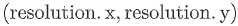
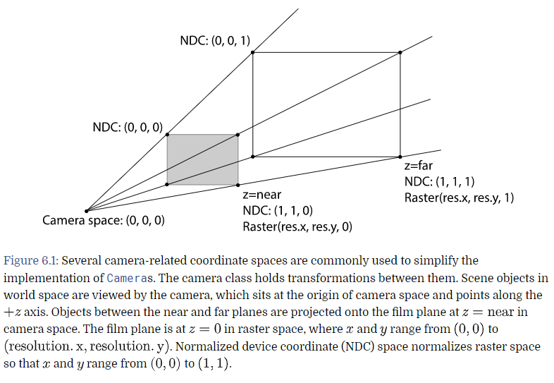
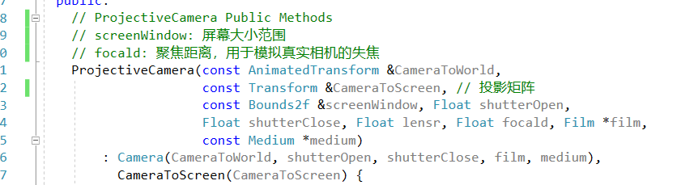
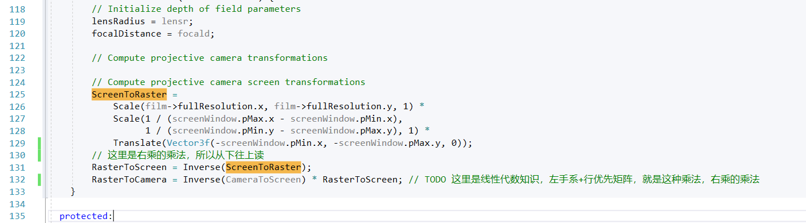
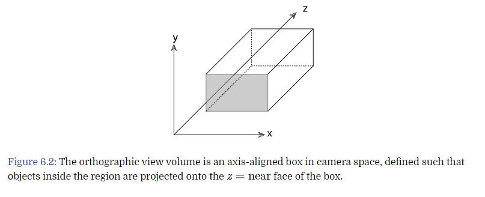
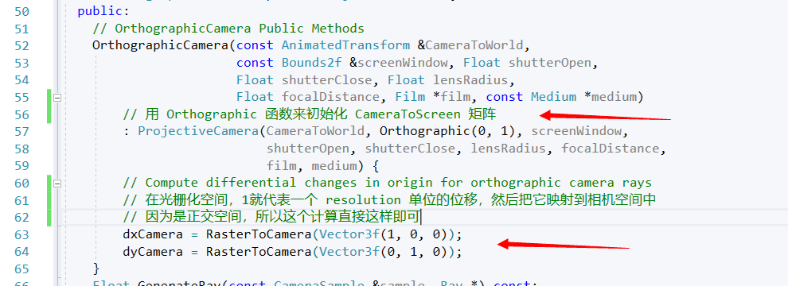
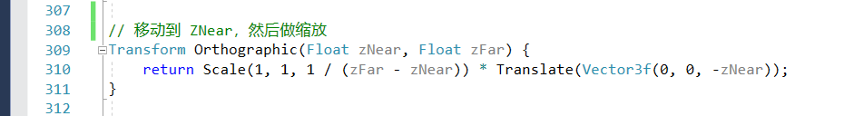
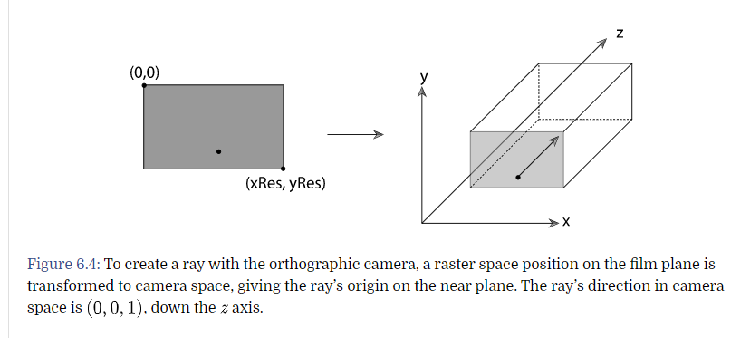

# 投影坐标模型

绝大多数的内容都可以用 4 * 4 的方法来解决，在这里介绍两种坐标系

- 正交投影相机
- 透视投影相机

在这里，再介绍几个坐标系

- **屏幕空间**：屏幕空间定义在 film 上，相机把**摄像机空间**投影到 film 平面上。平面能看见的部分就生成了。深度的 Z 值映射到 0 ~ 1 之间，来表示物体的远近。虽然被称为屏幕空间，但仍然是 3D 的。因为 Z 值在这里是有意义的。
- **规范化空间**：Normalized device coordinate (**NDC**) space，这是要渲染的实际图像的坐标系，Z 值和屏幕空间一样，XY的范围被压缩到了 （0，0）到 （1，1），我们通过一个线性变换，让 屏幕空间 变为 NDC空间
- **栅格空间**： **Raster space**，跟 NDC 几乎一样，但是 XY的范围是从 （0，0）到 

投影相机，可以通过 4 * 4 的矩阵，变换到几乎所有的坐标系，除了一些具有特殊成像特性的相机（**TODO**，是什么设定



该图描述了，NDC 和 Raster的转换关系（几乎一样

投影相机模型的初始化，会比相机模型的初始化多几个步骤（就是几个转换矩阵的预计算



这里是计算初始化矩阵的流程



注意到这里是 右乘，**TODO** 后续补这方面的线性代数知识

还有一点，在做屏幕空间 到 栅格空间 的流程
- 把屏幕空间中的 左上角 拉到原点
- 做缩放，注意这里 y 是反着的（因为y是负的），在这里缩放到 [0-1]，这就是 NDC 空间
- 放大到分辨率大小，栅格空间


# 正交摄像机



正交摄像机的初始化





这里的 dxCamera，在光栅化空间中，一个像素的位移，也就是微分，对应在相机空间中的微分向量

由正交摄像机，创建一条射线的方法



- 在光栅化空间找到一个点
- 找到该点对应的相机空间，在 Near 平面上的位置，这就是这条射线的 原点
- 摄像机的朝向，所以方向是 ```（0,0,1）```

