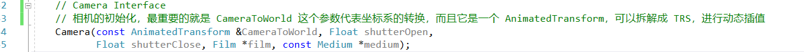
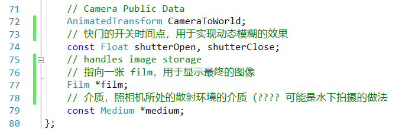
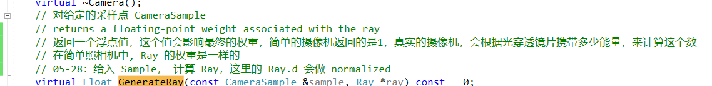
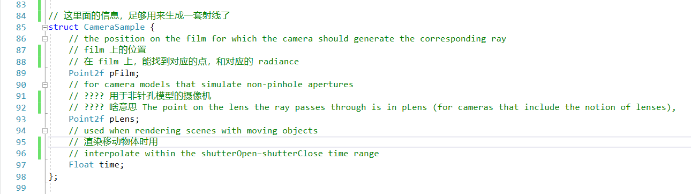
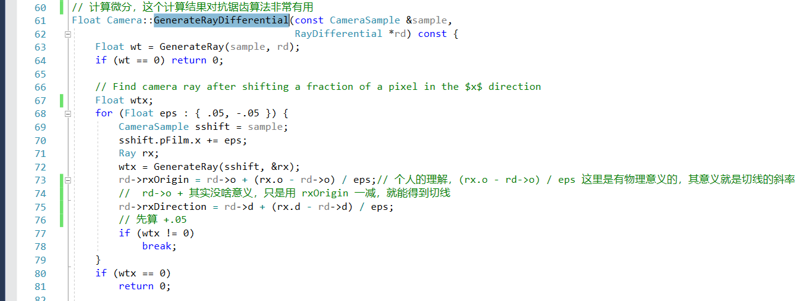
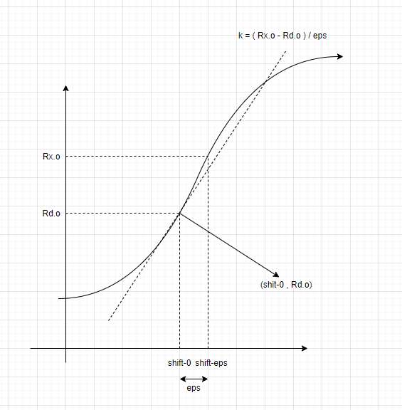
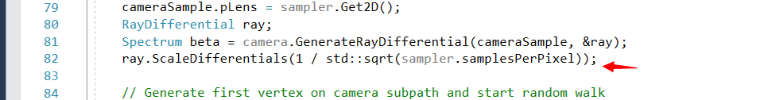
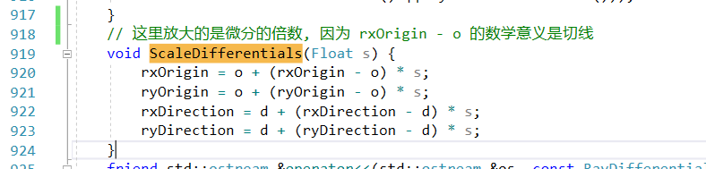

# 相机模型

首先是相机的初始化

不记得矩阵拆解玩法，和插值流程的可以去前面复习一波

然后是一些public变量

关于 GenerateRay 和 对应的 CameraSample

**TODO** 这里有一点不解

对于微分接口

这里这么理解

这里记录的是 O + K，我们要计算多少倍的微分，就这么算：

# 物体空间，世界空间，相机空间
- 物体空间： 以几何体中心为原点的坐标系
- 世界空间： 所有其他空间的标准空间
- 相机空间： 以相机点为原点的坐标系
- - Z轴：view direction 朝向向量
  - Y轴：上向量
  - X轴：右向量
  - 使用相机空间，来判断物体是否应该被看见

