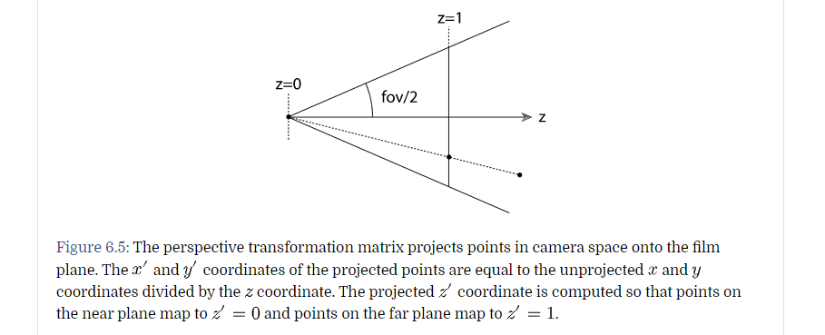
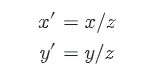
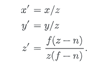
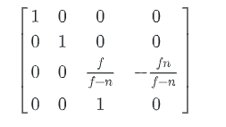
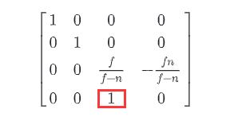
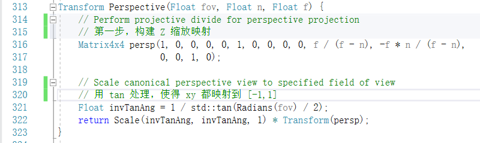
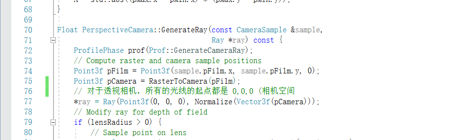
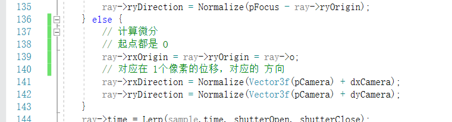

# 透视摄像机

透视摄像机和人眼的光看印象比较吻合，它具有透视缩短的特性。越远的物体，会显得越小。

在场景中的点，会投影到观察屏幕上，这个平面是垂直于 Z 轴的

**相机空间** -> **屏幕空间**

函数 ```Perspective(fov, near, far)``` 来实现这个转换

在 近平面的点 Z = 0， 在远平面的点 Z=1



这个映射分为3步

- 第一，我们要构建一个关系，因为从相似三角形的特性，我们可以得到



*个人理解：在这里光线是一条斜边，我们可以做 XOZ平面，那么会得到一个相似三角形，在一条斜边上的，X值一样，Z值不同*

我们再构建一个 Z 值,它的值域是  Near ~ Far，然后构建一个 0~1的映射



然后这个关系，可以用一个齐次矩阵来表示



注意，在这里，我们的分母 Z，是在  实现的，这里会乘出 ω = Z，再做除法就可以得到原来构建的等式

- 第二，我们要把 xy 映射到 [-1,1] 因为 Z 值是 分母，且 fov/2 的角度中，一边直角边 Z，所以直接用 tan 处理即可



生成射线





微分流程

#  The Thin Lens Model and Depth of Field（薄透镜模型，和 景深

在真实的针型的照相机中，存在一个矛盾的问题，我们不可能让光线只穿过一个点，来到达胶片

- 使用极小的光圈来模拟
- 因为光圈小，所以需要曝光时间长，容易让运动中的场景变得模糊

真实的摄像机会有一个镜头系统，用于调节光圈的大小。但是摄像师们面临一个权衡（trade-off

越大的光圈，到达胶片的光子越多，曝光时间越短

但是距离焦点越远的地方，会越模糊

在 6.4 中，我们提供了一种模拟真实相机的做法。**TODO** 后续再看这种真实相机的做法

在这里，我们使用 **thin lens approximation** 在传统计算机图形摄像机的基础上，来模拟光圈效果。


