# 薄透镜模型
*个人理解，其实这一章的内容并不关键，因为这个内容完全可以在后处理上完成*

薄相机模型是基于真实相机中的概念而做的模拟

- 光圈：相机的接受光子的孔，越大，接受的光子越快能形成图像，但是景深越短，会导致其他距离的物体越模糊
- 景深：详见百度百科
- 模糊圈：详见百度百科

这里，先给出凸透镜的聚焦模型

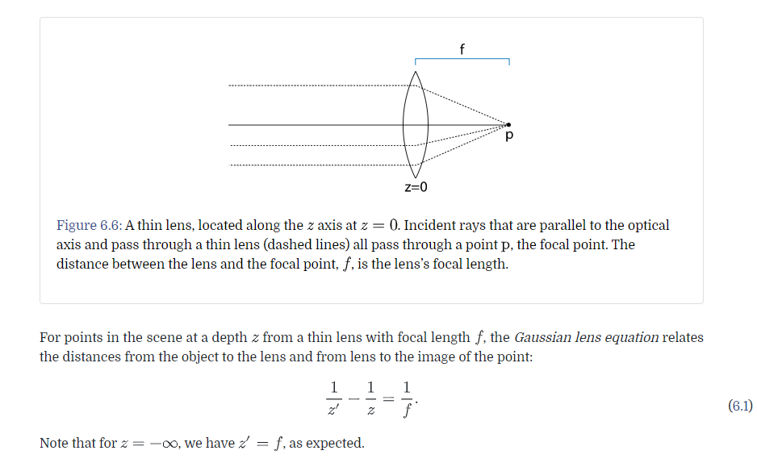

在这里，公式 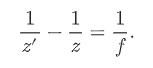 可以变成 

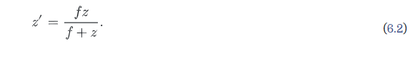

可能这里跟初中学的凸透镜成像原理不太一样，注意到，凸透镜位于 Z = 0，Z 是负数，film 在正方形

总之，就是无论跟 焦距的关系如何，我们对于凸透镜都有，

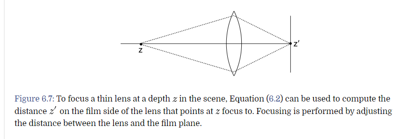

有 Z 就有对应的 Z`

[pbrt 的图片理解](http://www.pbr-book.org/3ed-2018/Camera_Models/Projective_Camera_Models.html#fig:dof-images)

这里就要介绍，景深的概念，注意到，在凸透镜原理上，物体在焦距上是不成像的，不过这不影响

因为我们就是要在焦距的附近，得到一段合适的景深，这段景深内的物体，会十分清晰，之外的，会模糊

为什么非常清晰呢，因为弥散圈，已经比摄像机的像素表示的内容要小了

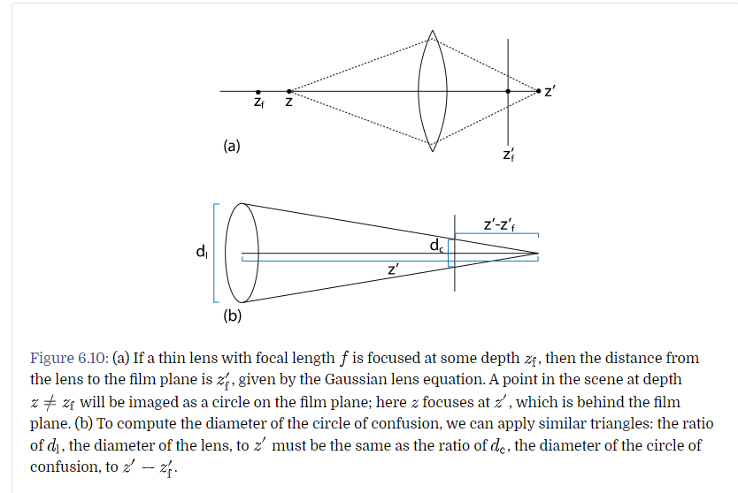

这张图中，Z是物体在的地方，Z\`是物体对于的成像点，Zf\`是 film 的位置，Zf是film的位置，对应的物体位置

在这里 焦距 f 是没有看到的

然后利用相似三角形，我们要计算 dc ，也就是模糊圈，也叫弥散圈

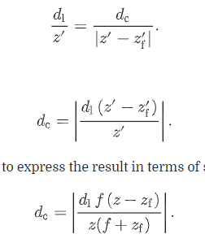

最后一步，是将带 \` 的都替换成对应的 f 和 不带\` 的组合

我们可以看一张图表

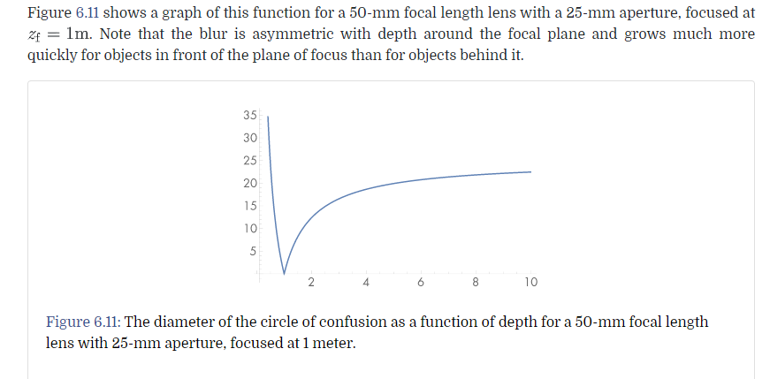

这里横坐标是物体距离，纵坐标是模糊圈大小

# 代码模拟

代码模拟非常简单

1. 模拟透镜的折射
2. 修改相机的出射Ray

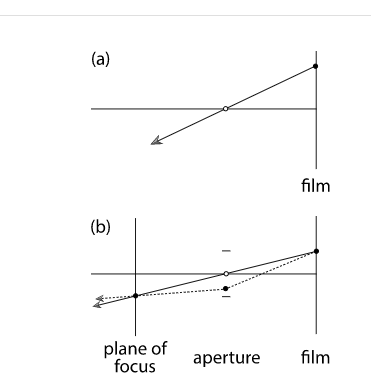

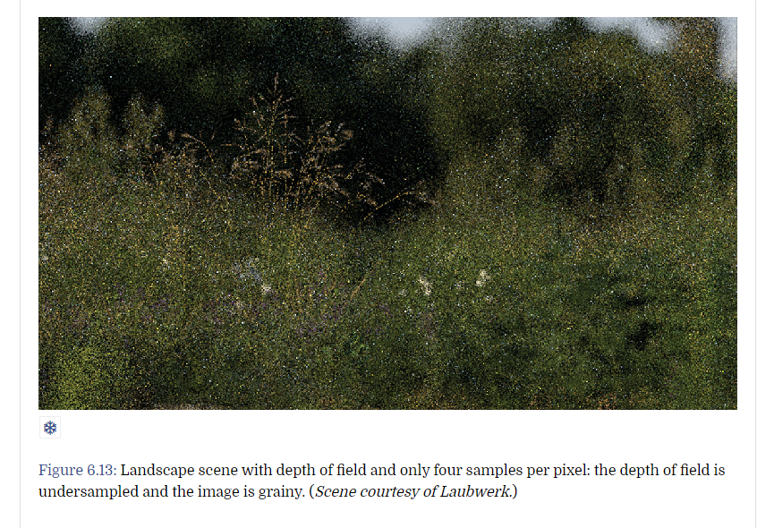

这个带噪声的结果还跟采样有关，**TODO**

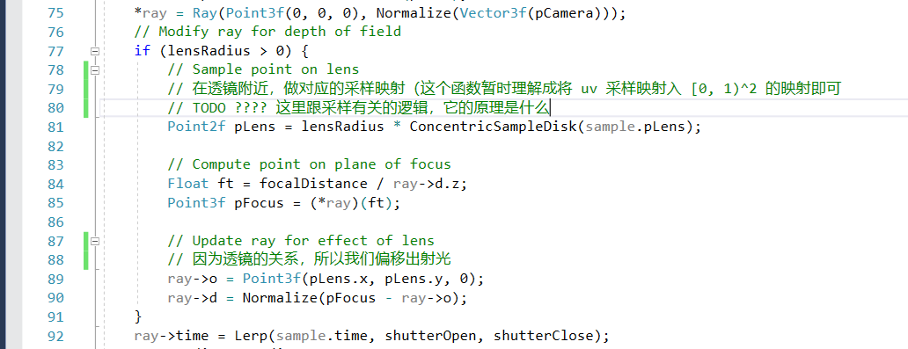

# 环境照相机

*与其说是环境照相机，其实就是全景照相机*

我们用球坐标系来描述每一条入射光线（这对环境光的设计非常有用

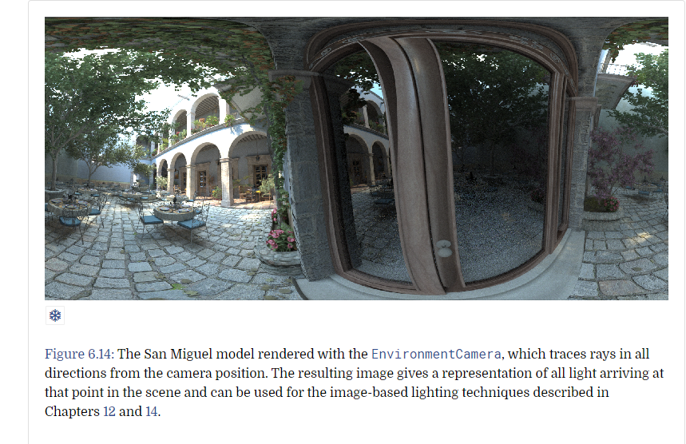

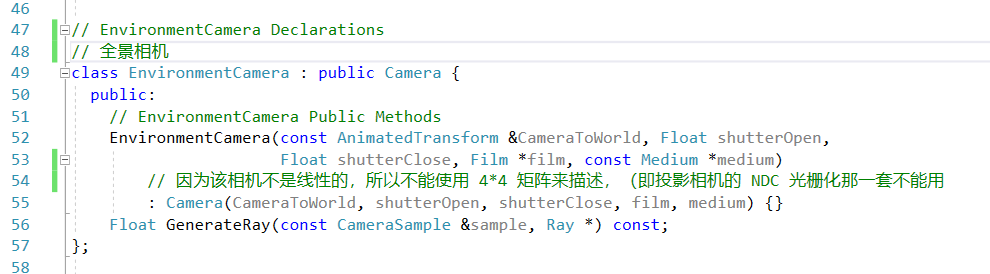

全景相机的初始化

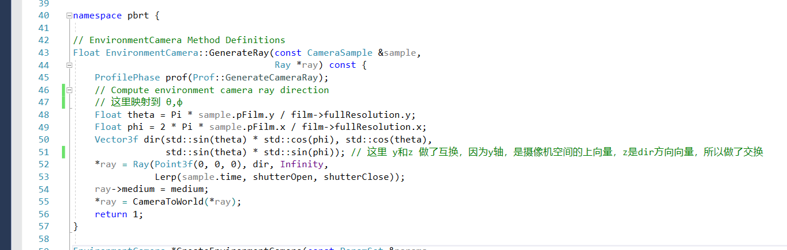

使用球形坐标生成射线，注意到这里 y和z 是互换的

