# 起步

采样对于图像的构建非常关键。

我们将从采样理论开始，从连续的函数中采取离散样本值，并重新构建近似的函数。

这里记录几个关键字，之后会详细的了解到

- sampling theory：采样理论
- low-discrepancy：低差异序列，一种伪随机方法
- Filter：类，用于处理多个采样-一个像素，怎么计算该像素的值
- Film：类，积累所有采样的内容，并生成图片

# 采样理论

- reconstruction：重构，收集样本，并转换回连续函数的过程

- aliasing：走样，采样再重构，会和原来的景象不一样，可能会以锯齿，闪烁等方式出现

最简单的采样重构方式，就是线性取点，并做线性的重构

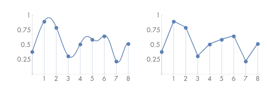

- Fourier analysis：傅里叶分析，从频谱域比较原函数和重构函数，

## 傅里叶变换理解

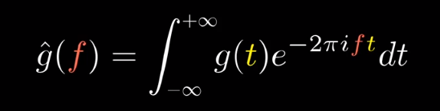

[观看视频B站网址](https://www.bilibili.com/video/BV1pW411J7s8)

整个视频已经非常详细，我在这里记录一下，我的思考记录

#### 坐标系映射

对于这个坐标系，我们要记住，它其实是一个极坐标系

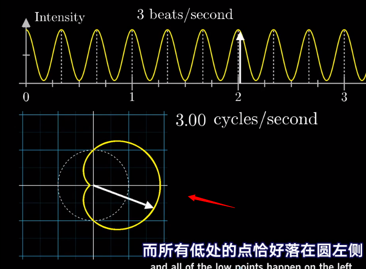

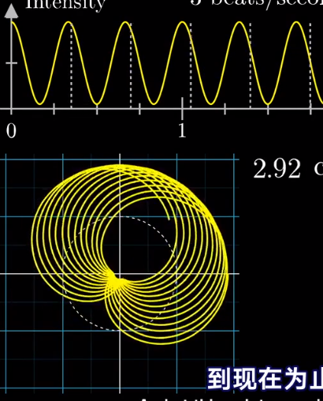

它的 长度 ，和 强度一一对应

它的 旋转角度，跟 时间相关，但是具体对应多少的弧度，由频率决定

它的 曲线分布，就是 频率，也就是说，这张图，只是一个频率的映射关系，频率改变了，曲线的分布也会改变

上图中，3 秒的横坐标长度，对应了一圈，也就是 2π，在这个频率下，乘上时间，才是具体旋转角度

#### 质心的几何意义

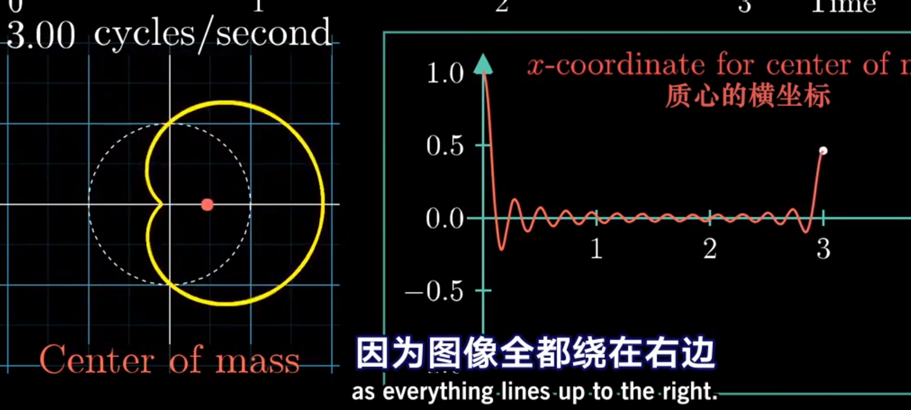

在这一part中，提到了用质心去描述缠绕的线圈

质心的几何意义，从该点出发，散发出无数条到几何体表面的向量，他们的总和为 0

所以这里的质心，描述的就是这些曲线的总和向量

#### 复平面中的一个点的表示

这个是[欧拉公式](https://www.bilibili.com/video/BV1fx41187tZ)

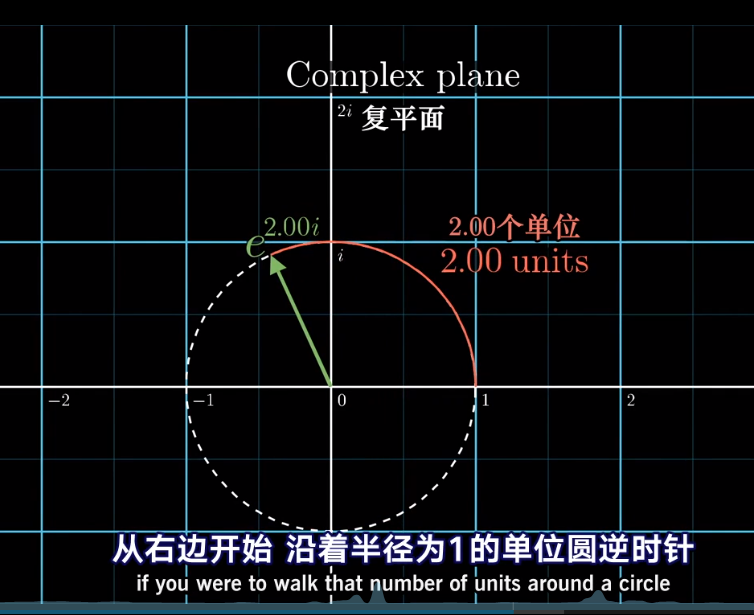

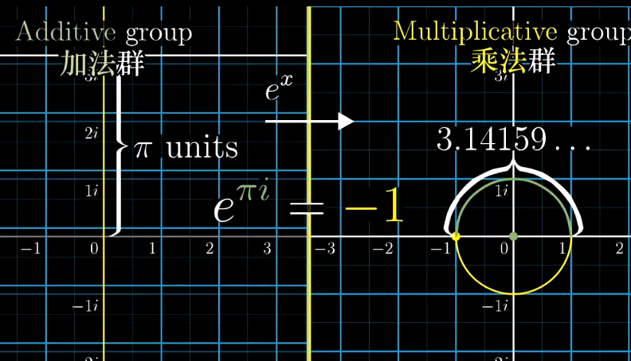

所以一个角度（标志长度1），可以用 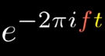 来表示

我们在某个频率上，某个时间点，的某一个复平面上的点，可以用 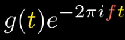 来表示

其中

- 负号：逆时针
- 2π：因为我们的频率是一圈的频率
- f：频率
- t：时间，ft 来决定弧度
- g(t)：原函数的 y 值，这也就是，长度

#### 求质点，求平均数？直接无穷积分？

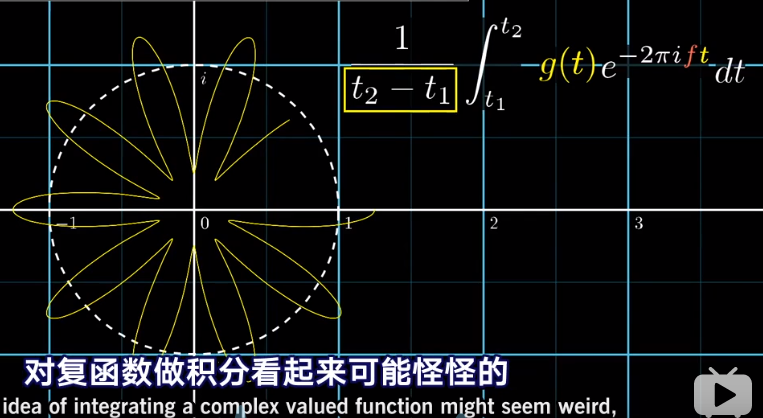

在这里，如果给定一段时间，求质点，的确是在一段时间内积分即可

但是，其实真正的傅里叶是没有除以时间的，我试着这么理解：

这里，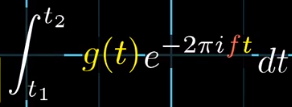 其数学意义，应该是，t1-t2 时间内，所有质心向量，加起来的和

但是我们知道，这个质心其实是会抖动的，频率固定，在时间改变的情况下，其实一直会在某个区域抖动

对于非峰值的频率，这些抖动，基本上是围绕原点做抖动，会互相抵消，所以，直接相加，问题也不大

对于峰值区域，这里的抖动，都会叠加，所以这个值，会跟时间正相关，时间积累得越多，影响越大

但是，对于固定的时间段，它的叠加值，也是有限的（公式这么写，就是为了把时间的影响加上

#### 综述

原函数：
- 输入：
- - 时间
- 输出：
- - 强度 
傅里叶变换：
- 输入：
- - 时间段（这可以是无穷，也可以是一个常数范围
- - 频率
- 输出：
- - 一个复平面上的点

## 频谱域 和 傅里叶变换

这里是原函数和傅里叶函数的对应图

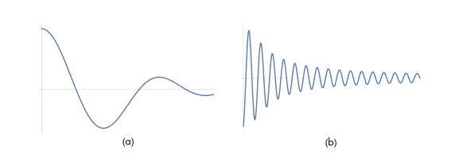

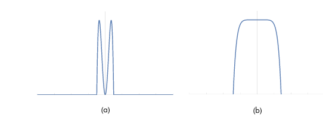

傅里叶变换和逆变换

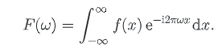

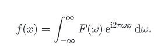

在这里，介绍一种，函数，[冲击函数](http://wuli.wiki//online/Delta.html)

它满足：

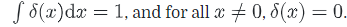

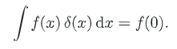

为什么要有这个函数呢，因为它的原函数，就是常量

且傅里叶变化满足：

对于 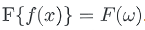

有：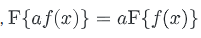 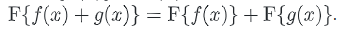

这个冲击函数，用于采样

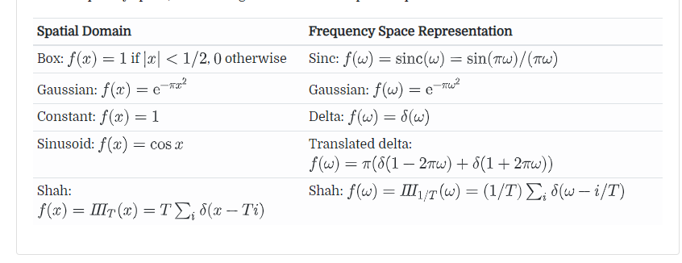

这是一个原函数，与傅里叶变换的一张表

最后一个函数，是脉冲函数，是 δ函数的拓展

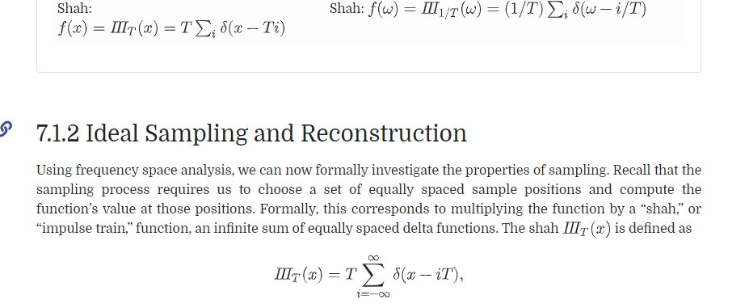

在这里，对 T 的理解，我们想象一下，如果T是2，那么我们的脉冲就是 2 4 6 相比是 1 的情况，稀疏了 2 倍

所以这里的积分（离散的叠加和）要乘上 对应的 T（周期，其实应该是频率的倒数
