# 进阶

## 理想的采样和重构

### 梳子函数

梳子函数 $III_{T}(x)$  是 多个冲击函数的 $\delta(x)$组合

```mathjax!
$$III_{T}(x)=T \sum_{i=-\infty}^{\infty} \delta(x-i T)$$
```

**TODO** 这里的周期参数 T，为什么要乘上这个参数，跟群里的大佬讨论过，这里应该是不该加这个系数的 

它能做到，对一个函数做一系列的采样

```mathjax!
$$III_{T}(x) f(x)=T \sum_{i} \delta(x-i T) f(i T)$$
```

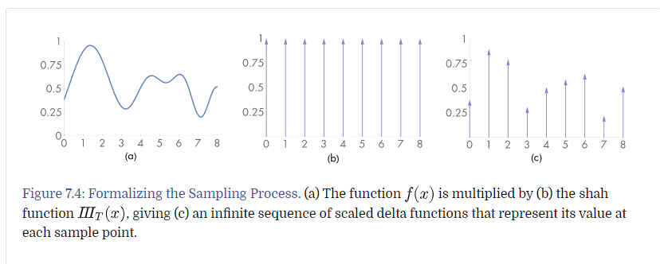

如图，这是我们用梳子函数对 $f(x)$ 做的采样

在这里，给出卷积的定义

```mathjax!
$$f(x) \otimes g(x)=\int_{-\infty}^{\infty} f\left(x^{\prime}\right) g\left(x-x^{\prime}\right) \mathrm{d} x^{\prime}$$
```

我们定义出重构函数 $r(x)$，这个函数的作用是，将采样的状态，还原成原函数的状态

那么我们的还原操作就是：

```mathjax!
$$\left(III_{T}(x) f(x)\right) \otimes r(x)$$
```

上面的式子可以化简为： **TODO 化简的数学流程学习**

```mathjax!
$$\tilde{f}(x)=T \sum_{i=-\infty}^{\infty} f(i T) r(x-i T)$$
```

### 例子

在上一小节中，我们知道对一个函数的进行采样重构的方法是：

```mathjax!
$$\tilde{f}(x)=T \sum_{i=-\infty}^{\infty} f(i T) r(x-i T)$$
```

我们以重构函数 $r(x)=max(0, 1-|x|)$ 做为重构函数，取 $T = 1$ 来观察函数

对于函数 $r(x-i)$ 它的函数图像是：

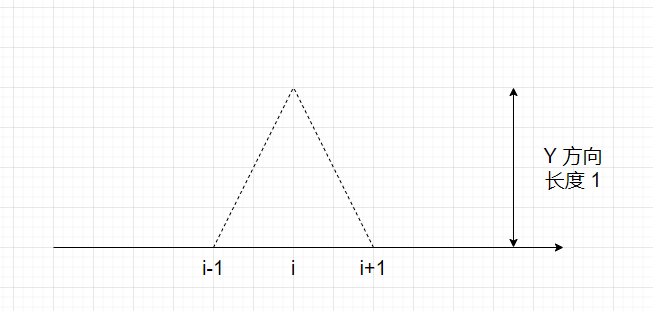

注意到，这里做卷积，是离散的点，那么我们尝试在两个点上计算卷积，一个是 $i$，一个是 $i-1/4$

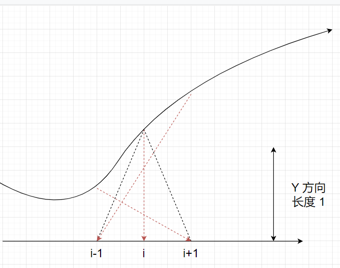

这里计算出来的卷积值，是 i （原点采样不变

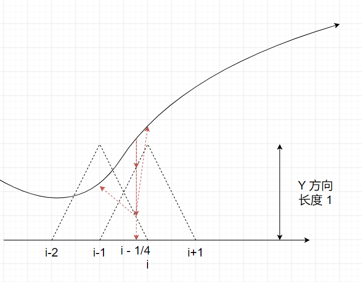

这里计算出来的卷积值， 是 $f(i) * \frac{1}{4} + f(i-1) * \frac{3}{4}$

所以，这其实是一个线性插值

如图

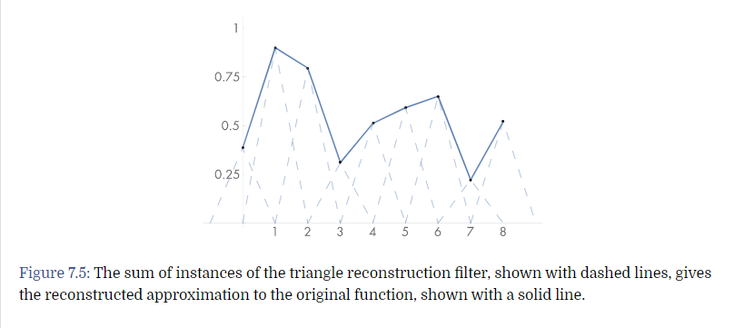

在这里，我们用来一个非常麻烦的方法，来表示采样和线性插值的重构，但是使用 傅里叶变换

我们能更好更快的得到重构函数 $\tilde{f}(x)$

### 完美的重构函数

首先，我们介绍卷积的两个跟傅里叶有关的公式，即乘法与卷积之间的互换

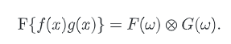

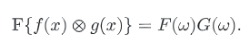

这里的大写表示小写对应的傅里叶变换

在这里，我们先对，我们的重构函数，做一次傅里叶变换，再做一次反傅里叶变换

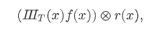

公式如下：
```mathjax!
$$({III}_{T}(x) f(x)) \otimes r(x)$$
$$F \Rightarrow F({III}_{T}(x) f(x)) R(x) $$
$$ = {III}_{1/T}(x) \otimes F(x) R(x) $$
$$ !F \Rightarrow ({III}_{T}(x) f(x)) \otimes r(x) $$
```
上面就是整个重构的流程，看上去是，用傅里叶展开了一下，然后再合并起来，并没有什么区别

但是就是在这个过程中，做到了采样并重构

#### 刷子函数的傅里叶变换

对于刷子函数 $III_{T}(x)$，它的傅里叶变换对应也是一个刷子函数，不过周期变成了 $1/T$

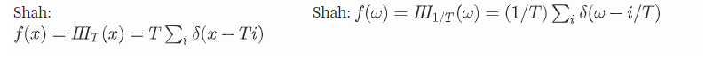

*请忽略这里的系数*

在这里，我们可以看到一个事实，如果刷子函数，在空间域的采样频率越高，那么它在频谱域上的周期反而会越长（因为会带有更多的信息

接下来，是刷子函数做卷积的特性，因为我们知道，刷子函数是无穷个 δ函数 组成的，而 **δ函数做卷积等于本身**，所以刷子函数就是多份拷贝，在这里，我们假设 $F(ω)$ 是一个尖锐的山峰，那么他们的卷积如图

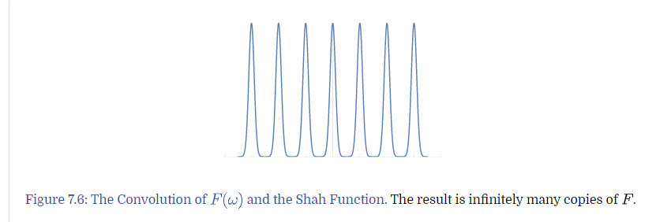

#### 选择重构的函数

在这里要理解，频谱域上，多次的山峰进行拷贝出现，就是我们采样的结果。

我们需要对齐进行重构，也就是，找出单个的 $F(ω)$ ，并把它还原成  $\tilde f(x)$ 

显然，由图片，我们取出单个  $F(ω)$  的最简单的方式，就是用一个方框，把它乘出来：

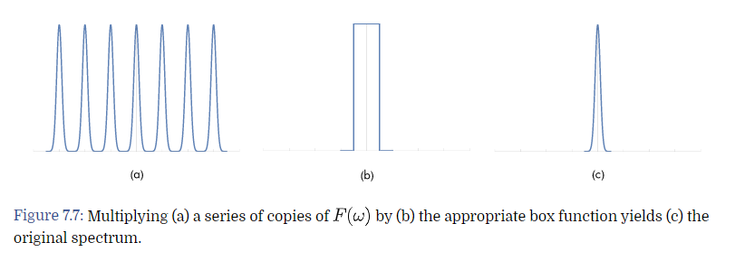

这个方框，又被称为盒子函数，它的定义如下：

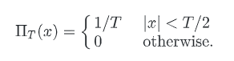

注意，在这里，$T$指的是盒子函数的周期，对应我们在频谱域上的周期是$1/T$

所以，我们可以得到重构函数的对应傅里叶变换结果 $\tilde F(x)$ 

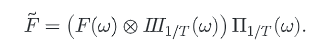

这就是，我们的重构函数，的傅里叶变换

在这里，我们有 盒子函数 对应的 反傅里叶变换

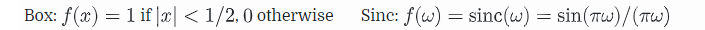

这里提到的 sinc 函数是：

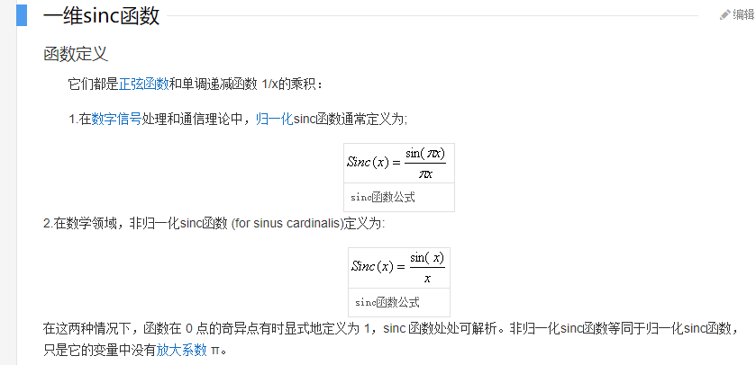

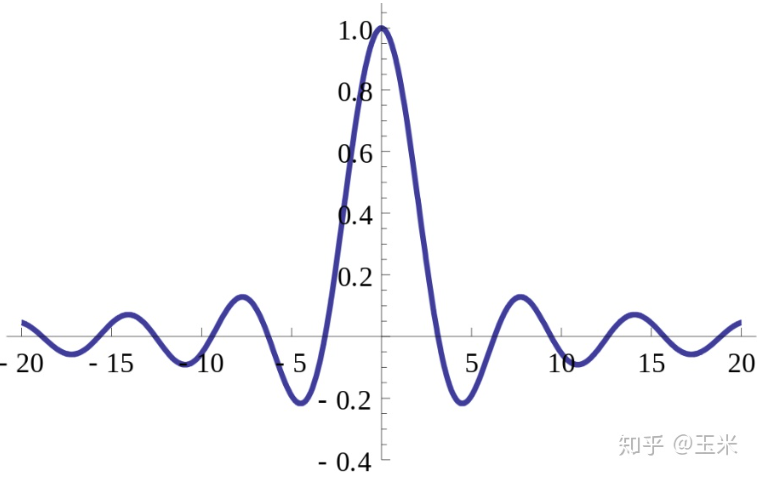

所以，我们取逆变换有：

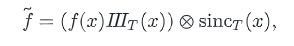

再在这基础上，做数学化简

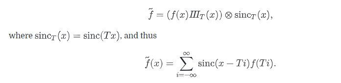

这个方法有个缺点

- sinc 是无限范围的，所以要完美重构，是需要在无限的范围做卷积，否则，会丢失一些细节
- 解决这个问题，可以再用Box函数过滤一遍 **TODO** 这里坏处没看太懂


## 走样问题

在频谱域上，会分两种函数，有限带宽函数和无限带宽函数（这个在百科上有定义，说下自己的理解

- 有限，即在频谱域上，对应的函数图形是有限的（在一定范围内有波动，其他地方都是0
- 无限，即在频谱域上，对应的函数图形是无法绘制完全的（是一条无限的函数

最经典的无限带宽函数，就是中断跳跃函数（即在某个位置，函数值从一个值毫无联系的跳跃到另一个值上

那么我们提出的完美重构的假设，是基于

- 有限带宽函数
- 采样的频率足够

只要其中一个条件不够，就会发生，在样本卷积中，有函数重叠的情况，这种情况，被称为**走样**

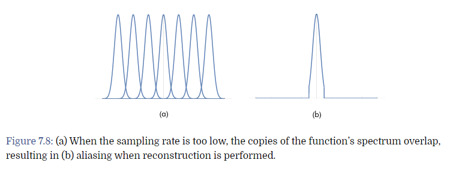

一个在频谱域上，不能过滤出原型的函数，在重构后，会和原函数有区别

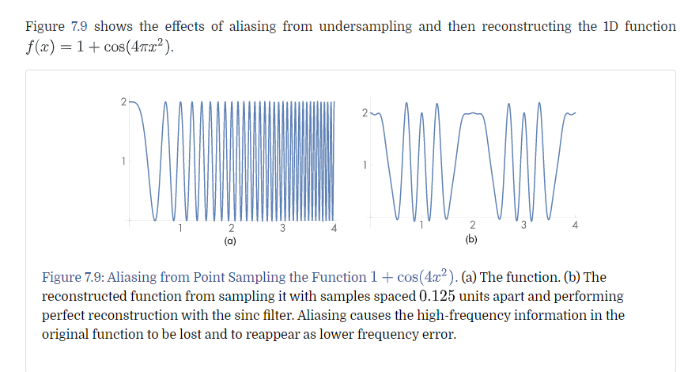

在这里提一个概念 **奈奎斯特频率 (Nyquist frequency)**

所以，我们采样的信号的频率要大于信号的最大频率的两倍（注意这里的周期是 $[-ω_m, ω_m]$

这样才能做到完美采样

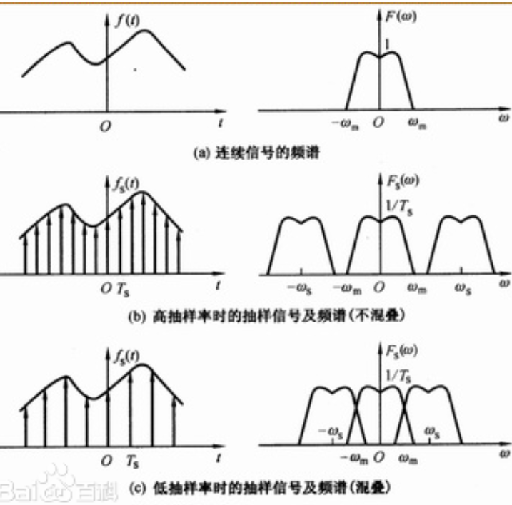

那么对于无限带宽的函数，走样是无法消除的

## 反走样技术

在这里，我们把重建前的重叠，称为 **前走样(prealiasing)**，把重建后的图形的重叠，称为 **后走样(postaliasing)**

针对这些而完善的技术，都被称为反采样技术

