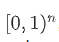
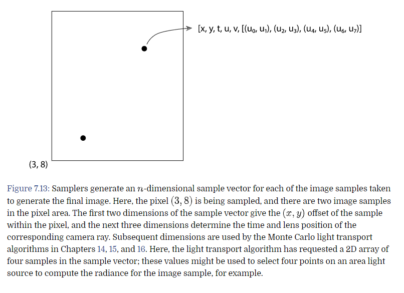
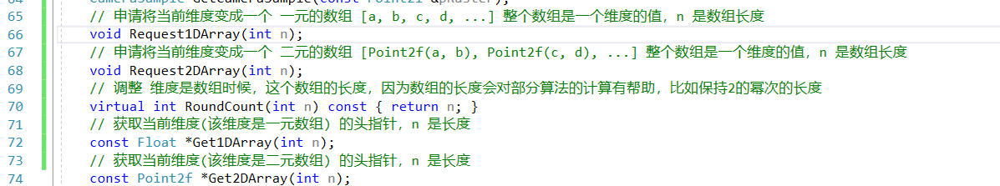
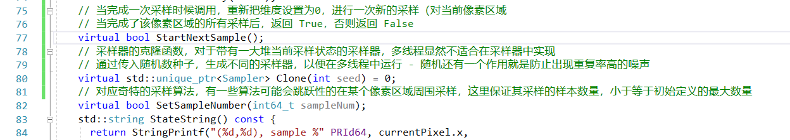
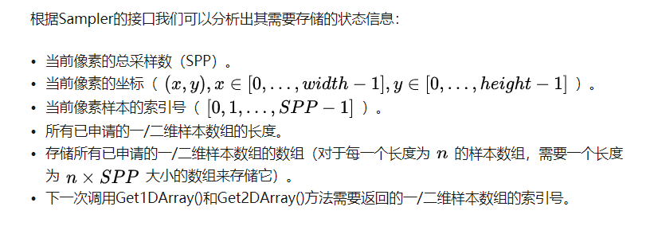
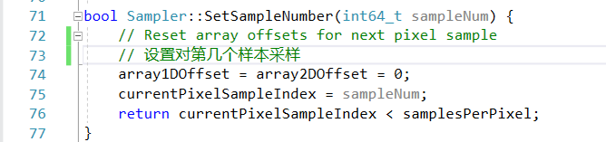
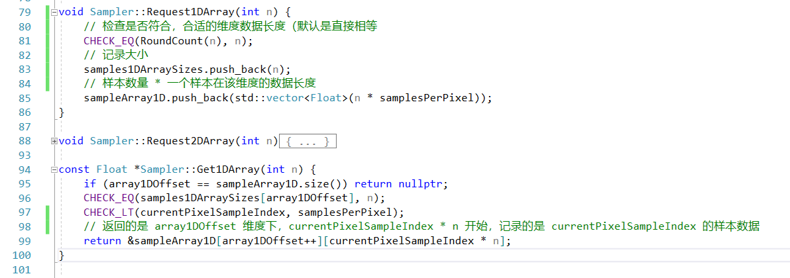

# 前言

采样接口都在 **core/sampler.h** 和 **core/sampler.cpp**

各个采样器的实现在 **samplers/ directory**

采样器的做用就是对于每一次图像采样，在 一系列 n 维度的，在  范围内的样本中，生成一个样本向量。

其中 n 的维度，根据光照的算法而不同。



举例：这张图中，对应像素 (3, 8) 其区域被采样，并且有两个样本，通过算法，计算样本，得到该点的，辐射度。

#### 小于1的最大值定义

**TODO：这里编译不通过，用浮点数代替**


在这个算法中，许多采样的值，都会被要求小于 1，所以 pbrt 给出了尽可能小于 1 的值的定义


# 样本差异

这一段没看懂，[参考链接](https://zhuanlan.zhihu.com/p/73943687)

简单的理解：
- 存在一个客观体现差异的值，这个值跟采样内容是否均匀有关，如果都是 1/2 那么这个客观差异值一直最小
- 但是均匀分布，又会对人眼的视觉产生明显的影响

# 基础样本类 接口


在这里，有的采样算法，需要的一个维度不仅仅是单个数，而是一串数组，在这里，我们也可以对这样一个特殊的维度做处理



Request 可以在初始化的时候调用，比如 ```SamplerIntegrator::Preprocess()```


**TODO：这里举了一个两个面光源的例子，不是很懂**



一个采样器，需要记录的状态，这里参考大神的笔记：



# 基本采样器的 实现


首先是在某个像素上开始的实现


开始下一次采样



外部接口，来设置对第几个样本做采样




1维数组做一个维度的做法，2维类似

# Pixel Sampler 像素采样器的实现


