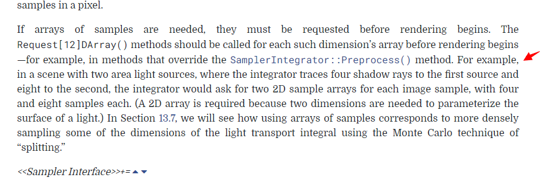

# 前言

采样接口都在 **core/sampler.h** 和 **core/sampler.cpp**

各个采样器的实现在 **samplers/ directory**

采样器的做用就是对于每一次图像采样，在 一系列 n 维度的，在  范围内的样本中，生成一个样本向量。

其中 n 的维度，根据光照的算法而不同。


举例：这张图中，对应像素 (3, 8) 其区域被采样，并且有两个样本，通过算法，计算样本，得到该点的，辐射度。

#### 小于1的最大值定义

**TODO：这里编译不通过，用浮点数代替**


在这个算法中，许多采样的值，都会被要求小于 1，所以 pbrt 给出了尽可能小于 1 的值的定义


# 样本差异

这一段没看懂，[参考链接](https://zhuanlan.zhihu.com/p/73943687)

简单的理解：
- 存在一个客观体现差异的值，这个值跟采样内容是否均匀有关，如果都是 1/2 那么这个客观差异值一直最小
- 但是均匀分布，又会对人眼的视觉产生明显的影响

# 基础样本类 接口


在这里，有的采样算法，需要的一个维度不仅仅是单个数，而是一串数组，在这里，我们也可以对这样一个特殊的维度做处理


Request 可以在初始化的时候调用，比如 ```SamplerIntegrator::Preprocess()```



**TODO：这里举了一个两个面光源的例子，不是很懂**


一个采样器，需要记录的状态，这里参考大神的笔记：


# 基本采样器的 实现


首先是在某个像素上开始的实现


开始下一次采样


外部接口，来设置对第几个样本做采样


1维数组做一个维度的做法，2维类似

# Pixel Sampler 像素采样器的实现

像素采样器比较像 Sampler 的简单拓展，主要有


- 实现了Get1D 和 Get2D 写法，用的方法也很简单
- 超出维度的采样，会用 RNG 的方法，得到一个随机数

# Global Sampler 全局采样器的实现

还有一种采样器，它的采样方式和像素采样器 (pixed-base) 使用的方法不太一样（不是再针对一个像素区域做采样）

而是在整个图像中，连续访问完全不同的像素进行采样。

在全局采样器中，我们会把所有的像素区域的大小，做一次映射，映射到 [0,1]，给出的表，就是一个 2X3的像素的图像，被映射到 0-1 之间


像这种采样器，采取的设计理念是，建立一个，采样坐标 到 当前采样像素区域的映射 （因为当前采样像素区域，会有很多个采样

在上图中，第 0,6,12 这3个点，都映射着 (0,0) 这个像素区域的映射。

但是，在运行程序中，我们也需要一个函数，能够逆映射的接口，比如当前采样点是 (0,2)，我要知道第 0 个样本，能够获取上图中的 2 ，这个点的下标


相似的，因为我们还有样本的维度，比如我们通过 GetIndexForSample 拿到了第几个样本，我们还需要取对应的维度，所以有

SampleDimension 函数来取出对应维度，而且取出的数据，不再是 [0,1] 的归一化数据，而是原始数据


在这里，SampleDimension(4,1) 之所以不是 1.3333 而是 0.3333 是因为这里记录的是在 像素区域内的位移，所以要减去这里的像素区域的原点

全局采样器，一样有 1D 和 2D 的设置，并且给 照相机留了 5个维度


# 个人理解

这一节是直接将基类，其实这个借口抽象性很高，不是那么好理解，更多的是一种设计模式的提取

要结合实际的代码看才行
