# 分层采样

## 实现

分层采样的算法，先介绍其数据结构

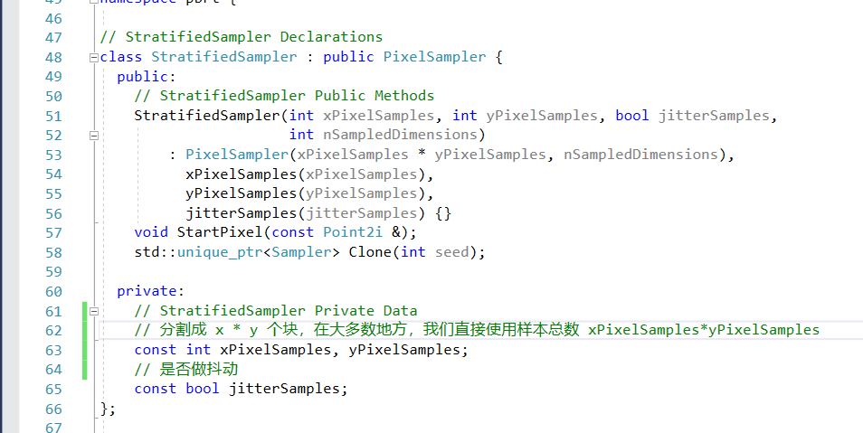

非常简单，大部分继承自 像素采样器

它最核心的算法是，在开始时，怎么对样本进行初始化，对于 samples1D，samples2D，samples1DArraySizes，samples2DArraySizes

这四个存随机值的地方

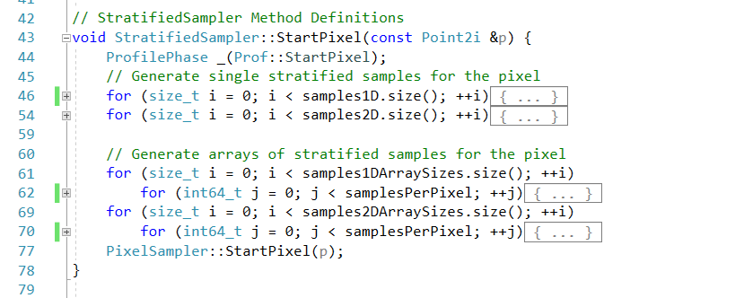

对于一维的随机值

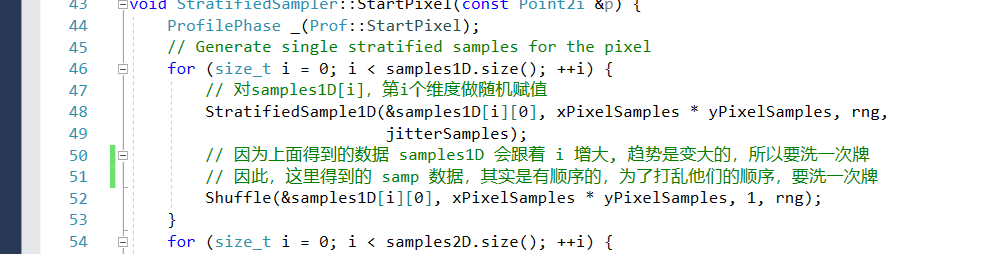

我们首先，是根据样本总数，做一个逐个采样，加上浮动，并映射到 [0-1]

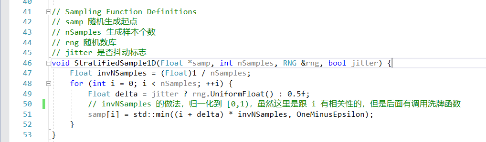

注意到，我们在设定完之后，样本是按照顺序随机的，所以，需要打乱顺序

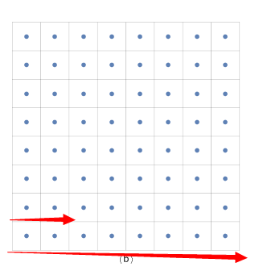

因为 i 是递增的，所以存在 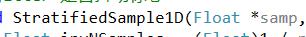 中的，也是按照顺序的

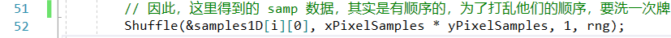

打乱顺序

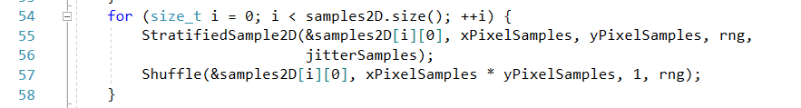

二维的情况同理，只不过是把我们需要设置抖动的分母，做一下改变

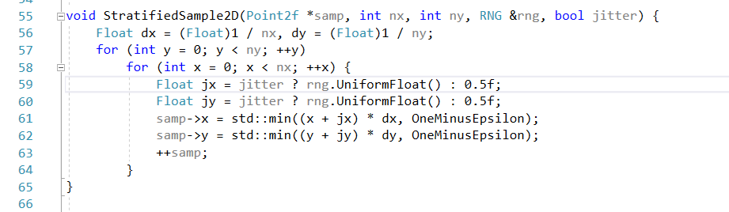

二维的做法是类似的

下面是对于，一个样本里面，它的一个维度的数据，是一维数组或者二维数组

先看一维数组的情况

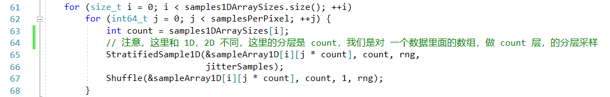

一维数组同理，不过这里，我们不再对样本总数做分层，而是对数组的数据长度做分层

那么，在这里，二维数组就很尴尬了，因为数组的长度是 count，是可变的，所以我们不好拆成 x * y  的形式做分层

这里，就提出了，用 count * count 这个正方形来做分层，这就是 **拉丁超几何算法**

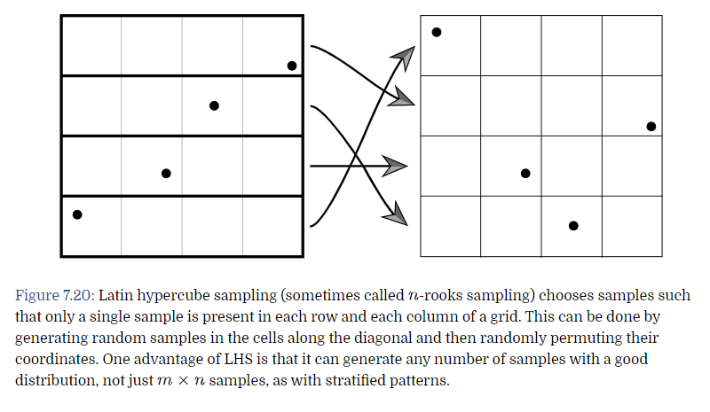

拉丁超几何算法的理念其实很简单，因为我们要对样本做均匀的采样，那么我们就先拓展成 n * n，然后每个对角线取一个样本

最后打乱样本的顺序，这样，我们得到的样本，就是相对均匀的采样值了。

这种方法的好处：

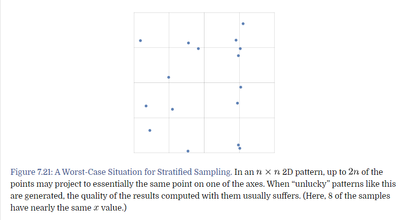

在分层算法的随机数分布非常不友好时，拉丁算法没有这个问题

这种方法的坏处：

随着 n 的增大，它的消耗是越来越高的

拉丁算法就分两步：
- 对角线取值
- 打乱采样点

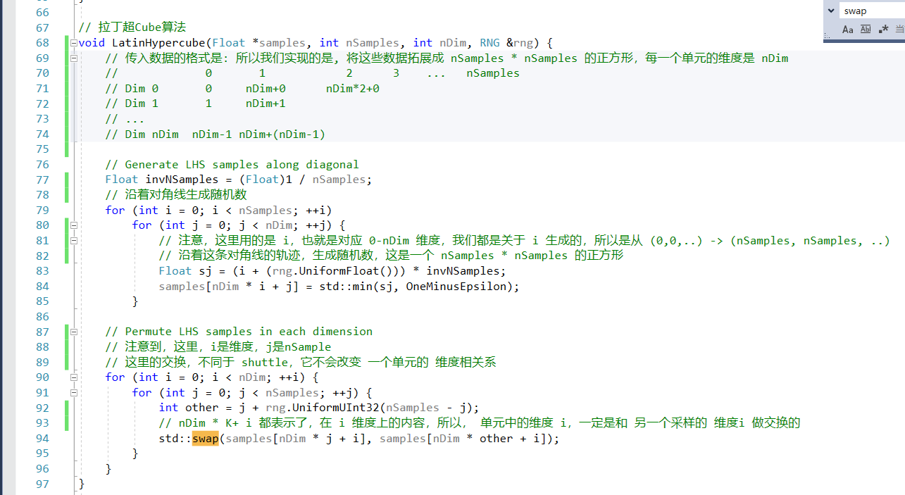

这边给出第一步的图示：

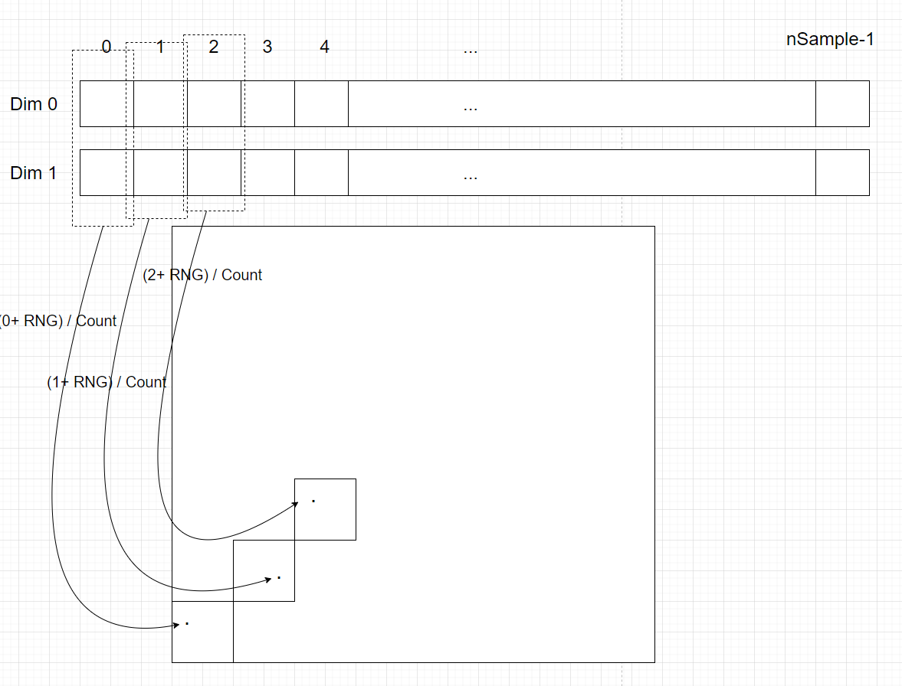

第二步的随机交换

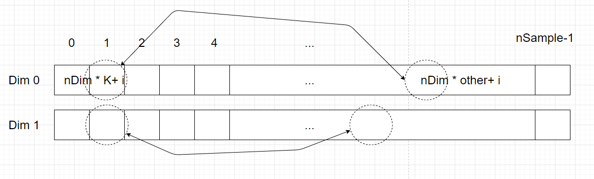

## 杂谈

采样主要是需要解决2个问题，或者说，平衡两个问题
- 如果图像变换比较均匀，那么应该怎么均匀的采样
- 如果图像在某一处变化特别大，那么是不是在变化多的地方，应该做更多的采样

分层采样只解决了点 1，其他的后面再谈

**TODO** 文章最后给出 16个样本，1个阴影，和 一个样本，16个阴影数据的对比，现在还看不懂，毕竟没有手写过

