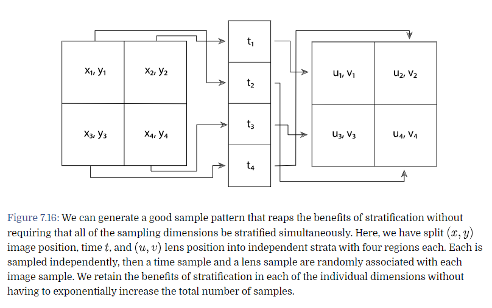
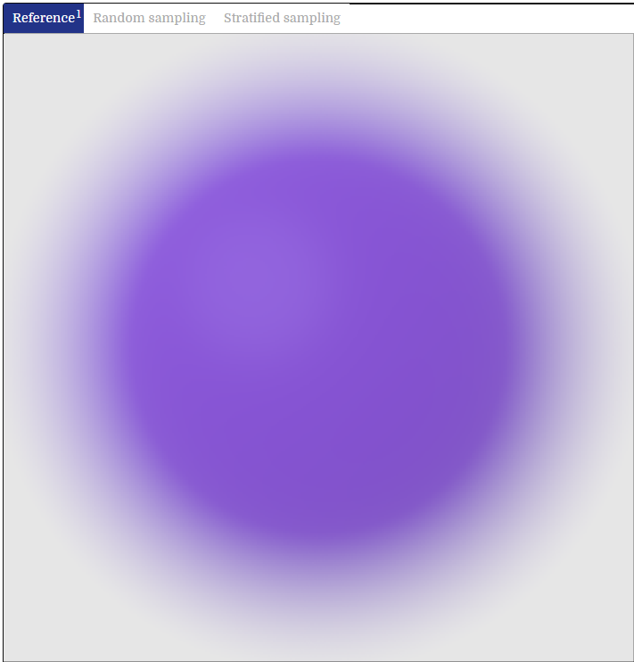
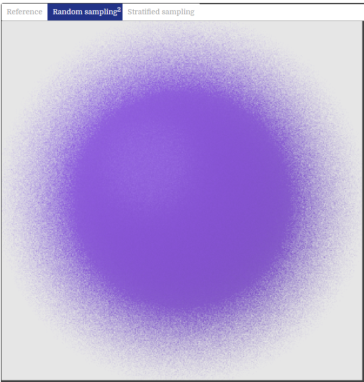
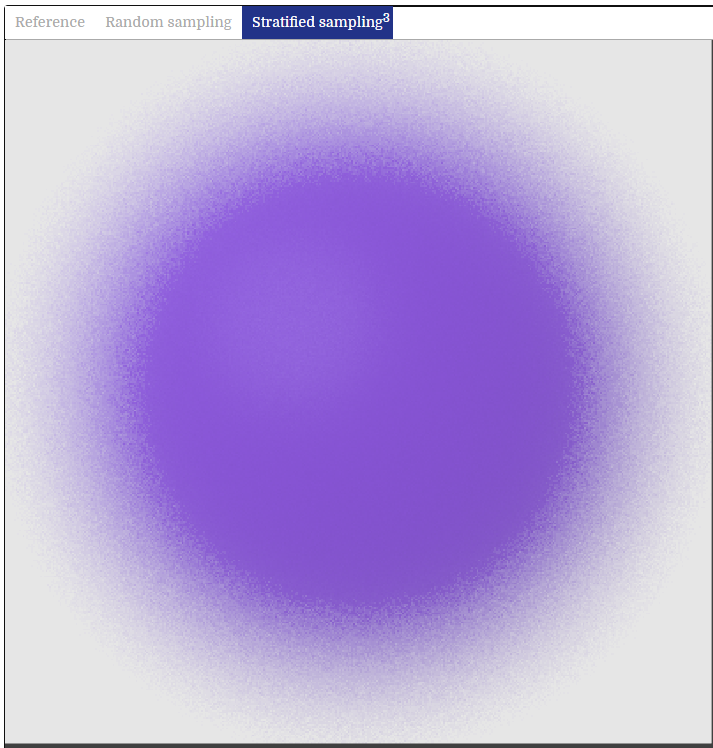
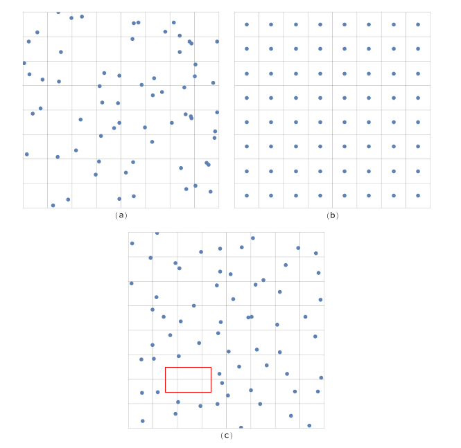
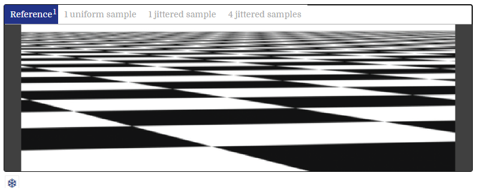
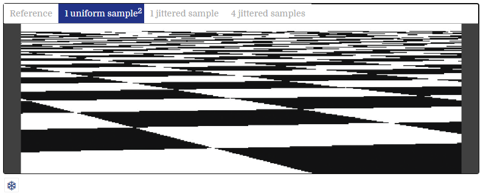
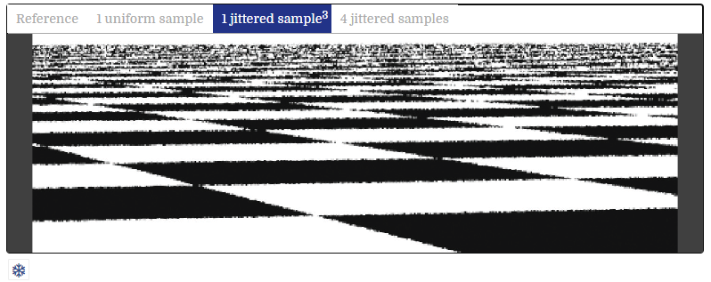
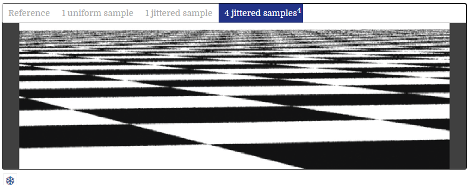

# 分层采样

## 理论

分层采样的主要思路，就是把一个 Pixel Area 分成若干个块，每一块被称为 Strata (层)

他分的层越多，代表采样率越高，因为该算法会在每一个层里面抖动(在层的区域内)，来获取每一个样本数据

也有不做抖动的情况，但这个一般是用作对比，而不是作为普通的等分采样去做的。

所以分层采样的特点

- 分格子
- 在格子内随机抖动

分层算法，对于高维度算法会比较吃力，因为分层+高维度，比如一个5个维度的图像，分4层，就是 4^5 = 1024

会产生大量的样本数据，这里的解决方案，是分维度分层，然后每个层做随机链接即可

这里是 xy 分层，t 分层，uv 分层，然后**随机**链接，总共 4 个样本解决 （感觉蛮偷懒的

原图 vs 完全随机 vs 分层随机

这里分层随机有这种效果，最重要是因为它在相机焦距上，做了分层采样

图5是 完全随机 vs 分层不抖动 vs 分层抖动

有几点：
- 完全随机完全不能看，有些地方采样过于密集，有些地方过于稀疏
- 不抖动，低频的内容会变成 alias
- 抖动，alias 变成 noise，并且相对均匀（当然，红框部分的信息，是有丢失的

原图 vs 不抖动 vs 1次分层 vs 4次分层

- 这张图的渲染难度很高，因为越接近地平线，像素间的距离，映射实际的距离很多
- 不抖动有明显的 alias
- 1次分层（相同采样率），alias 变成 noise
- 4次分层，效果好很多

