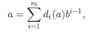
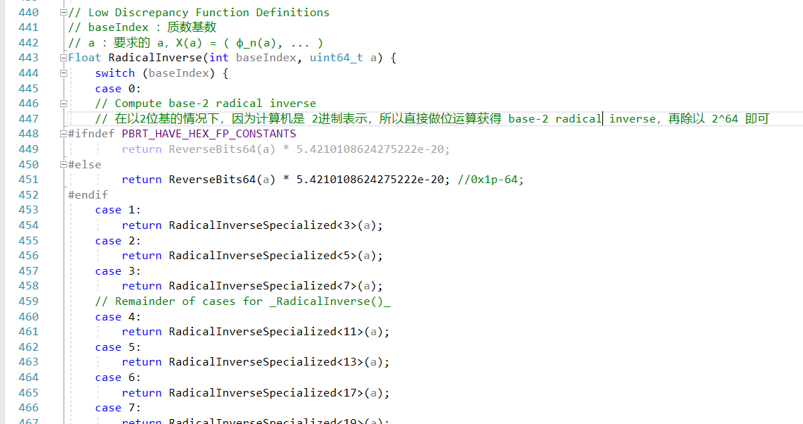

# Halton采样

主要参考文章

[文刀大神的文章](https://zhuanlan.zhihu.com/p/20197323)

[Zero大神的笔记](https://note.youdao.com/ynoteshare1/index.html?id=bb9fc1ecc1a33bcd65e6fee9da4ecd82&type=note)

## Halton 和 Hammersley 序列

对于一个正整数 a，我们可以把它转化为任意进制的数，假设转化为 b 进制（b是大于2的正整数

那么，a 就可以表示为

其中 d 代表是第几位的数字

那么，我们可以用函数式的形式表达出来

在这里，所有的数字 $d_i(a)$，都在 $[0, b-1]$ 的范围内，因为这是一个 b 进制的数

我们定义，**基逆函数(radical inverse function)** $\phi_b$，这是一个在基底为 b 的情况下，一个正整数 a 对应一个在 $[0, 1)$ 的范围内的小数的映射，它的方式很直观，就是关于小数点，做镜像

在这里，数字 $d_i(a)$ 在小数中，对应 $d_i(a) / b^i$

那么有一个最简单的 低差异序列(low-discrepancy sequences) ，被称为 van der Corput sequence，也没有对应的中文翻译

这个序列就是 以 2 为基底的，基逆函数

当然，这个序列也有点问题，就是当我们的 a 变得越大，$\phi_2(a)$ 和 $\phi_2(a-1)$ 之间的差值会越来越接近 $0.1(b)$

**TODO** 这个东西真的是问题么，我怎么觉得这个特点蛮好的

那么，这个序列的差异值是

算上 n 个维度的话

所以我们给出了 n 个维度的 halton 序列的定义，我们这里的基底，选择的是所有的质数序列

其中 $(p_1, ... , p_n)$ 就是对应的质数序列

n 维度的 halton 序列的差异是

**TODO** 差异值的定义和物理意义参考 pbrt 中的前一章，但是这个内容是怎么来的，数学方法未掌握

如果给定了有 N 个样本，我们可以在第一个维度加上一个平均点来减少差异

这个就是 **Hammersley** 序列

pbrt 给出了2张图，分别是 Halton 和 Hammersley 的对比

*在这里，第二张图的x值，是均分的，我们可以拿一张纸扫过去，每移动一点，都只会加一个新的点出来*

## halton序列的实现

halton 序列，最主要的就是 $\phi_b(a)$ 这个函数了，它在：

这里呢，提一点 trick 的技巧，用于提升运算速度的，就是 2 进制的情况，因为机器本身的数字表示就是 2 进制，可以使用位运算来实现计算 基逆

这是，a 的 2 进制表达，这里之所以 m 是 64 是因为，我们用的是 64 位的

那么，它的基逆的第一步，就是倒过来

然后除上 2 的 64 次方，变成小数

64位的数字，通过位运算来置换顺序

这是普通的做法

这里有几点需要注意，能够尽可能的提升性能
- 使用模板函数，因为有一些整数的除法，编译器是可以做优化的
- 在循环中，尽量只做同一数据类型的计算

类似的，这是一个整数翻转的接口，后期会用到

接着，对于 halton 序列，当我们的基的大小越来越大时，得到的 $\Phi_b(a)$ 会越来越趋于规律化，所以需要一个 Permutation 函数做一个打乱顺序的功能

比如，对于点 $(\Phi_29(a), \Phi_31(a))$ 它的不打乱，和打乱，区别非常大

打乱也很简单，就是对于数字 $[0, b-1]$ 做一个乱序的映射即可

即

每个数字做一个乱序映射

用到的就是洗牌函数 Shuffle ，在 pbrt 的 Further Learn 里面有提供更好的方法

这里有一点要注意，0 也是有映射的，所以这里的小数点映射，后续都是 以0对应的映射结束的，无限循环小数

## 采样器的实现

pbrt 给出了使用 分层采样 和 halton采样 的对比，在近处的细节，分层采样的噪声更多

但是在远处，分层采样会把更多的 aliasing 转换成 noise，但是 halton 很明显的看到是规则的 aliasing

*给人的感观上，后者会更好（个人感觉*

首先注意到，这是一个继承于全局的采样器，全局采样器的意义在于，它不是对单单一个像素区域进行采样，而是对一片区域做采样

参考 Global Sampler，全局采样，需要实现这两个函数

在 pbrt 的前面章节中，给出了这么一张表

这恰好也是一个 halton 序列的 2 * 3 的表

它的映射关系应该是，我们对一个整个区域 res 做采样

#### 划分格子

在 pbrt 中，默认是用 128 的格子做划分的，这里给出了更小的值，是处理边缘情况和非常小的图片的情况

为什么在这里要拿 $2^j , 3^k$ 来做定位呢
- 1. 对需要采样的区域做格子划分，然后分别用 2，3 来做为基底，对这个区域内的位置，做一个标识
- 2. 用 2,3 做基底来定位，符合后续的算法需求

#### 获取格子内对应的index

使用欧几里得的流程，可以理解成，我们构造这么一种映射
- 具有在每间隔 a*b 的范围内，我们可以循环得到
- 使用当前像素在 区域内的位置，构建 Halton 伪随机数，并做映射

#### 获取对应随机维度

因为我们的 index，是根据像素位置而得来的，所以要做到脱离关系的伪随机，得把相应的影响消除

