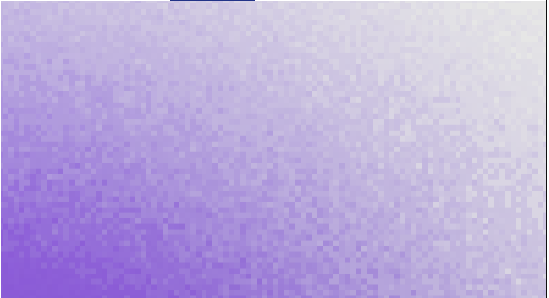
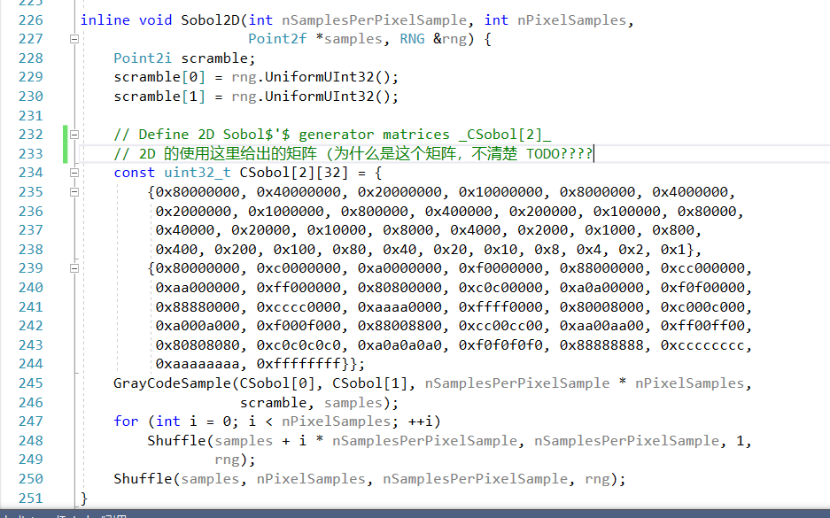

# 02序列采样

主要参考文章

[文刀大神的文章](https://zhuanlan.zhihu.com/p/20197323)

## 原理

0-2 采样器是基于 0-2 序列来生成的样本采样器

0-2 序列既能满足分层采样的限制，也能满足拉丁超拉丁采样的要求，对于一个 4*4 采样的情况，甚至满足 (1/2,1/8) 的每一块出现恰好一个采样的情况


我们对其做 2 次方系数的分割，都能在每一块都能恰好找到一个样本

0-2 序列怎么生成 2D 的图像采样？对于一个总共需要 2的整次幂 样本数图像(如果不够，则填充)，我们可以把它拆分为 $2^{l_{1}+l_{2}}$，其中 $l_i$ 是非负的整数，可以假设 $l_1$ 是横坐标的幂次，$l_2$ 是纵坐标的幂次，他们组成 2维的元素点，每个元素点和前一个元素点的距离在范围：


其中，a是


这个式子，对于任意的 $l_1 + l_2$ 组合都成立，对于这个序列的子序列，也成立。（比如 16个其中的前 4 个，也是成立的） 

##### 个人理解

首先理解这个间隔，这里的间隔是指，对前一个数的间隔，第一个数是和 0 做对比，所以每个维度的第一个数都是在范围

$$\left[\frac{0}{2^{l_{1}+l_2}}, \frac{1}{2^{l_{1}+l_2}}\right)$$

- 为什么是 0，1
- - 因为在这里，第一个数，所以必取 0，1，计算的是和起点 0,0 的距离
- 为什么是 $l_1+l_2$
- - 因为这里是对任意的 $l_1+l_2$ 的组合都满足，所以对于第一个数，最严格的组合，就是另一边的幂次是 0 的时候

那么，理解了第一个点的范围后，后续的点，就根据这个范围限制来随机

后续的以此类推，直到 $2^{l_i-1}$ 个数，恰好排满 $2^{l_i}$ 的需求

这里进一步解释了，如果面对，单个样本，也有多重数据的情况（2D 单个样本需求）应该怎么处理

这里假设，一个 pixel 需要 （2\*2) 个样本，（4\*4）的 2D 单个样本需求，我们应该怎么用 02序列 完成采样

- 首先，我们使用的依旧是 02 序列，但用的是前 $(2 * 2) * (4 * 4) = 2^6$ 个样本
- 对于前 $(4 * 4)$ 个样本，一样满足 02序列，那么这 16 个样本值，就作为第一个采样样本的 2D 需求
- 依次类推

## 采样和生成矩阵

*个人理解，这里主要解释了一个原因，为什么 02序列 能够在计算机上极速运行，根本原因是其 02 特性跟计算机的 2进制 十分吻合*

#### 02序列的生成

Halton 采样，对于成千上万的像素，非 2进制 的 Radical Inverse 计算开销还是太大了，所以如果都使用 2 进制，将提升很多。

在这里提到一个概念，生成器矩阵（generator matrices），在 Halton 采样中，因为base 会变化，所以对应的生成器矩阵，会每一种 base 对应一个。

但是 02序列 采样，我们打算都用 base 2 做基底，所以可以通用一个矩阵。

对于 Radical Inverse 函数，$\Phi(x)$ 其实可以用矩阵来表示，


这里做一下说明：
- 输入是 a ，它有 n 位
- 输出是 $x_a$，它的 base 是 b，它的取值范围一定在 $[0,1)$
- 如果把中间的矩阵，看成是单元矩阵，那么这条式子，就是  的矩阵拆除行列相乘的写法
- C 这个矩阵，是一个已经存在的矩阵，能够满足第一部分要求的矩阵，直接拿来用即可

```
where all arithmetic is performed in the ring Zb (in other words, when all operations are performed modulo b)
```

在这里面，所有的运算结果，都会模一次 b，这里主要指的是 C矩阵 和 d列 的运算部分，因为整个逻辑中，出现的应该都是，$[0, b-1]$ 的单个的数字

在这一部分，我们使用的条件是 ，并且利用各种 2进制 的特性，来简化运算。

注意到，因为是 2进制，所以 C矩阵，里面要么是 0，要么是 1，所以我们用一个 uint32_t 来表示它的列向量，这种表示方法，既省内存又高效

考虑到右边的矩阵乘法 ，我们将其展开，有：


在这里，数字 $d_i$ 只有 1和0，代表是否在总和上，加上 $C[i]$，而在这里面，加法再模2的结果，是和 **或** 运算是同一个结果


对于左边的运算，也可以化简，我们假设，上一步计算出来的结果 ，那么下一步就是：


注意到，我们的 v，也是用 uint32_t 的格式进行保存的，即，这个 v 的值是：


那对于这个数，我们进行，头尾调换操作，也就是做 Radical Inverse：

首先变成：


用哪个函数？上一节用的


然后，再乘上 $2^{-32}$ 即可

#### 乱序

为了让 02序列 更具有实用性，我们需要在对每个像素做采样时，加入一定的随机性，除了使用不同的 02 序列，另一种方法就是在某一步，我们加入随机的因子。

*个人理解，在上一整步中，C矩阵是固定的，整个算法流程也是固定的，所以同样的输入，就有同样的输出，这显然对于采样的需求上，是不可接受的，因此，就需要加入随机的因子*

这里提供的随机方法是，不停的改动区域，并尝试置换

对于每个维度
- 首先分为 $[0, 0.5)$ $[0.5, 1)$ 来确定他们是否进行交换
- 然后对分成的 2半，做上一步相同的处理
- 直到处理完，所有的 2进制位数为止

这种方法有一个好处：
- 保留了原本数据的 低差异性（不知道怎么得出的结论，pbrt说是就是了

下面是，原来的 02序列，和打乱了的视图


这个方法，同样可以用异或来实现，因为都是 01 表示的 uint32_t ，且异或中，异或 0 等于本身

我们暂时可以理解成，通过异或，来表示是否交换（**TODO**，第一次看，是看不懂为什么可以，但确实有这个流程）

*在看完后面的内容，可以理解为，我们通过一个随机数，就直接代表了整个的随机过程，然后再这个随机数的基础上，做我们的 Radical Inverse 算法*

在这里，先提出一个概念，[格雷码](https://zhuanlan.zhihu.com/p/29254973)

格雷码的特点：
- 对 $2^i$ 都支持 一一映射
- 相邻的数字，他们只有一位的变化
- 一位的变化是哪一位？比如下图中的 $g(n)$ 对比 $g(n-1)$，变化的位数就是 $n$ 本身，后面尾巴有多少个 0（ 100 到 000 不算


格雷码的获取方程


上面是我对于整个函数的理解

吐槽一下，在pbrt中，作者还给出了对应的 指令代码，非常自恋的夸赞代码的简洁（代价就是太难看懂了


**非常关键的一点**
- 虽然前面一直在谈 02序列，但这里举的例子，是 VanDerCorput 来说明格雷码的好用之处！一开始看会非常非常懵逼

#### 采样器的实现

02 采样器，2D 的数据使用的是 02序列，而 1D 的数据是 VanDerCorput

pbrt 中给出了 02序列采样 和 分层采样 的对比，相比来说，02序列采样，放大后有横竖纹路（但是从效率，和整体效果，肯定 02 更优

如下图




在 02序列采样中，初始化：


这个函数，把采样数，补到了 2 的整数次幂，为的就是方便我们进行后续的 02序列 运算（当然，因为我们的 VanDerCorput 采用了格雷码映射，所以也需要补齐


这个是在某个像素开始时，数据的初始化（因为这个是 Pixel Sampler，所以针对每一个像素，都有需要的内容初始化，参见 Pixel Sampler 那一章

我们先对 1D 的情况做采样，这里加上了，采样后的洗牌流程


如果硬是要理解 VanDerCorput 中的 C矩阵，那就是单位矩阵，不过 VanDerCorput 的流程中的矩阵，其实是做了一个逆转的


那么 02序列要怎么使用呢？没错，C 矩阵已经给好了，我们只需要把 1D 的 VanDerCorput C矩阵，换成 2D 的 C矩阵即可



#### 额外谈的一点

在pbrt中，他额外提到了一点

这里做洗牌的原因，是因为 1D 的数据，会和 2D 的数据显示出相关性，这个很好理解

因为都是同一个算法出来的，虽然用的随机值不同，但整个流程是一样的

但是提了一点，因为相关性


面光源无法覆盖在面光源上采样的点，这一点比较迷惑，但是这里有相关性，做随机洗牌确实是有必要的

**TODO** 这个相关性，导致面光源覆盖性不高的点


