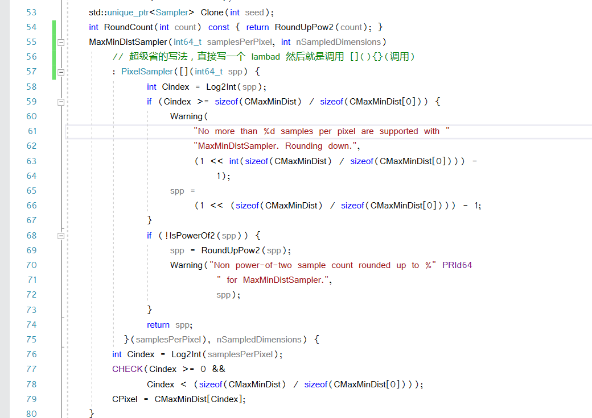
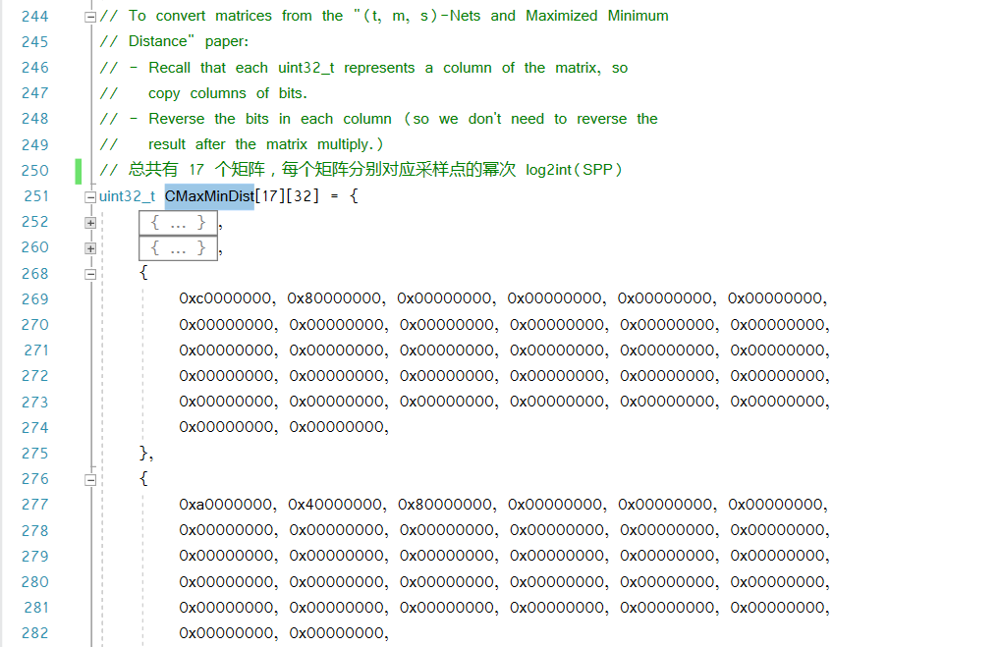
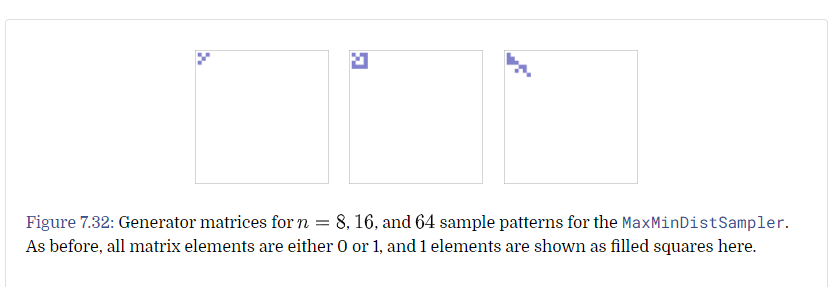
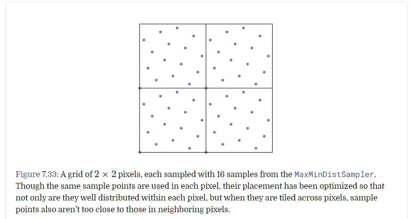
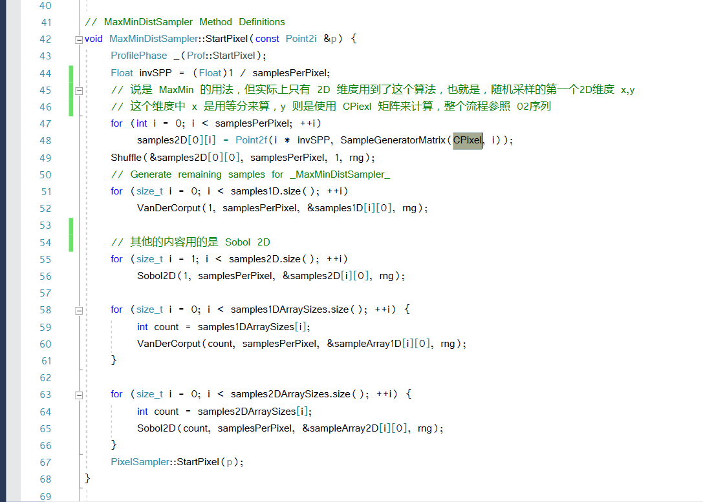

# 最大化最小距离采样

02序列 虽然不错，但是还是有一些问题。其中一个就是

- 有时候，采样生成的点，距离还是非常近

因此，有人提出了用不同的生成矩阵，去计算采样，这里介绍的，就是 最大化 最小距离，它对应的原理

## 原理

首先，这个算法取决于它的采样，该采样器是 继承 Pixel 采样器的

跟 02序列 采样器一样，要是 2 的整次幂

其核心算法，就是一个 CPixel 矩阵

每个幂次对应一种矩阵，pbrt 给出了对应的示意图

这是一张 2*2 的采样图，每个图做 16 次采样，也就是 SPP 是 16

但这里，可以发现他们是重复的，而且有环绕效果（首位相接），达到了既均匀，又有恰当的密度的效果

不过这里，只是针对第一个 2D维度的 (x, y) ，因为在代码中，只有这里用到了所谓的最大最小距离实现

## 代码

