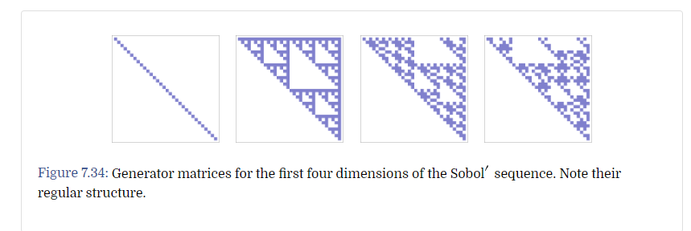
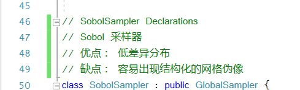
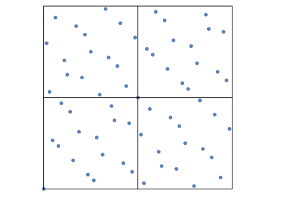
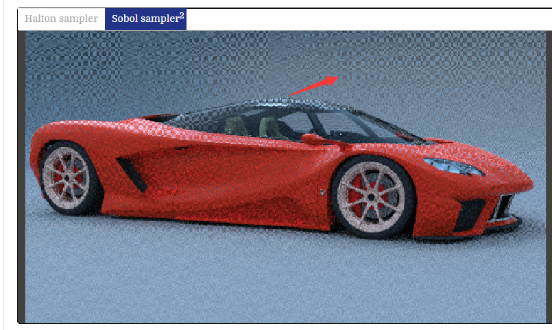
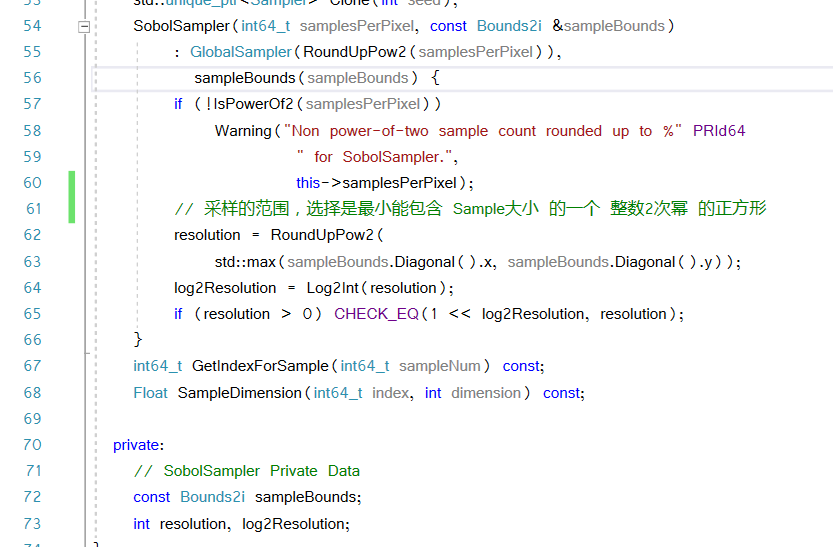
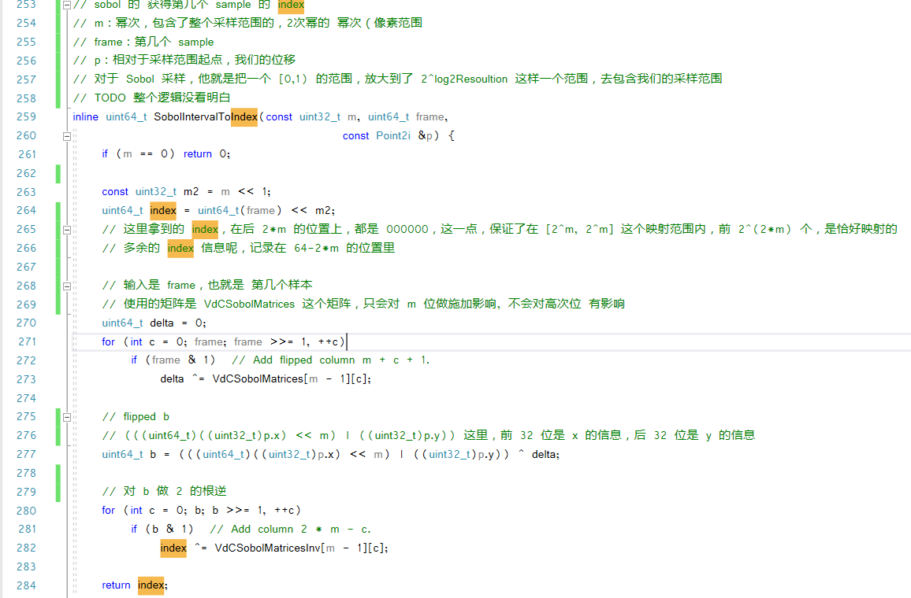
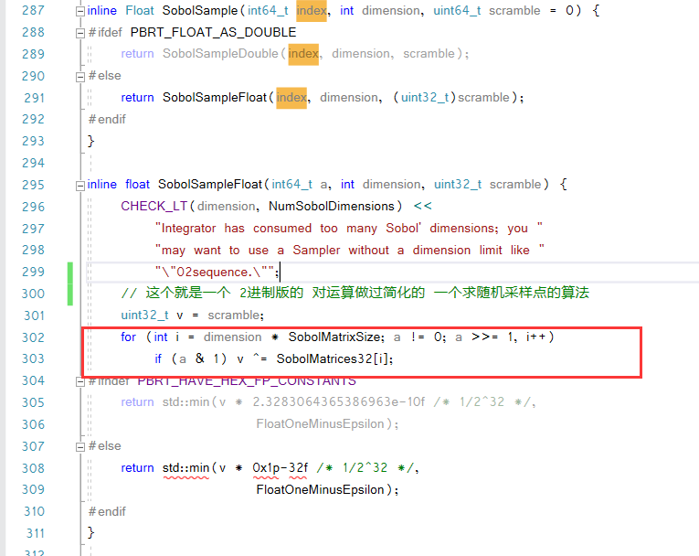
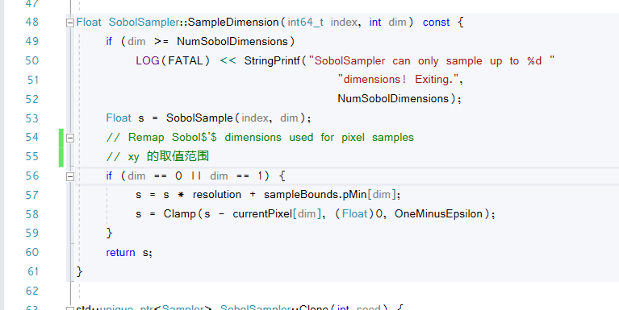

# Sobol采样

Sobol 采样是一个基于一系列矩阵的采样方式

这里是其矩阵的示意图

其采样点的分布，会非常相似

Sobol 的结构化伪影

Sobol，会用一个尽可能小的，2的整数次幂为边长的正方形，将一个采样区域囊括

这一段逻辑没看懂，但是其内核是一个 SampleNumber 到 Index 的一个映射 **TODO**

2进制的矩阵，快速计算的方法

我们计算出的，是一个 $[0,1)$ 的范围，要把它映射会，相对于 CurrentPixel 的 xy 位移

