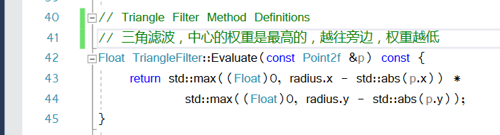
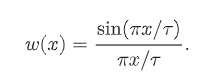

# 图像重构

当我们选择了恰当的采样器后，我们需要把样本，和他们计算出来的辐射度，转换成用于显示的像素值，或者存储起来。

根据信号处理的理论，我们需要做这三件事情，来计算最终的图像上的每一个像素的值
- 从图像样本中，重构一个连续的图形函数 $L$
- 对$L$ 进行预处理，将频率过高的部分，也就是因为像素间距而不能表现的细节，做一次过滤
- 在像素的具体位置，对 $L$ 进行采样，并计算最终的像素值

因为我们知道，在最后，对 $L$ 进行采样的是，只需要在像素的位置即可。所以我们不需要重构一个连续的函数表达。对于第一步和第二步，可以整合为一个 滤波器即可。

注意到，如果我们使用，比 **Nyquist频率** 更高的频率去采样，并且使用 sinc 去做重构。那么能得到完美的原始图像。（这是因为，我们纯粹的使用了点采样）。但往往我们达不到这么高的采样率，所以使用非均匀采样，在 aliasing 和 噪声 之间做权衡。


为了计算实心处的 $(x,y)$ 的像素值，在 radius.x 和 radius.y 之内的值都要被考虑。我们对其做加权平均


- $L(x_i,y_i)$ 表示第 i 个样本，在 $(x_i,y_i)$ 处的辐射度
- $w(x_i,y_i)$ 表示的是权重
- $f$ 表示的是滤波函数

在这里，sinc滤波并不是最佳的选择，因为对于超出频率极限的滤波，容易产生振铃。而且 sinc 的波形是无限长的，所以离中心

## 滤波函数

所有的滤波函数都继承 ```Filter``` 类，提供对应的滤波函数。```Film``` 类会存储一个指向```Filter```的指针，```Film```类在下一节中介绍。

下面介绍了几种滤波器，使用不同的滤波器，会对最终成型的图像有不同的影响：


- 高斯滤波：会模糊边缘
- Mitchell滤波：最清晰
- Box滤波：是最差的滤波器，因为sinc混了高频的信息进去


pbrt的滤波器，有一个 extent 的定义，其范围是根据从原点到截止点的半径来确定的。extent 是其半径的两倍。


## Box 滤波器

Box 的滤波器是最常见的滤波器。盒型滤波就是对图像正方形区域内的所有样本做平均加权。虽然效率是最高的，但是最差的滤波器。

下图是盒型滤波器和三角形滤波器的示意图：


上图是，盒型滤波器，重构 a 阶跃函数，和 b 正弦曲线的重构。可以看到，对 sin 函数的重构表现很差。


## 三角 滤波器

三角滤波器的效果比盒型滤波器好，他是在滤波器的平方范围内，权重从中心开始最高，到边缘下降



这就是在中心，权重会很高，越在旁边，权重就越低

## 高斯 滤波器

高斯滤波器，使用的是高斯函数，但是，在大于 Radius 的范围外，我们将其置为 0。


这是高斯滤波器，和米切尔滤波器的对比。相比来说，高斯滤波器会带来模糊，而米切尔滤波器，会锐化图像的边缘。

1D 的高斯函数是：


- α 控制滤波器衰减的速率。这个值越小，图像成像越模糊。
- 第二个因子，保证了 x 在到达 r 时，图像平缓下降到 0

为了效率运算， 第一项可以直接计算出结果。


## Mitchell 滤波器

Mitchell 滤波器，是在振铃现象和模糊的一个取舍。


在这里，边缘是取负值的，它会具有负的边缘区域，这一部分能改善边缘的清晰度。使图像更加清晰。
当然，如果负值过多，可能会使得像素值是负的，所以要做 $[0,1)$ 的约束

下图是 Mitchell 滤波器，对阶跃函数，和 sin函数的 一个重构


Mitchcell 滤波跟高斯滤波一样，它是 1D 滤波器在 X, Y方向的成绩，是可分离的。（实际上，pbrt用的滤波器都是可分离的，但是我们的接口```Filter::Evaluate()```并不强制要求，这样拓展性更高)


Mitchell 滤波，在 1D 上是一个偶函数，范围是 $[-2,2]$。这个曲线是一个拟合的3次多项式，而且在 $[0,1]$ 和 $[1,2]$ 上的拟合函数不同（是分段的）。这个函数设置得非常的精妙，保证了在 x 在 0,1,2 这3个点的连续性。


其实现：


## Windowed Sinc Filter （窗口Sinc滤波器

最后介绍的 ```LanczosSincFilter``` 是基于 sinc 函数实现的一种滤波器。事实上，sinc 往往会和另外的函数相乘，来保证在远处（距离 x = 0 较远的地方）的值是0。这种做法，使得滤波器变成了有限的范围。对于这个滤波器，我们添加一个参数，去控制 sinc 的周期，使得它在特定的周期归为0。下图是其函数式，其周期受到参数控制




注意到，他这里是截断的 sinc 函数，再乘上  Lanczos windowing function (orange line) 的结果


该滤波器的效果非常好

其效果实现


