# film 管线

在 pbrt 中，film 类会对传感设备进行建模。当确定了每一条 Camera Ray 的 Radiance 时，Film 类决定了，在 film 上的点附近的 piexl 上，采集到的样本的贡献度。当主循环推出时，Film 写入一个文件中。

对于 realistic  真实相机模型，章节 6.4.7 介绍了一种计算方法，用于计算一个相机的传感器，在一定时间内到达的能量，我们可以认为，这个传感器这一定时间内，一小块区域内，测出的是平均辐射强度。```Camera::GenerateRayDifferential```该函数返回了具体选择怎样的测量方式，以及射线的权重。因此，film 的实现只需要通过这些提供的辐射值，并乘上权重即可。

本节介绍了单个 Film 的实现，该实现，使用像素重构方程，来计算最终的像素值。对于一个基于物理的渲染器，它将图片用一个浮点图像的格式进行存储。这么做的原因是，用浮点数进行存储会更加灵活。避免图像量化到 8bit 时，丢失精度。

为了在显示设备上显示此类图像，我们需要把这些浮点像素值，映射为离散的值来显示。例如，显示器通常是使用 RGB 来描述颜色，而不是任意光谱的功率分布。因此用通用基函数系数描述的光谱，必须转化成 RGB 形势，然后才能显示。还有一个问题是，显示器可以显示的辐射范围，比真实场景中光的范围要小得多。所以像素值必须映射到一个可以显示的范围，来得到理想的显示方式

## Film 类

Film 类在 ```core/film.h``` 和 ```core/film.cpp``` 中被定义

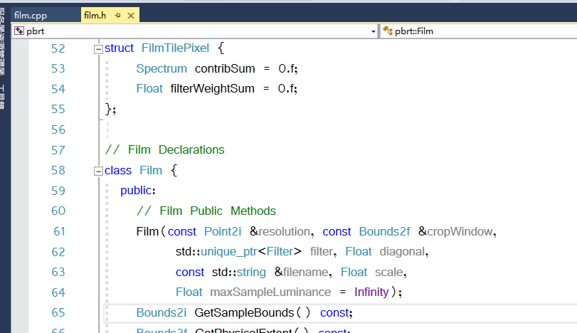

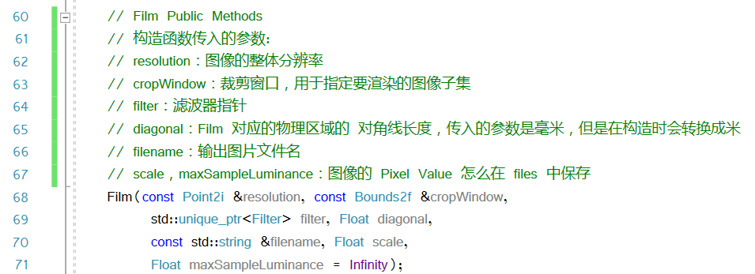

Film 的构造函数

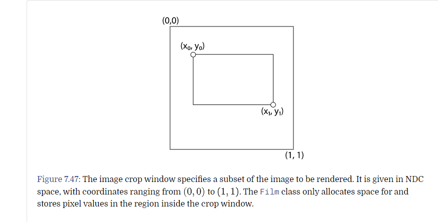

Crop Window 是一个在 NDC 空间上表示的渲染范围，他的大小范围是 ```(0,0)~(1,1)```，我们只会允许在 Crop 范围内的执行存储和写入。这对于后续调试是非常有帮助的。

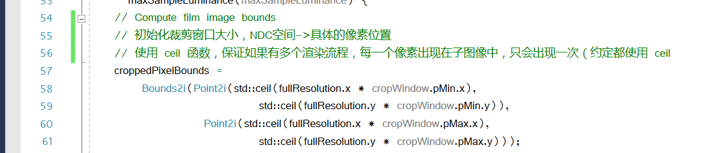

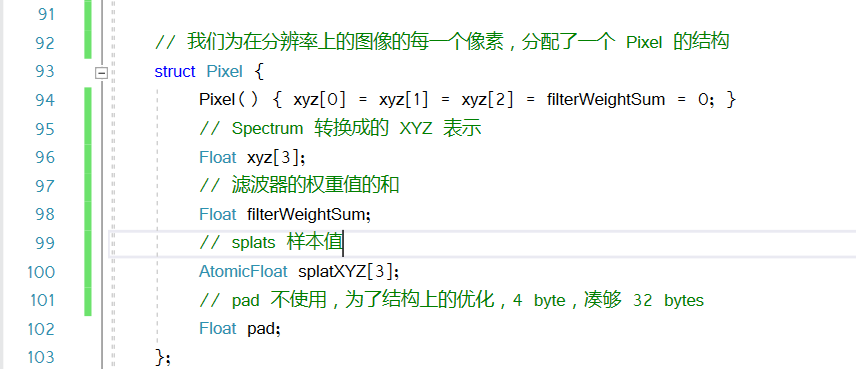

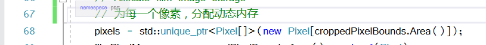

为每个像素分配动态内存

这里对于光谱的内容，我们使用的是 XYZ 的形势去存储，原因有下
- 不需要使用完整的光谱表达，只需要存储 XYZ 三条人眼最敏感的值即可
- 相对于 RGB，使用 XYZ 的表达，是和显示无关的，RGB 则需要一组特定的显示响应曲线。当然，在最后都会转为 RGB 存在文件中。

对于典型的滤波器设置，每一个图像样本，可以会对 16个或者以上 的像素造成影响。这里会花费很长的时间。

因此，Film 做了一个预计算。

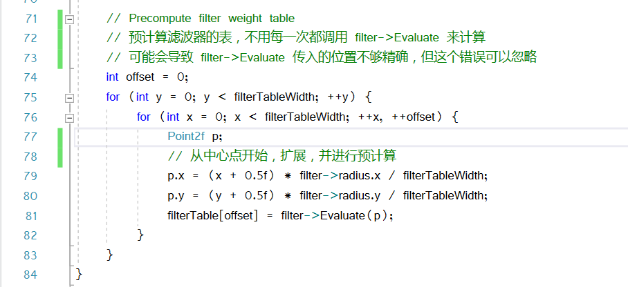

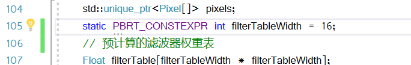

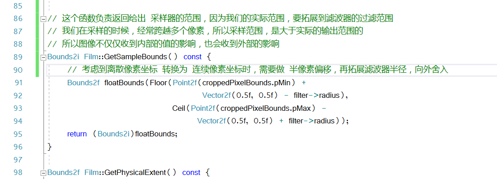

实际的采样范围，会比我们的图像范围要大

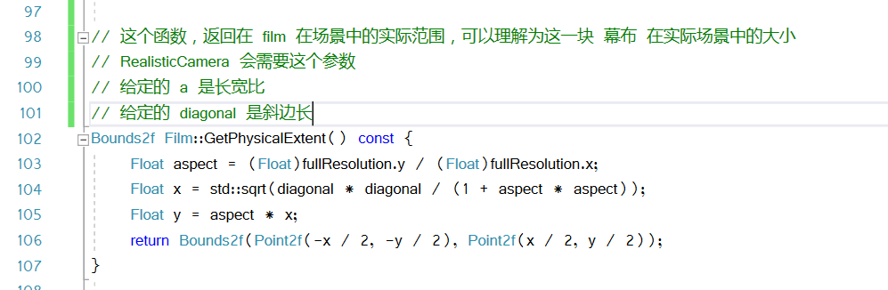

实际的 film 幕布大小，其核心计算依赖于

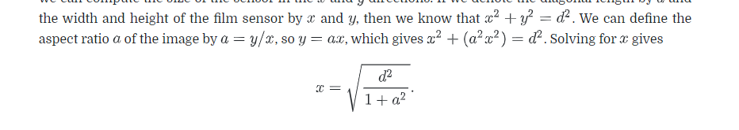

## 为 flim 类提供像素值

有三种方式，可以将采样的内容，提供给 film 类。先说第一种最简单的方法。

第一种方法，就是通过采样器在分块上的采样结果，这是直接将 film 上的像素，和光谱的贡献度联系起来。
但这种方法，不太适合多线程优化，因为每一个像素，可能有多个光谱去贡献，那么很难实现高性能

因此 film 定义了一个机制，块机制，传入一个 样本范围，给出一个存储了光照贡献信息的，块范围

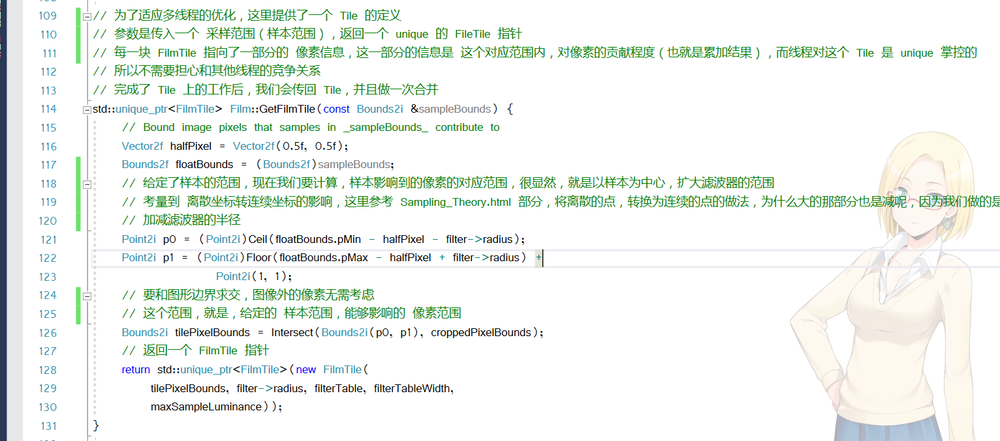

一个块的初始化，除了做预计算，还要分配范围大小的，像素累加值

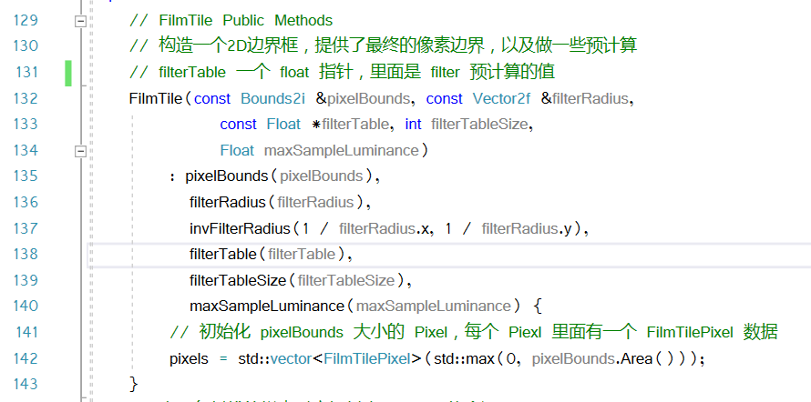

一个 FilmTile 中，应该有这些内容

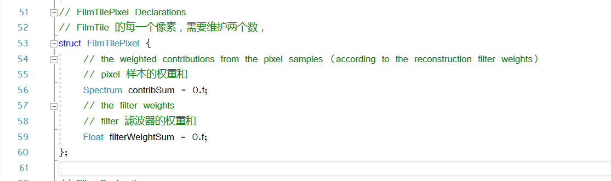

一个 Pixel 里面，存着该 Pixel 位置，对 Film 的贡献

当一条光线，上的一个样本，对应的辐射度被计算时，我们就可以调用 ```FilmTile::AddSample```

这个函数的输入，是对应的 辐射度```L``` 和样本贡献度```ω```，他会更新样本的贡献结果

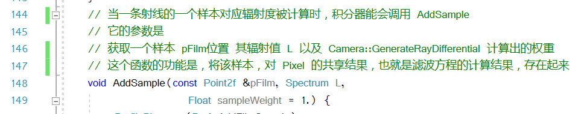

为了理解 ```FilmTile::AddSample```的用法，首先要回忆一次 Pixel filter 方程

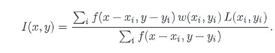

其中:
- I ：像素值，这个像素值是附近的 辐射度 的权重和
- ω ：光照权重值
- f ： 滤波器提供的权重值

在 pbrt 中，我们的滤波器，是有限范围的，这个方法，是去计算，当前的样本，影响了哪些像素。

在这里，我们去更新，被当前样本，影响的每一个 Pixel。分别去累加他们的 分子和分母。在渲染的最后，我们用除法来计算，最终的像素值

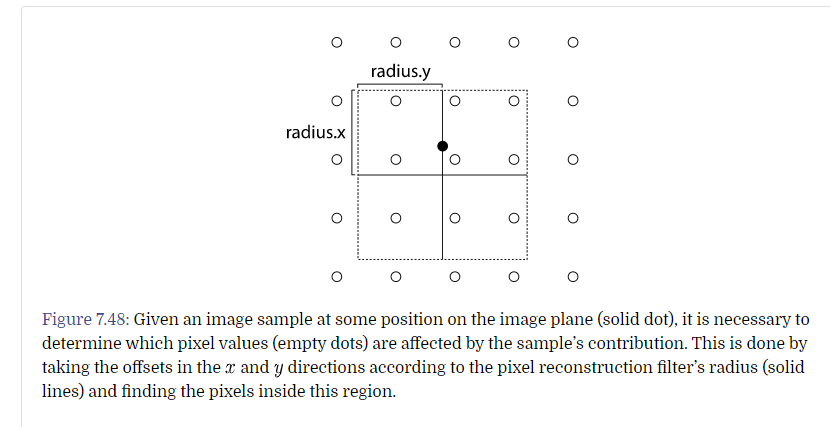

为了找到，一个样本，可以对像素范围内造成的影响。首先，是连续转离散的 -0.5 位移处理。然后是滤波器范围。因为在滤波器范围外的，这个像素就影响不到了。

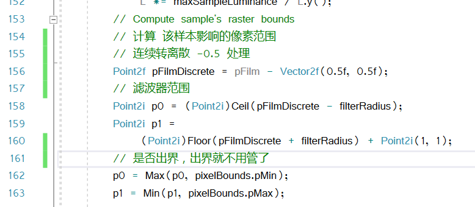

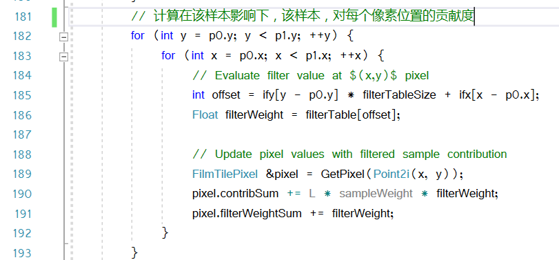

为了去计算，滤波器提供的权重，一般来说，我们会计算它距离中心的偏移值，然后用滤波器的```filter->Evaluate```来计算权重

比如

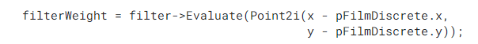

但是，这个权重表，是可以预先算好的，我们可以预先将位置映射也预计算一次，存在两个 1D 数组中

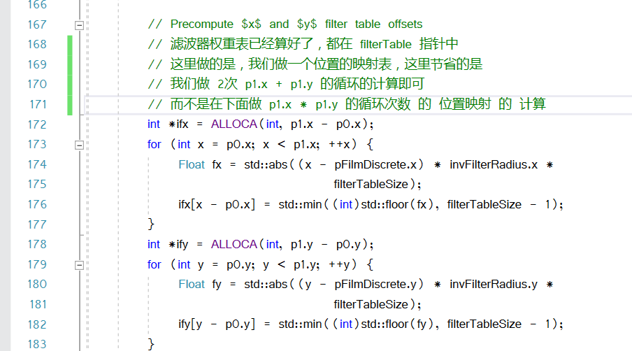

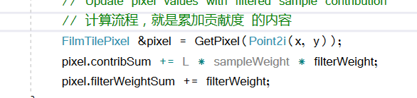

这个```GetPixel```函数，传入一个像素坐标，返回对应的 ```FilmTilePixel``` 的内容

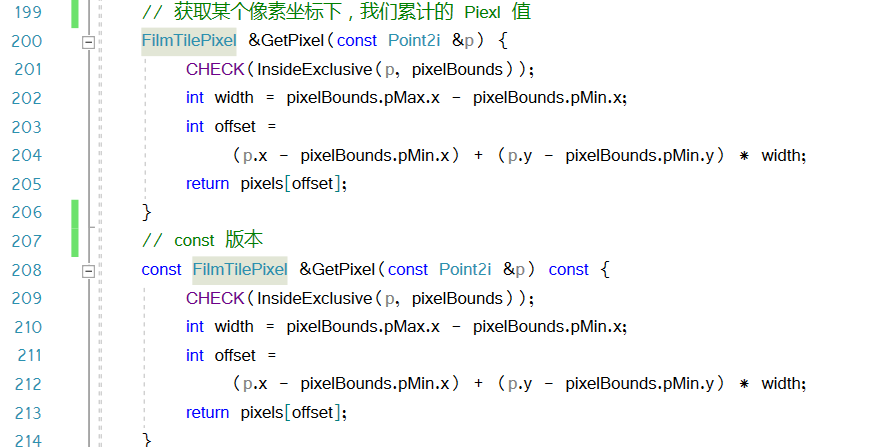

之后，我们的渲染线程，会调用 ```MergeFileTile``` 去合并我们的 FilmTile。

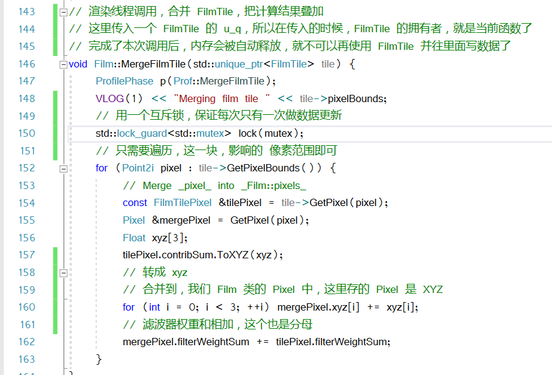

这是一个设置所有值的接口

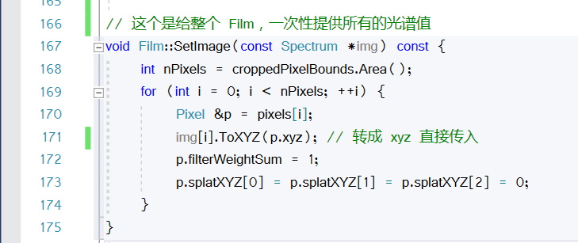

这是一个涉及后期的算法的接口，用到了原子数据，就不用写接口了

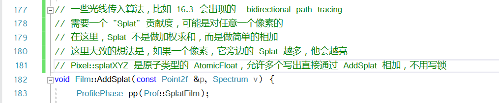

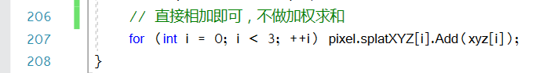

## 图片输出

在结束了主要的渲染循环后，```Integrator``` 的 ```Render()``` 函数会调用 ```Film::WriteImage()```

这个函数会把图像保存进文件中。

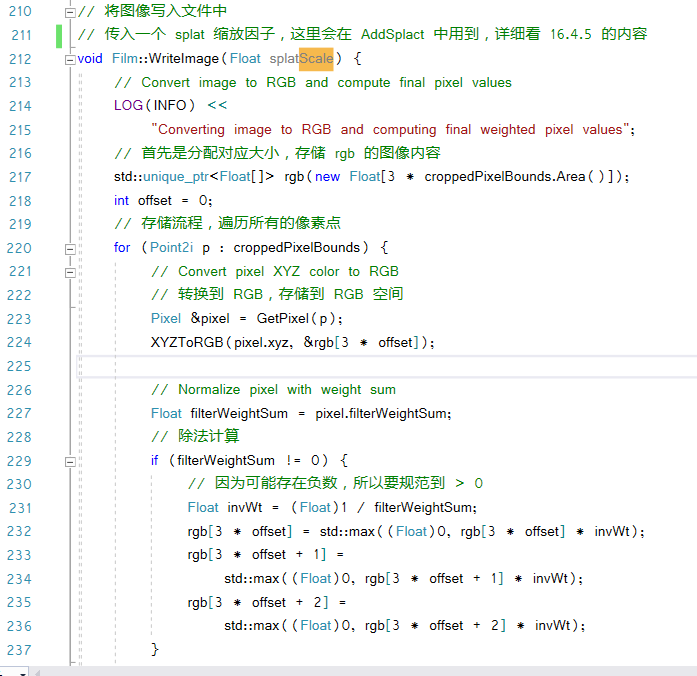

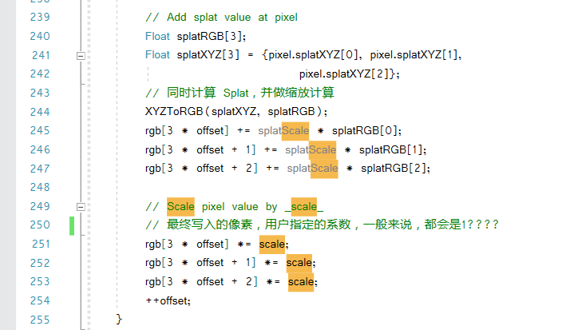

整个流程就是文件的写入，唯一有疑惑的就是要乘上一个给定的缩放因子，这个后续再研究。


 


