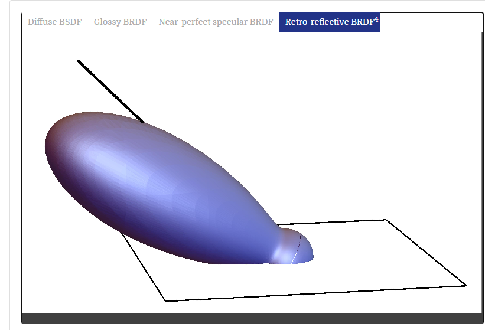

# 反射模型

这一章节，我们定义了一系列的类，来描述光在表面的散射模式。回忆一下，之前的 BRDF BTDF 和 BSDF，在本章中，会定义这些通用接口。

物体表面的散射，最好的描述，就是多个 BRDF 和 BTDF 在空间中的混合。在第9章中，我们会介绍 BSDF 来描述这种混合散射。当前章节，暂时回避了表面上的反射和透射的性质问题。第10章会解决纹理的问题。确切来说，BRDF 和 BTDF 是描述了 单个点进入 和 离开表面的光的散射现象。但对于表面下的光线传输，会在 11 章中讨论，即 BSSRDF。

表面的反射模型，有多种来源
- **测量数据**：在实验室中测量真实世界的反射分布性质。这些数据可以直接用表格或者一组基本函数来描述
- **现象学模型**：我们试图用描述现实世界的特性，来实现模拟方程。这类的 BSDF 会特别容易使用，因为他们有倾向于直观的参数，来修改其行为，比如粗糙度
- **模拟**：有时，我们已知表面底层的信息，比如我们知道涂料是由带有色彩的均匀颗粒组成的，或者特定的织物是由两种不同类型的线组成的，并且知道他们的反射特性。在这种情况下，我们可以从微几何来模拟反射数据。或者再渲染过程中，做一次预处理完成模拟，并使用一组基函数来用于真实渲染。
- **物理（波）光学**：一些反射模型是根据，使用详细的光模型，并将其视为波，使用 Maxwell 方程，来找到光是如何在物体表面进行散射的。这种计算模型通常代价高昂，而且也不见得会比几何光学模型准确。
- **几何光学**：和 **模拟** 方法一样，如果知道表面的底层散射和几何特性，我们可以从这些描述中，建立一个封闭形势的反射模型。这种方式，会使得光和表面更容易处理，因为我们忽略了光的偏振等波效应。

在这里，介绍整个系统的流程

- 如果一个 ```SamplerIntegrator```，我们会在每一条射线，计算```SamplerIntegrator::Li()```
- 找到与一个几何基元最近的```intersection```后，我们会调用该基元挂在的```surface shader```
- ```surface shader```是材质类的一个方法，它负责确定 BSDF，一个表面上的确定点的计算。在这里，返回一个 已经初始化来表示散射信息的 BSDF（包含 BRDF 和 BTDF）
- 最后，积分器用该点的入射辐照，以及 BSDF 方法，来计算该点的散射光。

## 基础术语

为了能够描述不同视觉效果的反射模型，我们在这里介绍一些基础术语，来描述表面的反射。

来自表面的反射，大致可以分为四大类：
- 漫反射
- 光滑镜面反射
- 完美镜面反射
- 逆向反射

大多数真实表面的反射，是这四种类型反射的混合。**漫反射表面**，会在各个方向均匀的散射光。尽管完全都是满反射在现实中并不存在，但是无光的黑板是类似的情况。**光滑镜面反射**，比如塑料或者高光泽度的油漆，他们会对其他对象给一个模糊反射。**完美镜面反射**，出射完全跟入射对称，镜子和玻璃就是例子。最后，是**逆向反射**，比如天鹅绒，月球表面，会沿着入射反向散射出光线。


漫反射


光滑镜面反射


完美镜面反射


逆向反射

在给定了反射的类型后，反射率的分布函数，可以是 各向同性(isotropic) 或者 各向异性(anisotropic)，大部分物体都是各向同性的：如果你选择一个点，并在该点绕法线旋转，反射光的分布率不变。相反，各向异性的材质，旋转之后会有不同的反射光分布，比如拉丝金属，各种类型的布，还有光盘。

## 几何设定(Geometric Setting)

pbrt 的反射计算，会在一个反射坐标系中进行，这个坐标系，由两条互相垂直的切线和法线组成 xyz 轴。在 BRDF 和 BTDF 的相关计算中，所有传入和返回的向量，都是在这个坐标系下的。


在这个 stn 坐标系中，传入的方向向量 ω 都会转换到这个坐标系

该坐标系，同时支持用球坐标系来表示方向，```(θ,φ)```，其中 θ 表示和 z 轴的夹角，φ 表示平面角。如果传入的是球坐标系的向量，我们可以很方便的算出 cosθ 的值：


为此，我们给出了几种快速计算的函数


同理，因为是球坐标系，所以我们有：


这个计算比较特殊！记住是，delta phi

在 pbrt 的 BRDF 和 BTDF 的流程：
- 入射光 ```ωi``` 和 出射光  ```ωo``` ，在转换到相对坐标后（nst），都是 归一化，且方向向外
- 出于方便，发现的 **n** 往往都是朝着物体的外面，这样就能很容易的区分，光线是进入还是离开透射的对象。如果入射光 ```ωi``` 和法线是在同一个半球，那么这就是进入的光线，否则，就是出去的光线。所以这里有一点，我们的法线，有可能和 入射光 ```ωi``` 及 出射光  ```ωo``` 在不同的表面。这和一些强行设置入射光和法线同方向的做法不一样。
- 我们使用的局部坐标系，可能和第三章提到的 ``` Shape::Intersect()```返回的坐标系不同，因为我们可以在求交点并实现渲染效果的时候去改变他们，比如凹凸贴图。第9章会提到这一点。
- BRDF 和 BTDF 的实现，并不关心入射光 ```ωi``` 和 出射光  ```ωo``` 是否在同一个半球。比如说，对于一个反射的BRDF，原则上对于一个入射光在表面上，出射光在表面下的情况，应该返回没有任何反射，但是在这里我们期望他按照公式来计算。我们会在更高一级的接口上，来保证反射和散射的正确。


