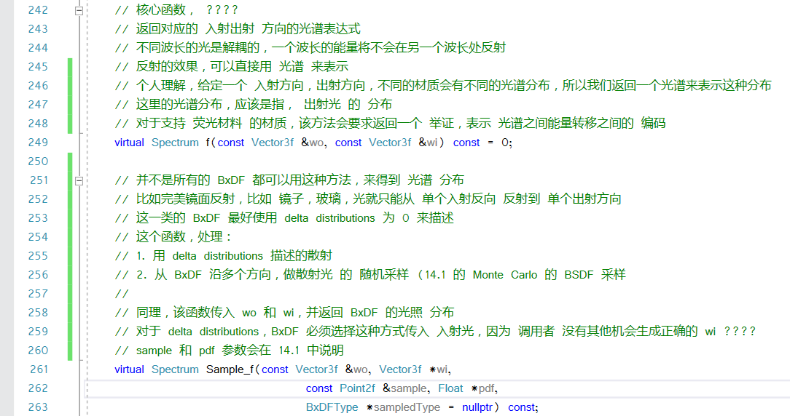

# 基础接口

BxDF 是一个综合接口，他包含了 BRDF 和 BTDF 通用的接口


BxDF 都会有一个 ```type``` 成员，来表示他的反射模型，一般来说，是一个表示 ```BSDF_REFLECTION``` 或者 ```BSDF_TRANSMISSION ```的标志位，加上一个表示```diffuse, glossy, and specular```其中之一的标志位。


核心函数 f



两个核心函数的解释，看的不是很懂，**TODO**


# 反射率(Reflectance)

首先，反射函数是一个 4D 的函数(wo,wi 用 θ 和 φ 表示)，然后固定 wi，将其变为 2D 的函数。

这里说的就是，**半球反向反射率函数(hemispherical-directional reflectance)**


这个函数的意义是给定方向光 ```wi``` 在半球上，产生的全反射，注意，这里是对 ```wi``` 求积分


这个函数，被称为 **半球对半球反射率(hemispherical-hemispherical reflectance)**

不太能理解，这里的 2重积分的意义 **TODO**

这个函数，就是计算这个 rhh，参数是为``` Monte Carlo ``` 实现设计的参数


# BxDF 缩放适配器


