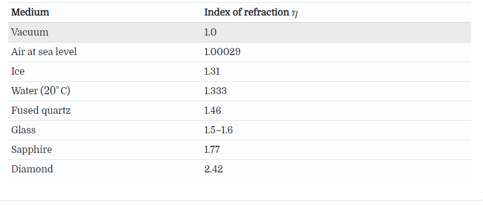
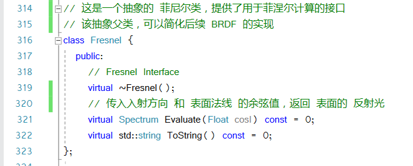
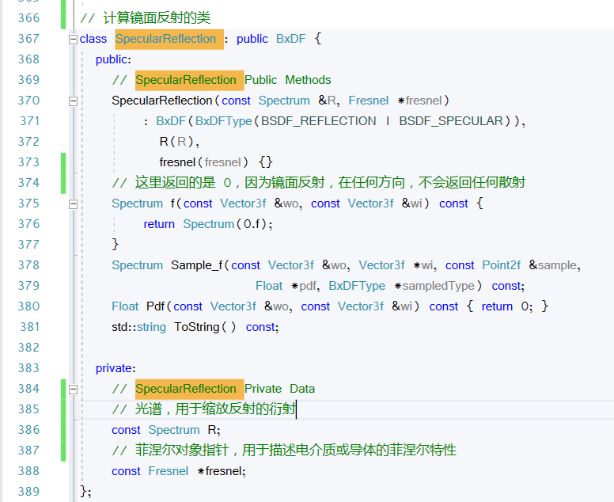
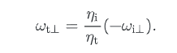
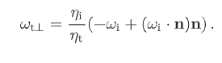

# 镜面的反射和透射

对于表面是，完美光滑的几何模型。入射光和出射光的建模十分简单。

对于给出的入射光 ```wi```，所有的出射光都只有一个方向 ```wo```

对于，镜面反射，他们满足


并且，满足 

对于透射的情况，同样满足  但是，透射光的方向，满足 Snell Law 该原理


其中```η``` 念作 eta，表示的是，光在介质中的折射率。

通常来说，光在介质中的折射率，既跟介质本身有光，也和光的波长有关。因此，入射光在两种介质的边界，会发生 **发散现象(dispersion)**，这个最明显的例子就是，白光的棱镜散射现象。对于这种现象，有两种处理方式
- 忽略这种波长的依赖项，简化光传输的运算
- 在一个支持 **发散** 的物体上，我们可以追踪多条光线。

下面是 pbrt 提供的两张图


第一幅图，是反射，第二幅图，是折射，在这里除去了外部和内部的反射，因为部分能量的丢失，所以有黑色的部分。

# 菲涅尔反射率 Fresnel Reflectance

除了计算反射和折射的方向，我们还需要知道入射光中，反射和折射的比例。在真实的物理环境中，这个比例是跟方向相关的，不能捕获为一个标准常量。因此，我们提出了一个解决方案，菲涅尔方程 Fresnel equations，这个方程，描述了从表面反射得到的光，在光滑表面上，它是 Maxwell 方程的 解决方案

给定表面的折射率，和入射光的角度， 菲涅尔方程，会给出该入射光，在是否偏振的两种状况的对应的反射率。但是因为偏振的效果是有限的，所以 pbrt 是假设光是非偏振的。也就是说，对于不同的光波，我们是随机的。基于这种简单的假设，菲涅尔反射率，可以是，平行和垂直偏振项的平均值。

在这一点上，我们需要对几种重要材料的类别，做一个区分

- 电介质，也称为 绝缘体。他们通常有一个 实值的折射率  real-valued indices of refraction（通常是 1到3），并会对入射光进行一部分的透射。他们的示例是，玻璃，矿物油，水，空气
- 导体，比如金属材质。这一类材质，电子可以在原子晶格内自由移动，使得电流从一个地方跑到另一个地方。当导体受到电磁辐射时，比如可见光，这种原始特性会转化为截然不同的行为，该材料是不透明的，并且会反射大部分的照明。一部分的光，也会被传入导体内部，并被快速吸收。通常来说，会在表面 0.1 μm 的位置，发生吸收现象。因此，只有极其薄的金属膜，才能透射大量的光。在 pbrt 我们忽略这种透射，仅对反射分量进行建模。与电介质相反，这种导体的折射率，通常是复数形式

- 最后一种是半导体，硅或者锗，这本书不考虑。

导电体和电介质，都由同一组菲涅尔方程控制。尽管如此，我们还是会创建一个专门用于电介质的特殊方程，这是为了保证计算的方便。

这里给出了各种物体的折射率。这里的折射率，因为其折射率跟可见光的波长有关，所以采用的是平均的波长值。这个平均波长下的折射率。



材质解析
- Vacuum 真空
- Air at sea level 海平面上的空气
- Ice 冰
- Water 水
- Fused quartz 熔融石英
- Glass 玻璃
- Sapphire 蓝宝石
- Diamond 钻石

为了计算两种介质之间的反射率，我们需要知道，他们各自的折射率。上表给出了各种绝缘体的折射率。绝缘体的菲涅尔反射方程是：

$$\begin{aligned}
r_{\|} &=\frac{\eta_{\mathrm{t}} \cos \theta_{\mathrm{i}}-\eta_{\mathrm{i}} \cos \theta_{\mathrm{t}}}{\eta_{\mathrm{t}} \cos \theta_{\mathrm{i}}+\eta_{\mathrm{i}} \cos \theta_{\mathrm{t}}} \\
r_{\perp} &=\frac{\eta_{\mathrm{i}} \cos \theta_{\mathrm{i}}-\eta_{\mathrm{t}} \cos \theta_{\mathrm{t}}}{\eta_{\mathrm{i}} \cos \theta_{\mathrm{i}}+\eta_{\mathrm{t}} \cos \theta_{\mathrm{t}}}
\end{aligned}$$

在这里
- $r_{\|}$ 指的是 平行偏振光反射率 the Fresnel reflectance for parallel polarized light
- $r_{\perp}$ 指的是 垂直偏振光反射率 the Fresnel reflectance for perpendicular polarized light
- $\eta_{\mathrm{i}}$ 和 $\eta_{\mathrm{t}}$ 分别是入射介质和折射介质的 折射率
- $\omega_i$ 和 $\omega_t$ 是入射光和折射光的方向，其中折射光的方向，可以通过 Snell Law 计算

在这里，我们需要保证 cos 的值是大于等于0的，也就是说，在计算 cos 的时候，我们需要将法线，翻转到计算的光线的同一半球中

那么，对于非偏振光，反射率就是


因为能量守恒原则，所以我们的透射的能量就是 


该函数在代码中的实现，第一步是判断入射光是否跟指向外的法线在同一半球中，比如：


全反射现象

下一步，我们来关注导体的折射率，复数的情况 $\bar{\eta}=\eta+\mathrm{i} k$，这种情况下，入射光可能会被导体材质吸收，并转换成热量。因此除了实部，菲涅尔公式，还依赖于虚部 k，这个表示为 吸收因子


这张图中，横坐标是波长（nm），实线，表示的是，金的吸收系数，虚线，表示的是，金的反射参数

在导体和绝缘体的边界处的，菲涅尔反射率，是下图公式给出


而且，式子 $\eta+\mathrm{i} k=\bar{\eta}_{\mathrm{t}} / \bar{\eta}_{\mathrm{i}}$ 是两个复数相除，表示的相对折射率。当然，这里的 $\bar{\eta}_{\mathrm{i}}$  可以用一个实数表示

这个计算，由函数 ```FrConductor()``` 完成，这个对应了 8.3 的实现





# 镜面反射 Specular Reflection

现在，我们实现了``` SpecularReflection```类，该类描述了如何计算合理的镜面反射。接下来，我们会得出描述镜面反射的，BRDF。因为我们可以由菲涅尔公式计算出，反射的光的比例，即 $F_{\mathrm{r}}(\omega)$，那么我们需要这样一个 BRDF 方程

$$L_{0}\left(\omega_{0}\right)=\int f_{\mathrm{r}}\left(\omega_{0}, \omega_{\mathrm{i}}\right) L_{\mathrm{i}}\left(\omega_{\mathrm{i}}\right)\left|\cos \theta_{i}\right| \mathrm{d} \omega_{\mathrm{i}}=F_{\mathrm{r}}\left(\omega_{\mathrm{r}}\right) L_{\mathrm{i}}\left(\omega_{\mathrm{r}}\right)$$

在这里，$\omega_{\mathrm{r}}=\mathrm{R}\left(\omega_{\mathrm{o}}, \mathrm{n}\right)$，指的是，对于镜面反射，我们的 $\omega_{\mathrm{r}}$ 和 $\omega_{\mathrm{o}}$ 是一样的，记得参考那张图片，对于镜面反射，出射光的角度，和反射光的角度，是完全一致的。

BRDF 函数可以由 狄克拉函数 来构成，我们回一下，狄克拉函数的性质（一个函数跟狄克拉的卷积，等于它本身


相比于其他的函数，狄克拉函数需要特殊处理。然而，具有 delta distribution 的数值积分，必须考量到 delta distribution 。如果使用梯形规则，或者其他方法，对积分进行计算，根据狄克拉函数的定义，这个计算可能会是0（**TODO 真的没懂这里在说什么**），相反，我们必须允许狄克拉函数去计算它本身的值。我们将在 12章遇到，某些光源积分中的反射中，有 delta distribution。

相反的，我们希望完美的镜面反射

。。。这两段完全看不懂，最后得出的一个计算函数的结果


这条式子，和


是一致的

## 代码实现




其中，对称算法如下


# 镜面散射

接下来对镜面散射的处理，即 BTDF，也是使用 Snell Law。

对于两种介质之间的边界，分别具有折射率，${\eta_{\mathrm{i}}}$ 和 ${\eta_{\mathrm{t}}}$


在这里，提供一个说法，两个边界的透射辐射量，是跟折射率的平方，成比例缩放的。如果是直观的理解，因为辐射的微分立体角，由于透射的原因被缩放了。

我们假设，折射的能量比例是 $\tau$，其中 $\tau=1-F_{\mathrm{r}}\left(\omega_{\mathrm{i}}\right)$，那么可以用式子表示：

$$\mathrm{d} \Phi_{\mathrm{o}}=\tau \mathrm{d} \Phi_{\mathrm{i}}$$

我们用入射的光的能量的式子，可以得到

$$L=\frac{\mathrm{d} \Phi}{\mathrm{d} \omega \mathrm{d} A^{\perp}}$$

代入有：

$$L_{\circ} \cos \theta_{\mathrm{o}} \mathrm{d} A \mathrm{d} \omega_{\mathrm{o}}=\tau\left(L_{\mathrm{i}} \cos \theta_{\mathrm{i}} \mathrm{d} A \mathrm{d} \omega_{\mathrm{i}}\right)$$

因为立体角，可以拆分为两个角的积分的乘积

$$L_{\circ} \cos \theta_{\circ} \mathrm{d} A \sin \theta_{\mathrm{o}} \mathrm{d} \theta_{\mathrm{o}} \mathrm{d} \phi_{\mathrm{o}}=\tau L_{\mathrm{i}} \cos \theta_{\mathrm{i}} \mathrm{d} A \sin \theta_{\mathrm{i}} \mathrm{d} \theta_{\mathrm{i}} \mathrm{d} \phi_{\mathrm{i}}$$

根据 Snell Law 有，这里理解成，cos 做积分就是 sin

$$\eta_{0} \cos \theta_{0} \mathrm{d} \theta_{\mathrm{o}}=\eta_{\mathrm{i}} \cos \theta_{\mathrm{i}} \mathrm{d} \theta_{\mathrm{i}}$$

那么，我们有

$$\frac{\cos \theta_{0} \mathrm{d} \theta_{0}}{\cos \theta_{\mathrm{i}} \mathrm{d} \theta_{\mathrm{i}}}=\frac{\eta_{\mathrm{i}}}{\eta_{\mathrm{o}}}$$

代入 L 的式子

$$L_{\mathrm{o}} \eta_{\mathrm{i}}^{2} \mathrm{d} \phi_{\mathrm{o}}=\tau L_{\mathrm{i}} \eta_{\mathrm{o}}^{2} \mathrm{d} \phi_{\mathrm{i}}$$

因为入射角和出射角满足 $\phi_{\mathrm{i}}=\phi_{\mathrm{o}}+\pi$，所以他们 $\mathrm{d} \phi_{\mathrm{i}}=\mathrm{d} \phi_{\mathrm{o}}$ 因此，最后化简（**不理解这里的角度的化简**）

$$L_{0}=\tau L_{\mathrm{i}} \frac{\eta_{\mathrm{o}}^{2}}{\eta_{\mathrm{i}}^{2}}$$

那么这个关系式，就是散射的出射，和入射的关系

因为跟 BRDF 一样，BTDF 也是需要除以一个 cos 值，来计算正确的能量，所以有

$$
f_{\mathrm{r}}\left(\omega_{0}, \omega_{\mathrm{i}}\right)=\frac{\eta_{\mathrm{o}}^{2}}{\eta_{\mathrm{i}}^{2}}\left(1-F_{\mathrm{r}}\left(\omega_{\mathrm{i}}\right)\right) \frac{\delta\left(\omega_{\mathrm{i}}-\mathrm{T}\left(\omega_{\mathrm{o}}, \mathrm{n}\right)\right)}{\left|\cos \theta_{\mathrm{i}}\right|}
$$

- $\mathrm{T}\left(\omega_{\mathrm{o}}, \mathrm{n}\right)$ 这个式子表示的是，$\omega_{\mathrm{o}}$ 对应的，镜面透射的向量
- $\left(1-F_{\mathrm{r}}\left(\omega_{\mathrm{i}}\right)\right)$ 对应一个现实中常见的效果，透射现象在近垂直处，会更叫明显。比如，如果是直视水面，那么我们可以看得很深，但是如果是掠射，大部分的光线都会像镜子一样的反射

类 ```SpecularTransmission```和类```SpecularReflection ```几乎一样，除了采样的方向不同。


这是一张混合了 BRDF 和 BTDF 的图。应用了，在不同的角度上，反射和透射的比例不同。

## 代码实现


然后，我们要计算，透射出来的透射光，的向量

### 折射向量的推导过程


第一步，做垂直分量的分解，而且因为  所以我们能得到，两个垂直分量的，比例关系



那么，再把垂直分量，化成原向量，和法线的表达方式



同理，我们可以用垂直分量，来表示平行分量


所以有


# 菲涅尔-调变 镜面反射和透射


